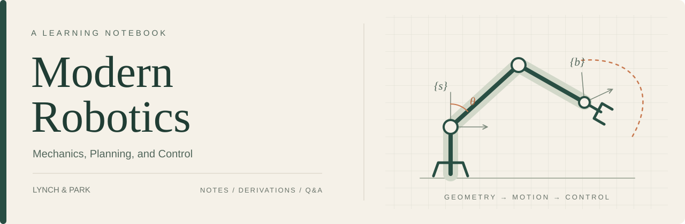

# Modern Robotics Study Notes

<p align="center">
  
  <a href="README.md"></a>
</p>

Chinese study notes for Kevin M. Lynch and Frank C. Park's *Modern Robotics: Mechanics, Planning, and Control*. The repository follows the textbook chapter by chapter, combining concept explanations, derivations, figures, and self-check questions in one place.

The detailed notes are written primarily in Chinese, with English chapter names and key terms included for cross-language reference. Each completed chapter has a paired note and Q&A file so that reading and retrieval practice stay connected.

**[Chapter Index](#chapter-index)** · **[Textbook PDF](books/modern-robotics.pdf)** · **[Progress](progress.md)** · **[Sources](sources.md)**

## Chapter Index

Each chapter keeps a main note and a companion Q&A. Read the note for a continuous explanation, then use the Q&A for retrieval practice and review.

| Chapter | Topics | Notes | Practice |
| :--- | :--- | :--- | :--- |
| **02 · Configuration Space** | Degrees of freedom, joint constraints, topology, task and workspace | [Chapter note](notes/ch02/ch02-configuration-space.md) | [Q&A](notes/ch02/ch02-configuration-space-qa.md) |
| **03 · Rigid-Body Motions** | Rotations, homogeneous transformations, screw theory, exponentials and logarithms, wrenches | [Chapter note](notes/ch03/ch03-rigid-body-motions.md) | [Q&A](notes/ch03/ch03-rigid-body-motions-qa.md) |
| **04 · Forward Kinematics** | Space and body PoE, robot modeling, and URDF | [Chapter note](notes/ch04/ch04-forward-kinematics.md) | [Q&A](notes/ch04/ch04-forward-kinematics-qa.md) |

> [!NOTE]
> This table lists chapters with notes already available. The current section, pending exercises, and next action are tracked in [Progress](progress.md). Coverage and independent mastery are recorded separately.

<details>
<summary><strong>Full textbook outline</strong></summary>

The outline helps locate textbook content; chapters without note links have not been written yet.

| Chapter | Topic |
| :--- | :--- |
| 01 | Introduction |
| 02 | [Configuration Space](notes/ch02/ch02-configuration-space.md) |
| 03 | [Rigid-Body Motions](notes/ch03/ch03-rigid-body-motions.md) |
| 04 | [Forward Kinematics](notes/ch04/ch04-forward-kinematics.md) |
| 05 | Velocity Kinematics and Statics |
| 06 | Inverse Kinematics |
| 07 | Kinematics of Closed Chains |
| 08 | Dynamics of Open Chains |
| 09 | Trajectory Generation |
| 10 | Motion Planning |
| 11 | Robot Control |
| 12 | Grasping and Manipulation |
| 13 | Wheeled Mobile Robots |
| Appendices A-D | Rotation representations, D-H parameters, optimization, and Lagrange multipliers |

</details>

## How to Use This Repository

1. **Read the chapter note first.** Follow the section links from the chapter index and move from problems to concepts, derivations, and examples.
2. **Practice with the paired Q&A.** Answer each question before opening the reference answer, and distinguish recognition from independent recall.
3. **Return to the textbook when needed.** Figure numbers, equation numbers, and page references point back to the local PDF; see the [source index](sources.md) for version details.

The notes use Markdown and LaTeX with relative links between chapters, Q&A files, and figures. They can be read directly on GitHub or opened as an Obsidian vault.

## Textbook and Resources

| Resource | Use |
| :--- | :--- |
| [Textbook PDF in this repository](books/modern-robotics.pdf) | The May 3, 2017 preprint used for these notes; 644 PDF pages |
| [Official book page](https://hades.mech.northwestern.edu/index.php/Modern_Robotics) | Preprint, errata, and companion materials from the authors |
| [Official video lectures](https://modernrobotics.northwestern.edu/nu-gm-book-resource/) | Chapter-by-chapter explanations and examples |

Page references use the PDF stored in this repository. Recheck page numbers when changing textbook versions. Copyright for the textbook and reproduced figures remains with the authors and respective rights holders; this repository is a personal study record.

<details>
<summary><strong>Repository structure and maintenance</strong></summary>

```text
modern-robotics/
├── README.md                  # Chinese entry page
├── README_EN.md               # English entry page
├── books/
│   └── modern-robotics.pdf    # Textbook version used for study
├── notes/
│   └── chXX/
│       ├── chXX-<topic>.md    # Chapter note
│       └── chXX-<topic>-qa.md # Paired questions and answers
├── attachments/chXX/          # Textbook figures by chapter
├── assets/                    # Homepage visual assets
├── sources.md                 # Textbook version and page references
├── progress.md                # Single live study checkpoint
├── learning_protocol.md       # Study cadence and note rules
└── AGENTS.md                  # Study assistant recovery entry point
```

New chapters should use the paired filename convention and place textbook figures in the matching attachment folder. Long-term notes belong in the chapter note, questions and answers belong in Q&A, and the live state belongs in `progress.md`.

To resume a study session in this repository:

> Continue studying Modern Robotics. Read `AGENTS.md` at the repository root first, then resume from the current checkpoint.

See [learning protocol](learning_protocol.md) for study cadence, source checks, and state maintenance.

</details>
