# 第 2 章 · 构型空间｜Q&A

[← 阅读首页](../../README.md) · [章节正文](ch02-configuration-space.md) · [学习进度](../../progress.md) · [来源索引](../../sources.md)

<strong>Q&A 目录</strong>

- [Session 001 - 第 2 章，第 2.1 节：刚体的自由度](#session-001---第-2-章第-21-节刚体的自由度)
- [Session 002 - 第 2 章，第 2.2 节：关节的自由度](#session-002---第-2-章第-22-节关节的自由度)
- [Session 003 - 第 2 章，第 2.2 节：读图后再计数](#session-003---第-2-章第-22-节读图后再计数)
- [Session 004 - 第 2 章，第 2.2 节：Grübler 公式与平面四杆机构](#session-004---第-2-章第-22-节grübler-公式与平面四杆机构)
- [Session 005 - 第 2 章，第 2.2 节：滑块—曲柄先读图](#session-005---第-2-章第-22-节滑块曲柄先读图)
- [Session 006 - 第 2 章，第 2.2 节：滑块—曲柄的两种建模](#session-006---第-2-章第-22-节滑块曲柄的两种建模)
- [Session 007 - 第 2 章，第 2.2 节：开链与闭链的自由度](#session-007---第-2-章第-22-节开链与闭链的自由度)
- [Session 008 - 第 2 章，第 2.2 节：例题 2.5 - 重叠关节（图 2.6）](#session-008---第-2-章第-22-节例题-25---重叠关节图-26)
- [Session 009 - 第 2 章，第 2.2 节：例题 2.6 - 冗余约束与奇异构型（图 2.7）](#session-009---第-2-章第-22-节例题-26---冗余约束与奇异构型图-27)
- [Session 010 - 第 2 章，第 2.2 节：例题 2.7 - Delta robot（图 2.8）](#session-010---第-2-章第-22-节例题-27---delta-robot图-28)
- [Session 011 - 第 2 章，第 2.2 节：例题 2.8 - Stewart–Gough platform（图 1.1(b)）](#session-011---第-2-章第-22-节例题-28---stewartgough-platform图-11b)
- [Session 012 - 第 2 章，第 2.3.1 节：构型空间的拓扑](#session-012---第-2-章第-231-节构型空间的拓扑)
- [Session 013 - 第 2 章，第 2.3.2 节：构型空间的表示](#session-013---第-2-章第-232-节构型空间的表示)
- [Session 014 - 第 2 章，第 2.4 节：构型与速度约束（configuration and velocity constraints）](#session-014---第-2-章第-24-节构型与速度约束configuration-and-velocity-constraints)
- [Session 015 - 第 2 章，第 2.4.2 节：完整约束与 Pfaffian 速度约束](#session-015---第-2-章第-242-节完整约束与-pfaffian-速度约束)
- [Session 016 - 第 2 章，第 2.4.3 节：非完整约束（nonholonomic constraint）](#session-016---第-2-章第-243-节非完整约束nonholonomic-constraint)
- [Session 017 - 第 2 章，第 2.5 节：任务空间与工作空间（task space and workspace）](#session-017---第-2-章第-25-节任务空间与工作空间task-space-and-workspace)
- [Session 018 - 第 2 章，第 2.5 节：SCARA 与喷涂机器人](#session-018---第-2-章第-25-节scara-与喷涂机器人)
- [Session 019 - 第 2 章，第 2.6 节：总结](#session-019---第-2-章第-26-节总结)

本文件只保存教师侧的学习设计与参考答案，不记录学习者的原始回答。

> 本章历史记录：第 2 章于 Session 019 收束。当前学习断点统一见 [学习进度](../../progress.md)。

## Session 001 - 第 2 章，第 2.1 节：刚体的自由度

### 掌握路径

1. 从平面硬币建立“位置 + 朝向”的直觉。
2. 用笔说明单点只能确定位置，不能确定完整朝向。
3. 用 $A,B,C$ 三个不共线点推导空间刚体的 $3+2+1=6$ 自由度。
4. 将自由度计数迁移到抽屉的移动关节。

### 题目 1 - 平面硬币的构型

**题目**：只能平放在桌面上的硬币，为什么有 3 个自由度？三个连续变量分别是什么？

**参考答案**：硬币中心（或任一参考点）可沿平面两个方向平移，记为 $x,y$；还可在平面内转动，记为 $\theta$。硬币正反面是离散选择，不增加连续自由度。

**教学意图**：区分连续自由度与离散状态，并建立构型的最小描述。

### 题目 2 - 一个点与完整构型

**题目**：为什么笔上一个点的位置确定后，笔仍可能具有不同构型？

**参考答案**：该点可以保持不动，而笔绕穿过该点的轴旋转；位置保持不变，但朝向改变。因此单点只能确定位置，不能确定刚体朝向。

**教学意图**：建立“位置不等于朝向”，为三点推导作准备。

### 追问 1 - 固定两个点

**题目**：若笔上的 $A$ 和 $B$ 两点位置都固定，笔还可以如何运动？还剩几个连续自由度？

**参考答案**：笔轴方向 $AB$ 已固定，但笔仍可绕 $AB$ 轴旋转，剩 1 个连续自由度。再固定一个不在 $AB$ 轴上的点 $C$，才会完整固定朝向。

**教学意图**：对应空间刚体推导中的最后 1 个自由度。

### 题目 3 - 抽屉关节

**题目**：抽屉相对柜体属于哪种关节？它唯一允许的相对运动是什么？

**参考答案**：移动关节（prismatic joint, P）；只允许沿导轨轴前后平移，故有 1 个自由度。

**教学意图**：把刚体自由度迁移到机构关节；下一步进入旋转关节、移动关节与约束计数。

### 下一步

继续第 2.2 节，比较旋转关节（R）和移动关节（P），并推导“关节自由度 $f$ + 关节约束数 $c$ = 6”。

## Session 002 - 第 2 章，第 2.2 节：关节的自由度

### 题目 1 - 螺旋关节与圆柱关节

**题目**：螺钉旋进螺母时，旋转和位移是绑定，还是可独立选择？

**参考答案**：绑定。理想螺旋关节满足 $z=\frac{p}{2\pi}\theta$；旋转量决定沿轴位移，故只有 1 个自由度。圆柱关节的旋转与平移才是独立的，故有 2 个自由度。

**教学意图**：区分“存在两种运动”与“存在两个独立自由度”；这是后续自由度计数的必要条件。

### 追问 1 - 单自由度的含义

**题目**：若螺钉转一整圈，它能否在同一关节模型下保持轴向位移为零？

**参考答案**：不能。给定螺距后，转一圈必产生一个螺距的轴向位移；若能独立保持为零，该关节就不是理想螺旋关节。

**教学意图**：通过反例检验“绑定”而不是机械记忆。

### 下一步

推导 Grübler 公式，并用平面四杆机构验证自由度计数。

## Session 003 - 第 2 章，第 2.2 节：读图后再计数

### 先行说明 - 平面四杆的结构

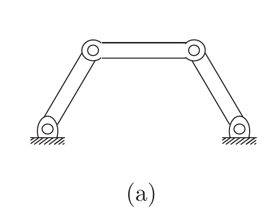

*来源：教材 Figure 2.4(a)，书页 18／本地 PDF 第 37 页；局部截取。*

**教学动作**：在使用教材例题 2.3（Example 2.3）前，先展示 Figure 2.4(a)，指出固定地面连杆、三根可动连杆和四个圆圈所代表的旋转关节。

**参考说明**：平面四杆是教材给出的闭链机构，不是额外假设的例子。它有 4 根连杆（含地面）和 4 个旋转关节；读图识别结构应先于自由度计算。

**教学意图**：避免把机构自由度学习误化为代数填空；建立“看图 → 数连杆/关节 → 选平面或空间 $m$ → 代入”的顺序。

### 下一步

从同一教材图 2.4(b) 的滑块—曲柄开始，先练习识别图中部件，再做计数。

## Session 004 - 第 2 章，第 2.2 节：Grübler 公式与平面四杆机构

### 题目 1 - 平面四杆的自由度

**题目**：平面四杆机构有 4 根连杆（包含地面）、4 个旋转关节；请写出 $m,N,J,\sum_i f_i$ 并计算自由度。

**最小支架**：先将 3 根可动连杆视为自由平面刚体，得到 $3\times3=9$ 个起始自由度；每个平面旋转关节保留 $f=1$，故施加 $c=3-1=2$ 个约束。

**参考答案**：$m=3,N=4,J=4,\sum_i f_i=4$。因此

$$
\mathrm{dof}=m(N-1-J)+\sum_i f_i=3(4-1-4)+4=1.
$$

等价地，$9-4\times2=1$。

**教学意图**：把“每根刚体的自由度”与“关节约束”合并为可计算的机构自由度；避免漏掉地面或把关节提供的自由度与约束数混淆。

### 下一步

用同一公式比较开链 $kR$ 机构与闭链滑块—曲柄机构，并理解“独立约束”这个前提。

## Session 005 - 第 2 章，第 2.2 节：滑块—曲柄先读图

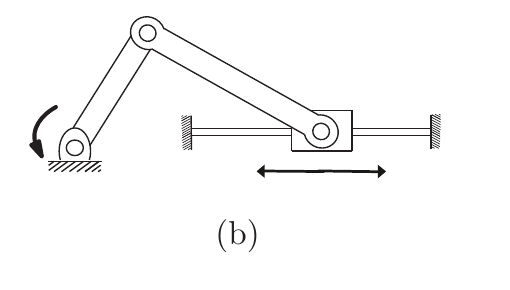

*来源：教材 Figure 2.4(b)，书页 18／本地 PDF 第 37 页；局部截取。*

### 题目 1 - 先识别结构

**题目**：看图 2.4(b)，不计算自由度。请写出：（1）共有几根连杆，是否包含地面；（2）共有几个关节，其中分别有几个 R 关节和几个 P 关节。

**预期答案／判定标准**：连杆为 4 根（地面、曲柄、连杆、滑块）；关节为 4 个，分别为 3 个 R 关节和 1 个 P 关节。地面连杆同时包括左侧固定支座与右侧导轨，不能把它们误数成两根地面。

**最小提示**：从固定地面出发，沿构件依次走到滑块，再从滑块经导轨回到地面；每次两个构件相接处就是一个关节。

**教学意图**：先建立机构图的“连杆—关节—闭环”读法，再代入 Grübler 公式；特别区分滑块（连杆）与滑块和导轨之间的 P 关节。

### 下一步

确认图中连杆与关节的计数后，代入平面 Grübler 公式，并与平面四杆比较。

## Session 006 - 第 2 章，第 2.2 节：滑块—曲柄的两种建模

### 讲解要点

教材例题 2.3（Example 2.3）对同一滑块—曲柄给出两种一致的模型：$N=4,J=4$（3R+1P）或 $N=3,J=3$（2R+1RP）。前者把滑块当作连杆，后者把滑块处的 R 与 P 合为一个 $f=2$ 的 RP 关节。

### 题目 1 - 两种模型为何不矛盾

**题目**：为什么同一机构在两种计数模型下 $N$、$J$ 不同，却仍得到相同自由度？

**参考答案**：第二种模型把滑块及其两处一自由度连接合并成一个直接连接连杆与地面的 RP 关节。因此少了一根连杆、少了一个关节，但 RP 关节提供 2 个自由度；代入的结构变化彼此抵消，两种模型都得 $\mathrm{dof}=1$。

**教学意图**：理解 Grübler 公式依赖于一致的机构模型，而不是把图中的线段机械相加。

### 下一步

进入教材例题 2.4（Example 2.4），比较开链 $kR$ 机构与几个平面闭链机构，并练习识别图 2.5 的连杆与关节。

## Session 007 - 第 2 章，第 2.2 节：开链与闭链的自由度

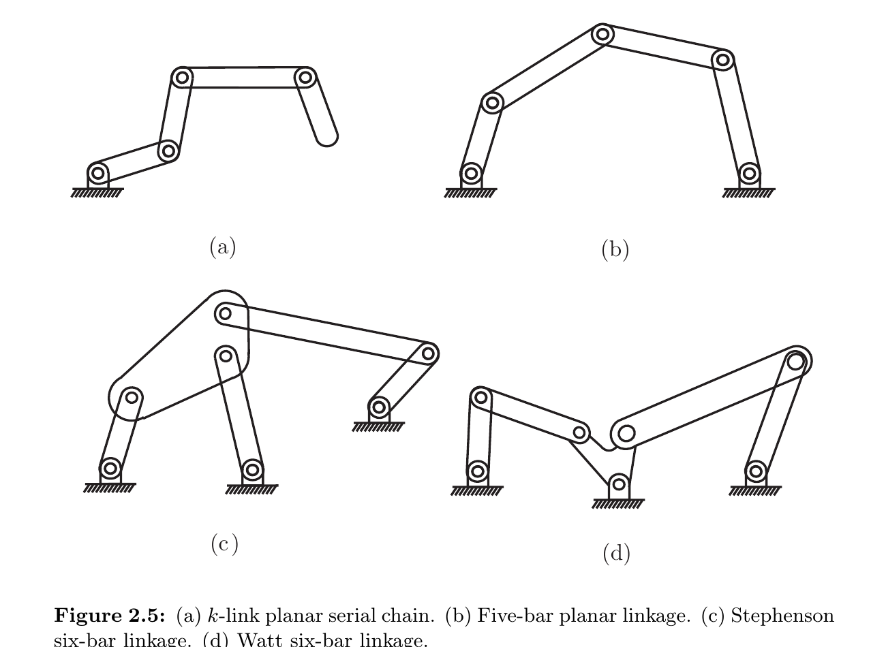

*来源：教材 Figure 2.5，书页 19／本地 PDF 第 38 页；局部截取。*

### 题目 1 - 先找闭环

**题目**：图 2.5 的 (a) 到 (d) 中，哪些是闭链？为什么图 2.5(a) 是开链？

**参考答案**：(b)、(c)、(d) 是闭链，因为可以从地面出发，沿连杆和关节走回地面形成闭合回路；(a) 的末端自由，沿链条无法回到地面，故是开链。

**教学意图**：先用图识别闭环，再理解为什么闭链的关节变量不必彼此独立。

### 题目 2 - $kR$ 开链

**题目**：一个平面 $kR$ 串联链为何有 $k$ 个自由度？

**参考答案**：它有 $N=k+1$（$k$ 根可动连杆加地面）、$J=k$，各 R 关节 $f_i=1$。故 $\mathrm{dof}=3((k+1)-1-k)+k=k$；也就是说每个关节角可独立选择。

**教学意图**：把 Grübler 公式连接到日后常见的串联机械臂“每个关节一个关节变量”的直觉。

### 下一步

继续教材例题 2.5（Example 2.5），学习三根连杆在同一点相交时，为什么不能把它误数成一个普通 R 关节。

## Session 008 - 第 2 章，第 2.2 节：例题 2.5 - 重叠关节（图 2.6）

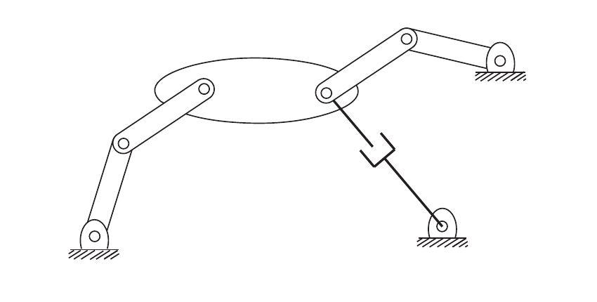

*来源：教材 Figure 2.6，书页 20／本地 PDF 第 39 页；局部截取。*

### 题目 1 - 三根连杆相遇时如何数关节

**题目**：图 2.6 右侧的大连杆交汇处有三根连杆相遇。为什么不能把这里直接当成一个普通 R 关节？

**参考答案**：普通关节按定义只能连接恰好两根连杆；三根连杆在同一点相遇，应解释为两个位置重叠的 R 关节。也可以把右下的 R-P 对合并成一个二自由度 RP 复合关节，但不能把三根连杆的相遇点压成一个一自由度关节。

**教学意图**：把“关节连接恰好两根连杆”从定义变成读图时的检查规则，避免复杂机构的自由度被低估。

### 题目 2 - 两种模型的完整代入

**题目**：教材为什么分别用 $N=8,J=9$ 和 $N=7,J=8$ 两种模型？两种模型各如何代入 Grübler 公式？

**参考答案**：展开模型为 $N=8$、$J=9$，由 8 个 R 和 1 个 P 得 $\sum_i f_i=9$，所以 $\mathrm{dof}=3(8-1-9)+9=3$。合并模型为 $N=7$、$J=8$，由 7 个 R 和 1 个二自由度 RP 得 $\sum_i f_i=7+2=9$，所以 $\mathrm{dof}=3(7-1-8)+7+2=3$。少了一根连杆和一个关节，但 RP 关节多提供了一个自由度，结果保持一致。

**教学意图**：完整复现教材例题 2.5 的两次计算，建立“模型必须自洽”的习惯。

### 下一步

继续教材例题 2.6，学习冗余约束与奇异构型：Grübler 公式在约束不独立时只给出自由度下界。

## Session 009 - 第 2 章，第 2.2 节：例题 2.6 - 冗余约束与奇异构型（图 2.7）

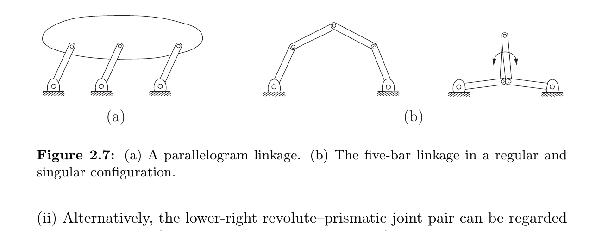

*来源：教材 Figure 2.7，书页 21／本地 PDF 第 40 页；局部截取。*

### 题目 1 - 公式结果与实际运动不一致

**题目**：为什么图 2.7(a) 用 Grübler 公式得到 $0$ 个自由度，但机构实际上仍能运动？

**参考答案**：平行连杆使部分关节约束重复，约束并不独立。公式把这些约束当成彼此独立来相减，因此低估了实际自由度；在这种情况下，Grübler 公式只给出自由度的下界。

**教学意图**：理解 Grübler 公式的适用前提，避免把公式输出的 0 机械解释为“绝对不能运动”。

### 题目 2 - 奇异构型下仍能运动

**题目**：图 2.7(b) 中，为什么“锁住两个接地关节”在正常构型下能得到刚体，但在中间连杆重合的奇异构型下仍可能运动？

**参考答案**：正常构型中，两条中间连杆提供不同的几何限制；锁住两个接地关节后，这些限制能把机构锁成刚体。中间连杆重合时，原本应独立的限制落在同一几何方向上，其中一个约束变成重复约束，因此重合连杆仍可产生额外的瞬时相对转动。

**教学意图**：把“约束失去独立性”从平行四边形的永久冗余，连接到五杆机构特定姿态下的瞬时奇异性。

### 追问 1 - 核心术语复述

**题目**：填空：奇异构型中，两个中间连杆重合，使约束变得______，所以锁住两个接地关节后仍有______运动。

**参考答案**：不独立（或重复）；瞬时。

**教学意图**：用最小复述确认学习者区分“约束重复”和“瞬时运动”，再推进到下一个教材例题。

### 当时的下一步（历史记录）

先完成例题 2.6 的核心检查，再进入例题 2.7。

## Session 010 - 第 2 章，第 2.2 节：例题 2.7 - Delta robot（图 2.8）

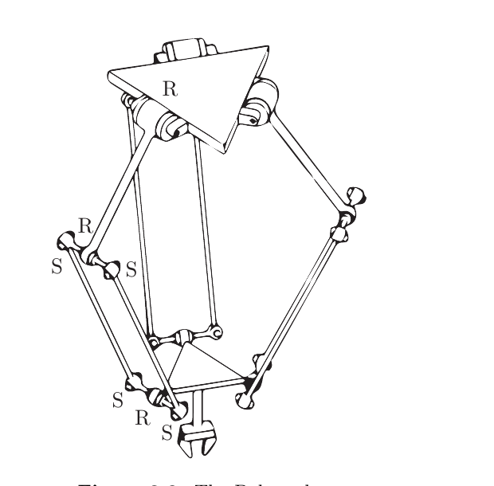

*来源：教材 Figure 2.8，书页 22／本地 PDF 第 41 页；局部截取。*

**教学目标**：先识别 Delta robot 的两个平台、三条平行四边形支腿及 R/S 关节，再理解“整体自由度”和“末端可见自由度”的区别。

**讲解要点**：三条支腿各含 5 根连杆、3 个 R 和 4 个 S；加上两个平台得到 $N=17$、$J=21$，其中 9 个 R、12 个 S。空间 Grübler 公式给出

$$
\mathrm{dof}=6(17-1-21)+9(1)+12(3)=15.
$$

其中只有 3 个自由度在末端平台上表现为 $x$、$y$、$z$ 平移；另外 12 个是平行四边形连杆绕长轴的内部扭转自由度。

### 题目 1 - 末端位置需要几个变量

**题目**：如果只关心 Delta robot 末端平台的位置，并且它必须始终与上平台保持平行，需要几个独立变量？它们是什么？

**参考答案**：需要 3 个独立变量，即末端平台在 $x$、$y$、$z$ 三个方向的位置。保持平行意味着末端姿态的三个转动变量被机构结构约束住，不能作为独立变量。

**教学意图**：先从末端任务直觉建立“可见自由度”，再理解它与整体模型自由度的区别。

### 题目 2 - 整体自由度与末端自由度

**题目**：图 2.8 中，为什么教材说 Delta robot 的整体模型有 15 个自由度，但末端平台只有 3 个可见自由度？

**参考答案**：15 是把所有连杆和关节的空间运动都计入后的整体计数；每条支腿的平行四边形结构把末端姿态约束为始终与固定平台平行，所以末端只剩三个平移自由度。其余 12 个自由度属于支腿内部连杆绕自身长轴的扭转，不表现为末端位姿变化。

**下一步**：完成这道结构—计数解释题，再继续教材例题 2.8。

## Session 011 - 第 2 章，第 2.2 节：例题 2.8 - Stewart–Gough platform（图 1.1(b)）

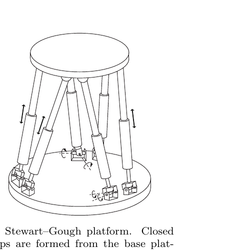

*来源：教材 Figure 1.1(b)，书页 2／本地 PDF 第 21 页；局部截取。*

**教学目标**：识别 Stewart–Gough platform 的固定平台、移动平台和 6 条 UPS 支腿，完成空间自由度计数，并区分平台自由度与支腿内部扭转。

**讲解要点**：$N=14$ 的来源是：每条 UPS 支腿被中间的 P 关节分成 2 根连杆，6 条腿共有 $12$ 根，再加上下两个平台，所以 $N=12+2=14$。平台算连杆，U/P/S 算关节。关节数为 $J=6\times3=18$；6 个 U 关节各有 $f=2$，6 个 P 关节各有 $f=1$，6 个 S 关节各有 $f=3$：

$$
\mathrm{dof}=6(14-1-18)+6(1)+6(2)+6(3)=6.
$$

这 6 个自由度就是移动平台的 3 个平移和 3 个转动。若把每条腿的 U 换成 S，公式会多出 6 个自由度，但它们是支腿绕自身轴线的扭转，不影响移动平台。

### 题目 1 - 连杆数 $N=14$ 的来源

**题目**：Stewart–Gough platform 为什么是 $N=14$ 根连杆，而不是 6 根或 20 根？

**参考答案**：每条 UPS 支腿的 P 关节把支腿分成 2 根连杆，6 条腿共有 $12$ 根；上下两个平台也各算一根连杆，所以 $N=12+2=14$。U、P、S 是关节，不计入连杆数。

**教学意图**：区分“连杆”和“关节”，并让自由度代入前的结构计数可追溯。

### 题目 2 - 平台自由度与 Delta robot 对比

**题目**：为什么 Stewart–Gough platform 的 6 个自由度可以完整表现为移动平台的 3 个平移和 3 个转动，而 Delta robot 的末端只有 3 个平移？

**参考答案**：Stewart–Gough platform 的 UPS 支腿允许移动平台在空间中保持一般刚体运动，未强制其姿态与固定平台平行，因此 6 个自由度都可在平台上看到。Delta robot 的平行四边形支腿额外约束了末端姿态，所以只剩 3 个平移自由度。

**下一步**：完成这道对比题后，第 2.2 节的主要例题就结束，随后进入教材第 2.3 节。

## Session 012 - 第 2 章，第 2.3.1 节：构型空间的拓扑

**教学目标**：从“自由度数量”过渡到“构型空间的形状”，理解同维空间可能有不同拓扑，并区分拓扑性质与坐标表示。

**讲解要点**：二维平面和球面都有 2 个维度，但平面不绕回、球面会绕回；不切开或粘合的连续变形保持拓扑。典型一维空间包括圆 $S^1$、直线 $\mathbb{R}$、闭区间 $[a,b]$ 和与直线拓扑等价的开区间 $(a,b)$。同一圆既可用角度 $\theta$ 表示，也可用满足 $x^2+y^2=1$ 的 $(x,y)$ 表示，坐标改变不改变拓扑。随后用笛卡尔积（Cartesian product）组合独立子空间。

**检查题**：二维平面与球面都有 2 个维度，为什么它们仍不是同一种构型空间？

**参考答案**：维度只表示描述一个点所需的局部独立变量数量；拓扑描述空间整体如何连接和绕回。平面无限延伸且没有绕回，球面闭合并会绕回，因此两者维数相同但拓扑不同。

**下一步**：完成这道概念检查，再学习机器人构型空间的笛卡尔积例子。

### 题目 2 - 2R 机械臂的拓扑

**题目**：为什么平面 2R 机械臂的构型空间是 $S^1\times S^1=T^2$（环面），而不是二维球面 $S^2$？

**参考答案**：2R 机械臂有两个彼此独立的旋转角，每个角度都绕一整圈后回到原点，所以每个关节的空间都是 $S^1$。两个圆相乘得到环面 $T^2$；球面 $S^2$ 不是两个独立圆周的笛卡尔积。

**教学意图**：把“关节自由度数量”与“关节变量的拓扑”连接起来，避免把所有二维空间都误认为平面或球面。

**下一步**：完成这道拓扑判断题，再进入第 2.3.2 节的数值表示。

## Session 013 - 第 2 章，第 2.3.2 节：构型空间的表示

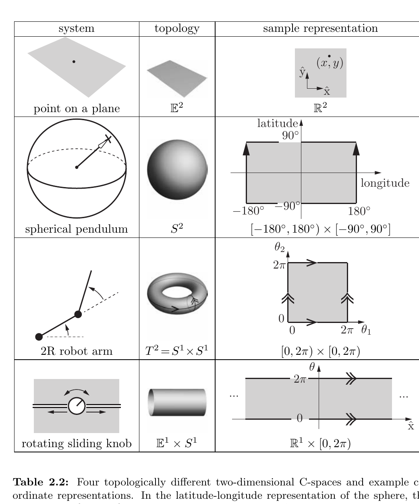

*来源：教材 Table 2.2，书页 26／本地 PDF 第 45 页；局部截取。*

**教学目标**：区分拓扑（topology）与坐标表示（representation），理解显式参数化（explicit parametrization）及其可能产生的表示奇异性（representation singularity）。

**讲解要点**：用 $n$ 个参数表示 $n$ 维空间称为显式参数化。表 2.2 中，球面的纬度—经度矩形需要在边界处按规则粘合；2R 机械臂的角度矩形需要把相对边首尾相接，才能表达环面 $T^2$。球面两极的纬度—经度坐标奇异，是表示的问题，不是物理空间本身的问题。

**检查题**：为什么球面上的点靠近北极时，物理运动可以很小，但纬度—经度表示中的经度可能发生很大变化？

**参考答案**：在北极处，所有经度代表同一个物理点；因此点只需发生很小的实际移动，经度坐标就可能从接近 $180^\circ$ 跳到接近 $-180^\circ$，或反向跳变。这是坐标表示的奇异性，不是球面发生了不连续运动。

**下一步**：比较图册（atlas）与隐式表示（implicit representation）如何避免这种表示奇异性。

### 题目 2 - 图册与隐式表示

**题目**：图册（atlas）和隐式表示（implicit representation）分别怎样处理球面纬度—经度表示在极点的奇异性？各自的主要代价是什么？

**参考答案**：图册用多张互相重叠的局部坐标图，在接近某张图的奇异点时切换到另一张图；优点是每张图只用最少参数，代价是需要管理切换。隐式表示用更高维坐标加约束（如单位球面的 $x^2+y^2+z^2=1$），避免坐标图奇异性；代价是使用的数字多于自由度。

**教学意图**：理解“拓扑导致表示困难”时的两类通用工程处理，不把坐标奇异性误解为物理奇异性。

**下一步**：完成这道比较题，再进入第 2.4 节的闭链约束与隐式 C-space。

## Session 014 - 第 2 章，第 2.4 节：构型与速度约束（configuration and velocity constraints）

### 2.4.1 平面四杆的闭环方程

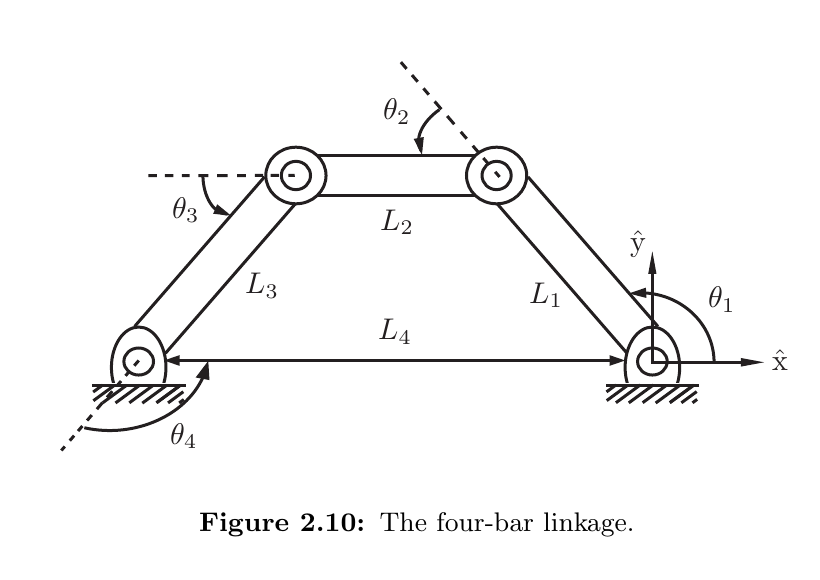

*来源：教材 Figure 2.10，书页 29／本地 PDF 第 48 页；局部截取。*

**教学目标**：理解如何把闭链机构写成隐式表示，并识别平面四杆的三个闭环方程。

**讲解要点**：把四杆看成 4R 串联链，用 $\theta_1,\ldots,\theta_4$ 和 $L_1,\ldots,L_4$ 表示。前两条方程让末端的水平、竖直位置回到原点，第三条方程让总方向回到水平：

$$
\begin{aligned}
\sum_i L_i\cos(\theta_1+\cdots+\theta_i)&=0,\\\\
\sum_i L_i\sin(\theta_1+\cdots+\theta_i)&=0,\\\\
\theta_1+\theta_2+\theta_3+\theta_4-2\pi&=0.
\end{aligned}
$$

四个变量减去三个独立约束，所有可行解在四维关节空间中形成一条一维曲线，即四杆的 C-space。

**检查题**：图 2.10 的三条闭环方程分别在几何上约束什么？

**参考答案**：前两条分别约束闭环末端在水平和竖直方向回到原点；第三条约束四根杆的总转角为 $2\pi$，使最后一根地面杆保持水平。

**下一步**：继续学习速度约束，即对闭环方程随时间求导得到的线性关系。

## Session 015 - 第 2 章，第 2.4.2 节：完整约束与 Pfaffian 速度约束

**教学目标**：理解一般闭环约束 $g(\theta)=0$ 的含义，以及对时间求导后得到的速度约束 $A(\theta)\dot{\theta}=0$。

**讲解要点**：$\theta\in\mathbb{R}^n$ 收集所有关节变量；$k$ 个独立的完整约束（holonomic constraints）把 C-space 从 $n$ 维降为 $n-k$ 维。对轨迹 $\theta(t)$ 求导：

$$
A(\theta)\dot{\theta}=0,\qquad A(\theta)=\frac{\partial g}{\partial\theta}.
$$

该 Pfaffian 约束（Pfaffian constraint）描述当前位置允许的关节速度；若它来自某个 $g(\theta)$ 的梯度，就称为可积（integrable），可以重新积分回构型约束。

**检查题**：$g(\theta)=0$ 与 $A(\theta)\dot{\theta}=0$ 分别描述什么？为什么后者可以由前者得到？

**参考答案**：$g(\theta)=0$ 描述哪些构型本身满足闭环几何，是位置层面的约束；$A(\theta)\dot{\theta}=0$ 描述在当前构型下允许哪些关节速度，是速度层面的约束。机器人沿轨迹始终满足 $g(\theta(t))=0$，对时间求导便得到后者。

**下一步**：用无侧滑滚动硬币的例子说明非完整（nonholonomic）速度约束。

## Session 016 - 第 2 章，第 2.4.3 节：非完整约束（nonholonomic constraint）

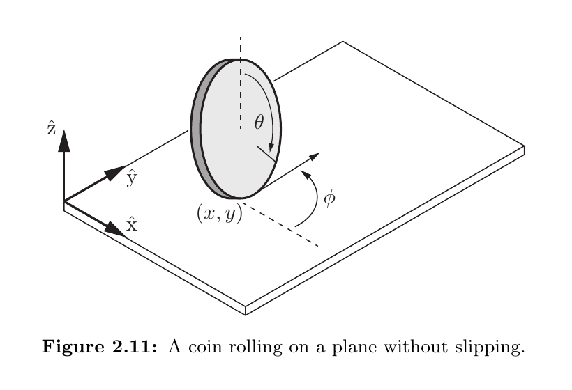

*来源：教材 Figure 2.11，书页 31／本地 PDF 第 50 页；局部截取。*

**教学目标**：理解无侧滑滚动硬币的速度约束，区分“瞬时不能做什么”和“最终能到达哪些构型”。

**讲解要点**：硬币构型为 $(x,y,\phi,\theta)$，C-space 是 $\mathbb{R}^2\times T^2$，维数为 4。无侧滑要求

$$
\begin{bmatrix}\dot{x}\\\dot{y}\end{bmatrix}
=r\dot{\theta}
\begin{bmatrix}\cos\phi\\\sin\phi\end{bmatrix}.
$$

它限制当前速度方向，但不能写成某个位置方程 $g(q)=0$；因此是非完整约束。硬币不能瞬间横移，却可以通过转向路径到达 C-space 中的不同构型。非完整约束降低可行速度的维数，不必降低可达构型空间的维数。

**检查题**：为什么滚动硬币的无侧滑条件是非完整约束，而不是完整约束？

**参考答案**：无侧滑条件直接约束当前速度，硬币不能横向瞬移；但它不能积分成只依赖当前位置的方程 $g(q)=0$。通过前进和转向的组合路径，硬币仍能到达原四维 C-space 中的不同构型。

**下一步**：完成这道区分题后，进入第 2.5 节任务空间（task space）与工作空间（workspace）。

## Session 017 - 第 2 章，第 2.5 节：任务空间与工作空间（task space and workspace）

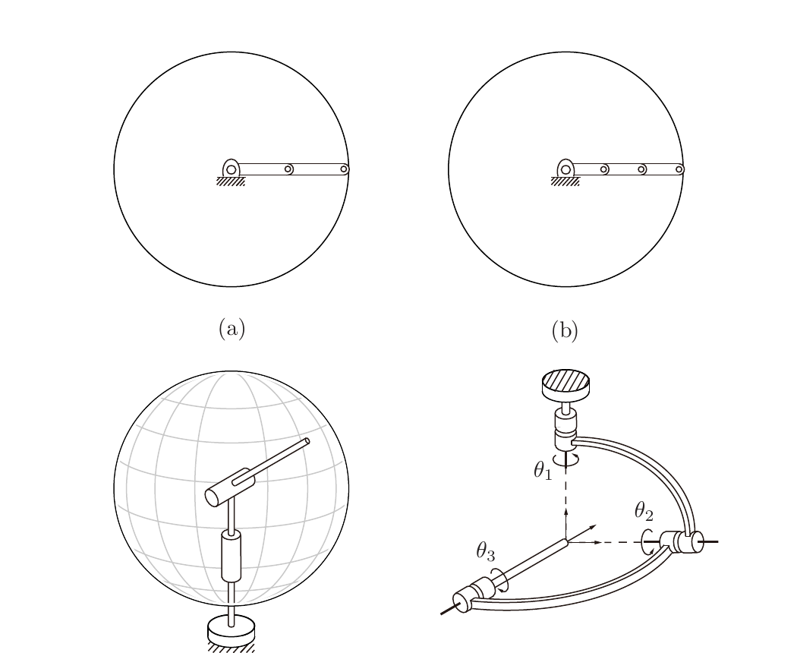

*来源：教材 Figure 2.12，书页 33／本地 PDF 第 52 页；局部截取。*

**教学目标**：区分任务空间与工作空间，并理解它们与机器人 C-space 的关系。

**讲解要点**：任务空间由任务需求决定，通常描述末端执行器坐标系的位姿；工作空间由机器人结构决定，描述末端实际可到达的构型。二者都可能忽略不重要的末端自由度，也都不一定唯一确定完整机器人构型。任务空间可包含不可达目标，工作空间只包含至少一个构型可达的点。

**检查题**：任务空间（task space）和工作空间（workspace）分别由什么决定？为什么它们都不等同于机器人的 C-space？

**参考答案**：任务空间由任务如何表达决定，工作空间由机器人结构的可达性决定。它们只描述末端相关的目标或可达集合；同一个末端点可能对应多个关节配置，因此不能完整指定机器人的全部构型。

**下一步**：完成这道概念检查，再学习 SCARA 与喷涂机器人例子。

## Session 018 - 第 2 章，第 2.5 节：SCARA 与喷涂机器人

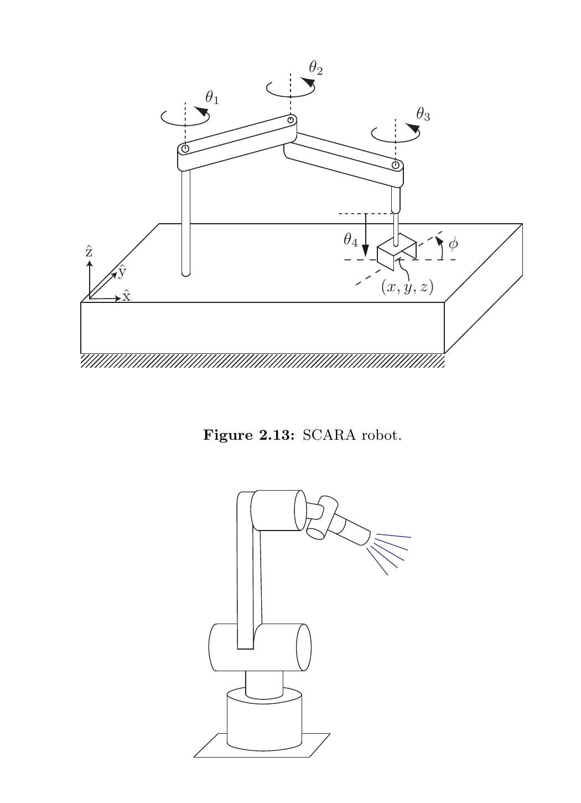

*来源：教材 Figure 2.13、Figure 2.14，书页 35／本地 PDF 第 54 页；合并局部截取。*

**教学目标**：用具体任务判断应保留哪些末端变量，理解任务空间不必包含所有姿态自由度。

**讲解要点**：SCARA 的末端任务变量是 $(x,y,z,\phi)$，典型任务空间为 $\mathbb{R}^3\times S^1$；喷涂喷嘴需要位置 $(x,y,z)$ 和喷射方向 $(\theta,\phi)$，绕喷嘴轴的滚转不重要，因此任务空间为 $\mathbb{R}^3\times S^2$。喷涂工作空间可取这些变量中的可达集合，也可为便于可视化只取可达位置。

**检查题**：为什么 SCARA 的任务空间需要位置加一个平面朝向，而喷涂机器人的任务空间需要位置加一个球面方向？

**参考答案**：SCARA 的桌面抓取/放置任务需要末端在平面内的朝向 $\phi$，但不需要完整三维姿态；喷嘴任务需要控制喷射方向，而绕喷嘴自身轴的旋转不影响喷漆，所以用球面方向 $(\theta,\phi)$，不再增加滚转角。

**下一步**：完成这道任务变量判断题，再进入第 2.6 节总结。

## Session 019 - 第 2 章，第 2.6 节：总结

**教学目标**：收束本章概念链，确认自由度、C-space、约束、任务空间和工作空间之间的关系。

**讲解要点**：本章从刚体自由度出发，推广到关节机器人和 Grübler 计数；再区分 C-space 的维数、拓扑和数值表示；最后区分完整/非完整约束，以及任务空间和工作空间。

**检查题**：如果只记住本章的一条主线，如何解释“机器人有多少自由度”“它的 C-space 是什么”“末端能完成什么任务”这三个问题之间的关系？

**参考答案**：先用连杆、关节和约束计算机器人的自由度，也就是 C-space 的维数；再判断各关节变量组合形成的 C-space 拓扑及其表示方式；最后根据任务需求定义任务空间，并根据机器人结构求出末端实际可达的工作空间。C-space 描述整个机器人，任务空间和工作空间只描述末端相关部分。

**下一步**：第 2 章学习记录收束；新会话从下一章开始。

---

[返回顶部](#第-2-章--构型空间qa) · [阅读首页](../../README.md) · [第 3 章 →](../ch03/ch03-rigid-body-motions-qa.md)
