# 互动学习记录

本文件只保存教师侧的学习设计与参考答案，不记录学习者的原始回答。

> 当前学习断点与练习状态统一见 [学习进度](../../progress.md)。下方 Session 保留历史教学记录，不作为实时进度摘要。

## Session 001 - 第 3 章章前导读：关于向量与参考系

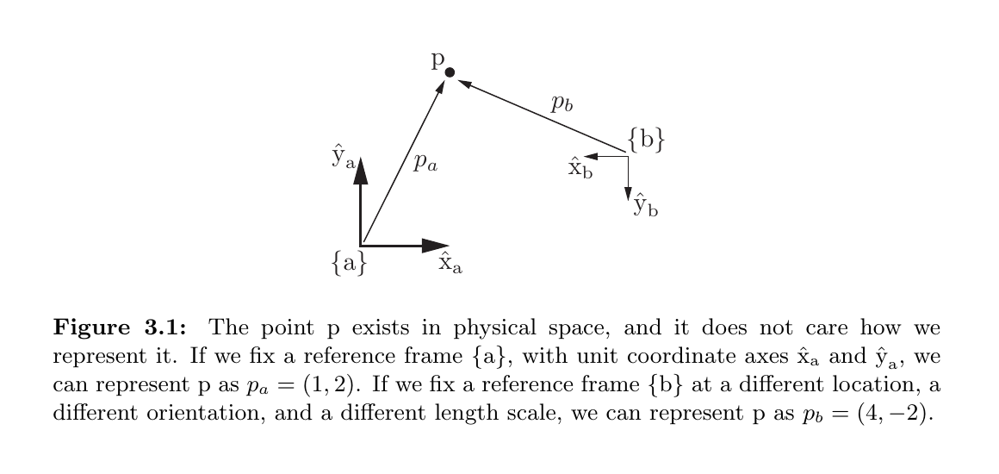

*来源：教材 Figure 3.1，书页 61／本地 PDF 第 80 页；局部截取。*

### 掌握目标

学习者能区分物理空间中的点/自由向量与它在特定参考系中的数值表示。

### 题目 1 - 同一点的两种坐标

**题目**：Figure 3.1 中 $p_a=(1,2)$、$p_b=(4,-2)$。为什么两个数组不同，却仍然可以表示同一个物理点 $p$？请同时说明“改变的是什么”与“不变的是什么”。

**预期答案／判定标准**：必须提到 $\{a\}$ 和 $\{b\}$ 的原点、方向或尺度不同，所以坐标数组改变；但物理空间中的点 $p$ 本身未变。只说“坐标系不同”但未区分对象与表示，不算完全掌握。

**最小提示**：想象用“校门”和“图书馆”两个不同原点报告同一座建筑的位置。

**追问（仅在回答混淆时使用）**：如果只更换参考系而不移动点 $p$，哪一项可能改变：点的物理位置，还是表示它的坐标数组？

**参考答案**：$p_a$ 和 $p_b$ 分别是点 $p$ 相对参考系 $\{a\}$ 和 $\{b\}$ 的坐标。因为两个参考系的原点、轴方向和尺度不同，数值表示会改变；不变的是物理空间中的同一点 $p$。

**教学意图**：建立本章所有坐标变换的核心区分：几何对象是坐标无关的，数值向量依赖所选参考系。

### 当时的下一步

继续教材章前导读中的 Figure 3.2，学习右手参考系和正转方向。

## Session 002 - 第 3 章章前导读：右手参考系与正转方向

### 教学目标

学习者能用右手法则确定坐标轴方向，并判断绕指定正轴的正旋转方向。

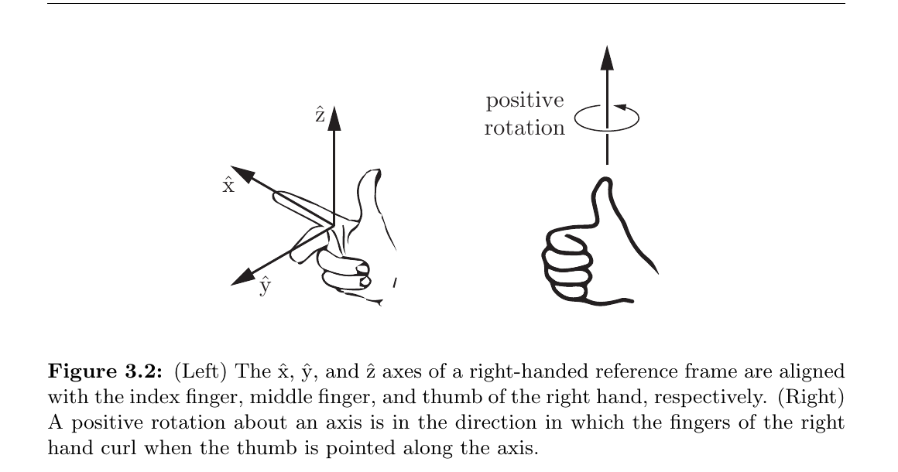

*来源：教材 Figure 3.2，书页 62／本地 PDF 第 81 页；局部截取。*

### 题目 1 - 绕 $+\hat{z}$ 轴的正转

**题目**：右手拇指指向 $+\hat{z}$ 轴时，弯曲的四指表示什么？若从 $+\hat{z}$ 轴朝原点看，这个方向是顺时针还是逆时针？

**预期答案／判定标准**：弯曲的四指表示绕 $+\hat{z}$ 轴的正旋转方向；从 $+\hat{z}$ 轴向原点看是逆时针。必须同时说出观察方向，因为“顺/逆时针”依赖从轴的哪一端观察。

**最小提示**：拇指朝向自己的眼睛时，看其余四指的弯曲趋势。

**参考答案**：四指弯曲方向定义了绕 $+\hat{z}$ 轴的正转方向。观察者位于 $+\hat{z}$ 轴一端并朝原点看时，它显示为逆时针。

**教学意图**：将抽象的正角定义转化为可操作的方向判断，并强调观察视角必须明确。

### 下一步

进入第 3.1 节，使用 Figure 3.3 学习如何用位置和朝向描述平面刚体构型。

## Session 003 - 第 3.1 节：用位置与朝向描述平面刚体

### 教学目标

学习者能识别平面刚体的三个构型变量，并说明位置向量 $p$ 为什么不能单独确定刚体构型。

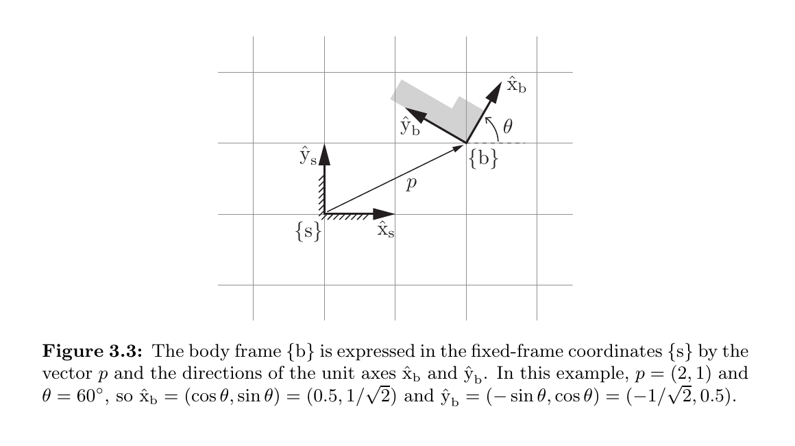

*来源：教材 Figure 3.3，书页 63／本地 PDF 第 82 页；局部截取。*

### 题目 1 - 三个构型变量

**题目**：若已知 Figure 3.3 中物体参考系原点的位置 $p=(p_x,p_y)$，为什么还不能唯一确定灰色刚体的构型？还需要哪个变量？

**预期答案／判定标准**：$p_x,p_y$ 只确定物体参考系原点在平面中的位置；刚体仍可以绕该原点转动而改变朝向。还需要朝向角 $\theta$，所以完整构型由 $(p_x,p_y,\theta)$ 描述。

**最小提示**：想象用图钉把灰色刚体的 $\{b\}$ 原点固定住，刚体还能做什么？

**参考答案**：只知道 $p$ 时，只知道 $\{b\}$ 的原点在哪里；刚体仍可绕该点转动，所以它的朝向尚未确定。再给出 $\theta$ 后，$(p_x,p_y,\theta)$ 才能完整确定其构型。

**教学意图**：把第 2 章的“平面刚体有 3 个自由度”迁移到第 3 章的参考系表示，并再次区分位置与朝向。

### 下一步

继续学习如何将 $\hat{x}_b,\hat{y}_b$ 组合成平面旋转矩阵。

## Session 004 - 第 3.1 节：平面旋转矩阵

### 教学目标

学习者能解释平面旋转矩阵 $P$ 的两列分别表示什么，而不把矩阵只当作需要背诵的三角函数排列。

### 题目 1 - 矩阵的两列

**题目**：在

$$
P
=
\begin{bmatrix}
\cos\theta & -\sin\theta\\
\sin\theta & \cos\theta
\end{bmatrix}
$$

中，第一列和第二列分别表示哪根物体坐标轴？这两列的坐标是用参考系 $\{s\}$ 还是 $\{b\}$ 表示的？

**预期答案／判定标准**：第一列是 $\hat{x}_b$ 在 $\{s\}$ 中的坐标，第二列是 $\hat{y}_b$ 在 $\{s\}$ 中的坐标。必须同时说出“哪根轴”与“用哪个参考系表示”。

**最小提示**：回到记号 $P=[\hat{x}_b\ \hat{y}_b]$；方括号中的两个向量是按列并排的。

**参考答案**：$P$ 的第一列 $(\cos\theta,\sin\theta)^T$ 表示 $\hat{x}_b$ 在 $\{s\}$ 坐标中的方向；第二列 $(-\sin\theta,\cos\theta)^T$ 表示 $\hat{y}_b$ 在 $\{s\}$ 坐标中的方向。

**教学意图**：建立“旋转矩阵的列就是旋转后坐标轴的方向”这一几何解释，为下一步坐标转换作准备。

### 下一步

用 $\theta=90^\circ$ 检查旋转矩阵的数值含义。

## Session 005 - 第 3.1 节：$90^\circ$ 旋转的数值检查

### 教学目标

学习者能将具体旋转矩阵的列转换回物体坐标轴在固定参考系中的实际方向。

### 题目 1 - 两根轴转到了哪里

**题目**：当

$$
P
=
\begin{bmatrix}
0 & -1\\
1 & 0
\end{bmatrix}
$$

时，$\hat{x}_b$ 和 $\hat{y}_b$ 分别指向 $\{s\}$ 的哪个方向？

**预期答案／判定标准**：第一列 $(0,1)^T$ 表示 $\hat{x}_b=+\hat{y}_s$；第二列 $(-1,0)^T$ 表示 $\hat{y}_b=-\hat{x}_s$。

**最小提示**：分别读出矩阵的第一列和第二列，再将 $(1,0)^T$、$(0,1)^T$、$(-1,0)^T$ 与 $\pm\hat{x}_s,\pm\hat{y}_s$ 对应。

**参考答案**：$\hat{x}_b$ 指向 $+\hat{y}_s$，$\hat{y}_b$ 指向 $-\hat{x}_s$。这表示 $\{b\}$ 相对 $\{s\}$ 逆时针旋转了 $90^\circ$。

**教学意图**：将矩阵中的数值与坐标轴的几何方向直接对应，避免只会代入三角函数。

### 下一步

进入 Figure 3.4，学习参考系的复合与坐标转换。

## Session 006 - 第 3.1 节：Figure 3.4 的位置复合

### 教学目标

学习者能说明为什么 $q$ 必须先经过 $P$ 转换，才能与 $p$ 相加。

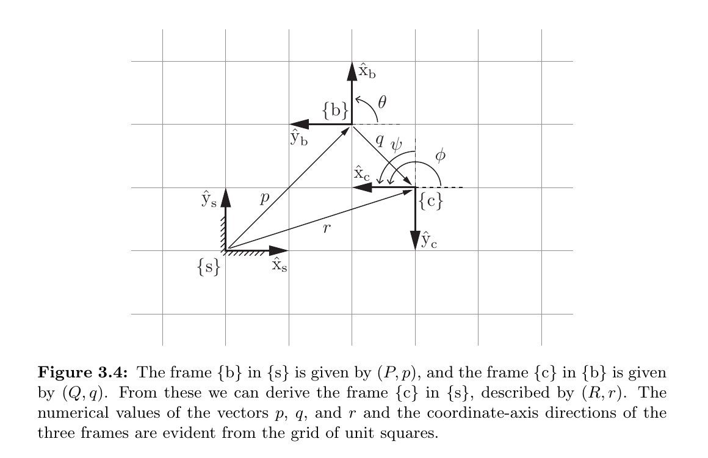

*来源：教材 Figure 3.4，书页 64／本地 PDF 第 83 页；局部截取。*

### 题目 1 - 为什么不能直接计算 $p+q$

**题目**：在 Figure 3.4 中，为什么 $\{c\}$ 在 $\{s\}$ 中的位置不能直接写成 $r=p+q$，而必须写成 $r=Pq+p$？

**预期答案／判定标准**：$p$ 用 $\{s\}$ 坐标表示，$q$ 用 $\{b\}$ 坐标表示，二者坐标基准不同，不能直接相加。$Pq$ 先把 $q$ 转换为 $\{s\}$ 坐标，才能与 $p$ 相加。

**最小提示**：先问自己：$p$ 和 $q$ 的两个数值分别是沿哪两根坐标轴量出来的？

**参考答案**：$p$ 和 $q$ 虽然都是位移向量，但 $p$ 的分量沿 $\hat{x}_s,\hat{y}_s$ 量取，$q$ 的分量沿 $\hat{x}_b,\hat{y}_b$ 量取。先乘 $P$ 将 $q$ 换算为 $\{s\}$ 坐标，得到 $Pq$，然后才能计算 $r=Pq+p$。

**教学意图**：建立“向量相加前必须先统一参考系”的操作原则，这是后续所有位姿复合的基础。

### 下一步

通过位置复合检查后，继续学习朝向复合 $R=PQ$。

## Session 007 - 第 3.1 节：Figure 3.4 的朝向复合

### 教学目标

学习者能说明 $R=PQ$ 中 $P$、$Q$ 的几何含义，并判断两个矩阵的作用顺序。


*来源：教材 Figure 3.4，书页 64／本地 PDF 第 83 页；局部截取。*

### 题目 1 - 哪个旋转矩阵先作用

**题目**：在 $R=PQ$ 中，若从一个用 $\{c\}$ 表示的方向出发，要依次把它转换到 $\{b\}$、再转换到 $\{s\}$，是 $P$ 先作用还是 $Q$ 先作用？为什么？

**预期答案／判定标准**：$Q$ 先作用，将 $\{c\}$ 坐标转换为 $\{b\}$ 坐标；$P$ 后作用，将 $\{b\}$ 坐标转换为 $\{s\}$ 坐标。矩阵乘法对列向量从右向左作用，因此总矩阵为 $PQ$。

**最小提示**：把一个列向量放在公式最右边：$PQv$。

**参考答案**：$Q$ 先作用，$P$ 后作用。若 $v$ 用 $\{c\}$ 表示，则 $Qv$ 是它在 $\{b\}$ 中的坐标，$P(Qv)$ 是它在 $\{s\}$ 中的坐标，所以复合矩阵是 $R=PQ$。

**教学意图**：建立矩阵复合“右边先作用”的顺序，并将其与参考系链条对应起来。

### 下一步

通过朝向复合检查后，将 $(R,r)=(PQ,Pq+p)$ 作为一个整体理解。

## Session 008 - 第 3.1 节：Figure 3.4 的完整位姿复合

### 教学目标

学习者能在一个简单数值例子中分别计算朝向复合与位置复合，并解释平移为什么不进入朝向公式。


*来源：教材 Figure 3.4，书页 64／本地 PDF 第 83 页；局部截取。*

### 题目 1 - 计算完整位姿

已知

$$
P=
\begin{bmatrix}
0 & -1\\
1 & 0
\end{bmatrix},
\qquad
p=
\begin{bmatrix}
2\\
3
\end{bmatrix},
\qquad
Q=I,
\qquad
q=
\begin{bmatrix}
1\\
0
\end{bmatrix}.
$$

**题目**：根据 $R=PQ$ 和 $r=Pq+p$，求 $R$ 与 $r$。

**预期答案／判定标准**：应得到 $R=P$，因为 $Q=I$；并算出 $Pq=(0,1)^T$、$r=(2,4)^T$。两个部分都正确才算通过。

**最小提示**：先分别计算 $PI$ 和 $P[1\ 0]^T$。

**参考答案**：

$$
R=PQ=PI=P
=
\begin{bmatrix}
0 & -1\\
1 & 0
\end{bmatrix},
$$

$$
r=Pq+p
=
\begin{bmatrix}
0\\
1
\end{bmatrix}
+
\begin{bmatrix}
2\\
3
\end{bmatrix}
=
\begin{bmatrix}
2\\
4
\end{bmatrix}.
$$

**教学意图**：把两条复合公式用于同一实例，检查学习者是否能区分朝向与位置的计算。

### 下一步

通过数值检查后，进入 Figure 3.5，区分“改变坐标表示”与“实际移动刚体”。

## Session 009 - 第 3.1 节：Figure 3.5 的刚体位移

### 教学目标

学习者能区分 Figure 3.4 的坐标变换与 Figure 3.5 的刚体位移，即使二者的公式形式相似。

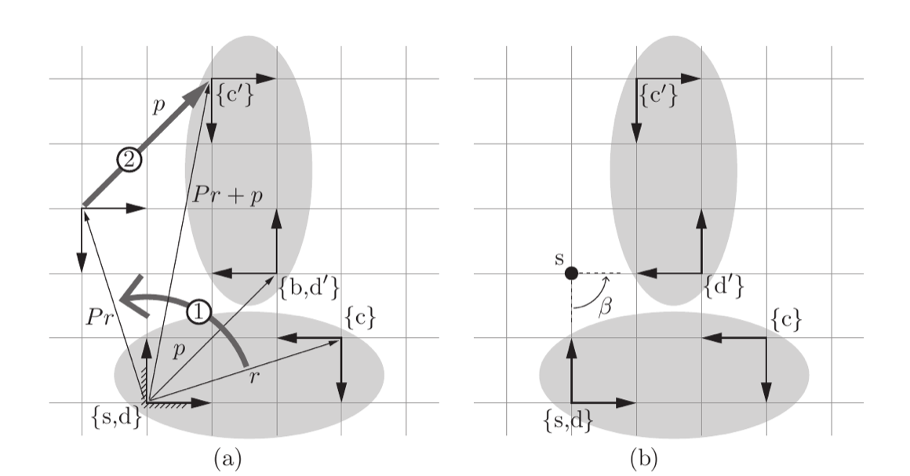

*来源：教材 Figure 3.5，书页 66／本地 PDF 第 85 页；局部截取。*

### 题目 1 - 相同公式背后的不同物理含义

**题目**：Figure 3.4 与 Figure 3.5 都出现“先乘旋转矩阵、再加平移向量”的形式。两幅图中，物理对象是否真的发生了运动？请分别说明。

**预期答案／判定标准**：Figure 3.4 中物理点或参考系没有移动，只将其表示从 $\{b\}$ 坐标转换为 $\{s\}$ 坐标；Figure 3.5 中刚体及其固连参考系从旧位置实际移动到了新位置。必须明确区分“表示改变”和“对象运动”。

**最小提示**：比较 Figure 3.4 的一个静态场景与 Figure 3.5 中灰色椭圆移动前后的两个位置。

**参考答案**：Figure 3.4 只改变描述同一几何对象所用的参考系，物理对象不动；Figure 3.5 的 $(P,p)$ 实际作用于刚体，使它先旋转再平移，固连在其上的 $\{c\}$ 也从 $\{c\}$ 移动到 $\{c'\}$。

**教学意图**：避免仅凭公式外形混淆被动的坐标变换与主动的刚体位移，为下一步理解 Figure 3.5(b) 的螺旋运动作准备。

### 下一步

通过区别检查后，继续 Figure 3.5(b)，将“旋转后平移”理解为绕固定点 $s$ 的等效旋转。

## Session 010 - 第 3.1 节：Figure 3.5(b) 的等效定点旋转

### 教学目标

学习者能说明 Figure 3.5(a) 与 (b) 为什么表示同一个刚体位移，并识别固定点 $s$ 的作用。


*来源：教材 Figure 3.5，书页 66／本地 PDF 第 85 页；局部截取。*

### 题目 1 - 固定点 $s$ 的作用

**题目**：在 Figure 3.5(b) 的等效描述中，点 $s$ 在刚体运动期间是否移动？它在这次运动中扮演什么角色？

**预期答案／判定标准**：点 $s$ 不移动；它是整个刚体以角度 $\beta=90^\circ$ 旋转时的固定旋转中心。若只回答“不移动”而未说明旋转中心，需追问。

**最小提示**：观察子图 (b) 中从 $s$ 指向刚体的虚线，以及标在 $s$ 附近的角度 $\beta$。

**参考答案**：点 $s$ 在这次运动中保持不动，它是等效旋转的固定中心；刚体绕它旋转 $\beta=90^\circ$ 后，到达与 Figure 3.5(a)“先旋转、再平移”相同的最终位姿。

**教学意图**：先建立平面螺旋运动的几何图像，再进入螺旋坐标与速度表示。

### 下一步

通过固定点检查后，学习平面螺旋运动的三个螺旋坐标 $(\beta,s_x,s_y)$。

## Session 011 - 第 3.1 节：平面螺旋坐标

### 教学目标

学习者能分别说明 $(\beta,s_x,s_y)$ 中旋转量与旋转中心的位置参数。


*来源：教材 Figure 3.5，书页 66／本地 PDF 第 85 页；局部截取。*

### 题目 1 - 三个坐标各描述什么

**题目**：在平面螺旋坐标 $(\beta,s_x,s_y)$ 中，哪个量描述旋转多少，哪两个量描述绕哪里旋转？

**预期答案／判定标准**：$\beta$ 描述旋转角度；$(s_x,s_y)$ 描述固定旋转中心 $s$ 在空间参考系 $\{s\}$ 中的位置。必须区分点 $s$ 与参考系 $\{s\}$。

**最小提示**：Figure 3.5(b) 中，角度标在弧线上，位置则由网格上的黑点给出。

**参考答案**：$\beta$ 是刚体绕固定点旋转的角度；$s_x$、$s_y$ 是固定点 $s$ 在参考系 $\{s\}$ 中的横、纵坐标。图中三者为 $(\pi/2,0,2)$。

**教学意图**：把平面螺旋运动拆成“旋转量”和“旋转轴位置”，为后续用角速度与线速度表示同一运动作准备。

### 下一步

通过参数含义检查后，学习螺旋轴 $S=(\omega,v_x,v_y)$ 的速度表示。

## Session 012 - 第 3.1 节：螺旋轴的速度表示

### 教学目标

学习者能区分螺旋轴 $S=(\omega,v_x,v_y)$ 中的 $v$ 与固定旋转中心 $s$ 的速度。


*来源：教材 Figure 3.5，书页 66／本地 PDF 第 85 页；局部截取。*

### 题目 1 - $v=(2,0)$ 是谁的速度

**题目**：Figure 3.5(b) 中 $S=(1,2,0)$，所以 $v=(2,0)$。这个 $v$ 是固定旋转中心 $s$ 的速度，还是位于空间参考系 $\{s\}$ 原点的刚体点的瞬时速度？固定点 $s$ 的速度是多少？

**预期答案／判定标准**：$v=(2,0)$ 是位于 $\{s\}$ 原点的刚体点的瞬时线速度；固定旋转中心 $s$ 的速度为零。必须正确区分两个点。

**最小提示**：旋转中心之所以称为“固定点”，意味着它本身不会沿圆周运动。

**参考答案**：$v=(2,0)$ 描述位于 $\{s\}$ 原点的刚体点在单位正角速度下的瞬时线速度，它向 $+\hat{x}_s$ 运动；旋转中心 $s$ 保持不动，所以其速度为零。

**教学意图**：防止把螺旋轴的线速度部分误认为轴上固定点的速度，为下一步理解指数坐标 $S\theta$ 和扭旋 $V=S\dot\theta$ 作准备。

### 下一步

通过速度对象检查后，学习用 $S\theta$ 表示有限位移的指数坐标。

## Session 013 - 第 3.1 节：有限位移的指数坐标

### 教学目标

学习者能区分归一化螺旋轴 $S$ 与实际运动量 $\theta$，并计算 $S\theta$。

### 题目 1 - 计算 $S\theta$

**题目**：已知 Figure 3.5 的螺旋轴 $S=(1,2,0)$，实际转角 $\theta=\pi/2$。求指数坐标 $S\theta$。

**预期答案／判定标准**：将 $S$ 的每个分量乘以 $\theta$，得到 $S\theta=(\pi/2,\pi,0)$。

**最小提示**：把标量 $\pi/2$ 分别乘到向量 $(1,2,0)$ 的三个分量上。

**参考答案**：

$$
S\theta
=(1,2,0)\frac{\pi}{2}
=\left(\frac{\pi}{2},\pi,0\right).
$$

**教学意图**：建立“归一化运动方向 $\times$ 运动大小”的分解，为下一步区分有限位移 $S\theta$ 与瞬时扭旋 $V=S\dot\theta$ 作准备。

### 下一步

通过计算后，学习扭旋 $V=S\dot\theta$ 及其与 $S\theta$ 的区别。

## Session 014 - 第 3.1 节：扭旋与瞬时速度

### 教学目标

学习者能区分有限运动量 $S\theta$ 与瞬时扭旋 $V=S\dot\theta$，并完成简单缩放计算。

### 题目 1 - 计算扭旋并判断含义

**题目**：若 $S=(1,2,0)$，当前旋转速率为 $\dot\theta=3\ \text{rad/s}$，求扭旋 $V=S\dot\theta$。它描述累计位移还是瞬时速度？

**预期答案／判定标准**：应得到 $V=(3,6,0)$，并明确它描述瞬时速度而非累计位移。

**最小提示**：将 $S$ 的每个分量乘以 $3$，再观察公式中使用的是 $\dot\theta$ 还是 $\theta$。

**参考答案**：

$$
V=S\dot\theta
=(1,2,0)\times3
=(3,6,0).
$$

它描述瞬时运动速度：角速度为 $3\ \text{rad/s}$，空间参考系原点处刚体点的线速度为 $(6,0)$。

**教学意图**：用数值计算固定 $\theta$ 与 $\dot\theta$ 的区别，并完成第 3.1 节最后一个概念检验。

### 下一步

通过后收束并整理第 3.1 节，再进入第 3.2 节「三维空间中的旋转与角速度」。

## Session 015 - 第 3.2.1 节：三维旋转矩阵的三列

### 教学目标

学习者能解释三维旋转矩阵 $R$ 的三列分别表示哪根物体坐标轴，以及这些坐标由哪个参考系表示。

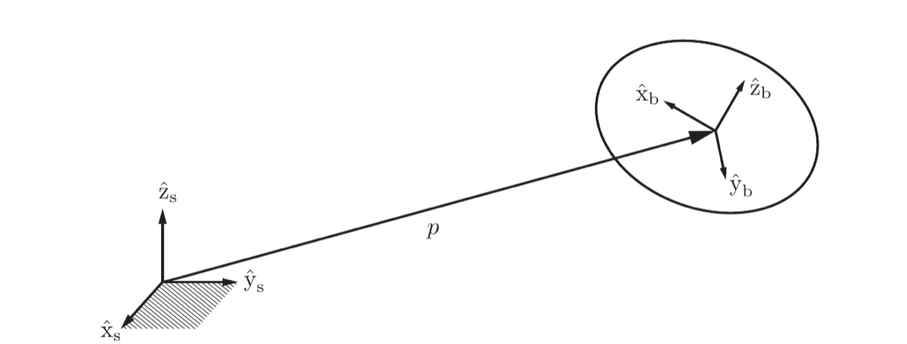

*来源：教材 Figure 3.6，书页 68／本地 PDF 第 87 页；局部截取。*

### 题目 1 - 第三列的几何含义

**题目**：在 $R=[\hat{x}_b\ \hat{y}_b\ \hat{z}_b]$ 中，第三列表示什么？它的三个分量是用 $\{s\}$ 还是 $\{b\}$ 的坐标轴量取的？

**预期答案／判定标准**：第三列表示物体坐标轴 $\hat{z}_b$ 的方向，其三个分量用空间参考系 $\{s\}$ 表示。必须同时答出“哪根轴”和“由哪个参考系表示”。

**最小提示**：回忆二维矩阵 $P=[\hat{x}_b\ \hat{y}_b]$ 的第二列如何解释。

**参考答案**：第三列 $(r_{13},r_{23},r_{33})^T$ 是 $\hat{z}_b$ 在固定参考系 $\{s\}$ 中的坐标表示。

**教学意图**：把第 3.1 节“旋转矩阵的列就是物体轴方向”的理解迁移到三维，为 $R^TR=I$ 的约束奠定几何基础。

### 下一步

通过列含义检查后，学习三列的单位长度与相互正交约束，并将它们合并为 $R^TR=I$。

## Session 016 - 第 3.2.1 节：旋转矩阵的正交约束

### 教学目标

学习者能把 $R^TR$ 的元素解释成旋转矩阵各列之间的点积，并由此理解 $R^TR=I$。

### 题目 1 - $(1,2)$ 元素表示什么

**题目**：若 $R=[\hat{x}_b\ \hat{y}_b\ \hat{z}_b]$，那么 $R^TR$ 的第 $(1,2)$ 个元素是哪两个向量的点积？它为什么应当等于多少？

**预期答案／判定标准**：第 $(1,2)$ 个元素是 $\hat{x}_b^T\hat{y}_b=\hat{x}_b\cdot\hat{y}_b$；因为两根坐标轴相互垂直，所以等于 $0$。

**最小提示**：$R^T$ 的第一行来自 $R$ 的第一列，随后与 $R$ 的第二列相乘。

**参考答案**：它是 $\hat{x}_b$ 与 $\hat{y}_b$ 的点积。两根轴正交，因此 $\hat{x}_b^T\hat{y}_b=0$，这对应单位矩阵 $I$ 的第 $(1,2)$ 个元素。

**教学意图**：让 $R^TR=I$ 不再只是需要记忆的代数条件，而是三根物体坐标轴保持单位长度和相互垂直的直接表达。

### 下一步

通过点积结构检查后，学习为什么还需要 $\det R=1$ 来排除左手系。

## Session 017 - 第 3.2.1 节：行列式与右手性

### 教学目标

学习者能说明为什么 $R^TR=I$ 仍不足以定义旋转矩阵，以及 $\det R=1$ 排除了什么变换。

### 题目 1 - 镜像矩阵是否为旋转矩阵

给定

$$
F=\operatorname{diag}(1,1,-1).
$$

**题目**：$F$ 满足 $F^TF=I$，但 $\det F$ 是多少？它能否作为旋转矩阵？

**预期答案／判定标准**：$\det F=-1$；它翻转 $z$ 轴并改变坐标系手性，是镜像反射而不是旋转矩阵。

**最小提示**：对角矩阵的行列式等于三个对角元素的乘积。

**参考答案**：$\det F=1\times1\times(-1)=-1$。虽然它的列仍单位正交，但它把右手系变为左手系，因此不属于旋转矩阵。

**教学意图**：区分“正交矩阵”和“旋转矩阵”，为特殊正交群 $SO(3)$ 的正式定义作准备。

### 下一步

通过镜像判断后，正式定义 $SO(3)$，并说明旋转矩阵为何只有 3 个连续自由度。

## Session 018 - 第 3.2.1 节：特殊正交群 $SO(3)$

### 教学目标

学习者能说出矩阵属于 $SO(3)$ 必须满足的两个条件，并解释它们各自排除什么。

### 题目 1 - $SO(3)$ 的成员条件

**题目**：一个实 $3\times3$ 矩阵 $R$ 要属于 $SO(3)$，必须同时满足哪两个条件？其中哪个条件排除镜像反射？

**预期答案／判定标准**：必须满足 $R^TR=I$ 和 $\det R=1$；其中 $\det R=1$ 排除行列式为 $-1$ 的镜像反射。

**最小提示**：“正交”对应一条矩阵等式，“特殊”对应一个行列式取值。

**参考答案**：$R^TR=I$ 保证各列单位且两两正交，$\det R=1$ 保证保持右手性并排除镜像反射；两者同时成立时 $R\in SO(3)$。

**教学意图**：固定 $SO(3)$ 的定义，为后续证明逆矩阵、复合与坐标变换性质提供统一语言。

### 下一步

通过定义检查后，进入第 3.2.1.1 节，学习旋转矩阵的群性质与 $R^{-1}=R^T$。

## Session 019 - 第 3.2.1.1 节：旋转矩阵的逆

### 教学目标

学习者能从 $R^TR=I$ 推出 $R^{-1}=R^T$，并解释它的几何含义。

### 题目 1 - 为什么转置就是逆

**题目**：已知旋转矩阵满足 $R^TR=I$。为什么可以直接得到 $R^{-1}=R^T$？从几何上看，$R^T$ 对原来的旋转做了什么？

**预期答案／判定标准**：$R^T$ 与 $R$ 相乘得到单位矩阵，因此按逆矩阵定义 $R^T=R^{-1}$；几何上它撤销原旋转或完成反方向的坐标转换。

**最小提示**：将 $R^TR=I$ 与逆矩阵定义 $R^{-1}R=I$ 对照。

**参考答案**：因为 $R^TR=I$，$R^T$ 正是乘在 $R$ 左侧并得到 $I$ 的逆矩阵，所以 $R^{-1}=R^T$。几何上，$R^T$ 将 $R$ 的旋转反向执行，把坐标转换回原参考系。

**教学意图**：把正交约束转化为可直接使用的求逆规则，并建立逆旋转的几何直觉。

### 下一步

通过逆矩阵检查后，验证两个旋转矩阵的乘积仍属于 $SO(3)$，理解封闭性。

## Session 020 - 第 3.2.1.1 节：旋转复合的封闭性

### 教学目标

学习者能在证明 $(AB)^T(AB)=I$ 时正确处理乘积转置的顺序。

### 题目 1 - 乘积转置的顺序

**题目**：若 $A,B\in SO(3)$，那么 $(AB)^T$ 应写成 $A^TB^T$ 还是 $B^TA^T$？利用正确顺序，$(AB)^T(AB)$ 最终等于什么？

**预期答案／判定标准**：$(AB)^T=B^TA^T$；代入 $A^TA=I$ 与 $B^TB=I$ 后得到 $(AB)^T(AB)=I$。

**最小提示**：把“先做 $B$、再做 $A$”反向撤销时，也要先撤销 $A$、再撤销 $B$。

**参考答案**：

$$
(AB)^T=B^TA^T,
$$

所以

$$
(AB)^T(AB)
=B^TA^TAB
=B^TIB
=I.
$$

**教学意图**：掌握乘积转置反序规则，并用它验证旋转复合保持正交性。

### 下一步

通过封闭性检查后，学习三维旋转乘法通常不满足交换律，而二维旋转是特殊例外。

## Session 021 - 第 3.2.1.1 节：三维旋转的非交换性

### 教学目标

学习者能根据矩阵从右向左作用的规则解释为什么 $AB$ 与 $BA$ 表示不同的旋转顺序。

### 题目 1 - 两个乘积的执行顺序

**题目**：$R_xR_yv$ 和 $R_yR_xv$ 分别先执行绕哪根轴的旋转？为什么这两个结果在三维中通常不同？

**预期答案／判定标准**：$R_xR_yv$ 先执行 $R_y$、再执行 $R_x$；$R_yR_xv$ 先执行 $R_x$、再执行 $R_y$。绕不同轴旋转会改变后续轴或向量的方向，因此顺序不同通常导致不同结果。

**最小提示**：矩阵乘列向量时，从最靠近向量的右侧矩阵开始。

**参考答案**：$R_xR_yv=R_x(R_yv)$，所以先绕 $y$ 轴、再绕 $x$ 轴；$R_yR_xv=R_y(R_xv)$，顺序相反。三维中两次旋转通常绕不同轴，第一步会改变第二步开始时的朝向，因此二者通常不相等。

**教学意图**：把非交换性与实际执行顺序联系起来，避免将矩阵乘法误当成可任意交换的标量乘法。

### 下一步

通过顺序检查后，学习旋转保持向量长度的性质 $\|Rx\|=\|x\|$。

## Session 022 - 第 3.2.1.1 节：旋转保持向量长度

### 教学目标

学习者能利用 $R^TR=I$ 说明为什么 $\|Rx\|=\|x\|$。

### 题目 1 - 推导中的关键一步

**题目**：在

$$
\|Rx\|^2=x^TR^TRx
$$

中，使用旋转矩阵的哪条性质，可以把右侧化简成 $x^Tx$？这说明旋转对向量长度有什么影响？

**预期答案／判定标准**：使用 $R^TR=I$；得到 $x^TIx=x^Tx$，说明旋转不改变向量长度。

**最小提示**：将 $R^TR$ 看成一个整体。

**参考答案**：因为 $R^TR=I$，所以 $x^TR^TRx=x^TIx=x^Tx$，进而 $\|Rx\|=\|x\|$；旋转只改变方向，不改变长度。

**教学意图**：将旋转矩阵的正交约束与刚性旋转不产生伸缩的物理意义联系起来。

### 下一步

通过长度保持检查后，进入第 3.2.1.2 节，学习旋转矩阵的三种用途，并使用 Figure 3.7 区分它们。

## Session 023 - 第 3.2.1.2 节：用旋转矩阵表示朝向

### 教学目标

学习者能正确读取 $R_{de}$ 的两个下标，区分被描述参考系与表示参考系。

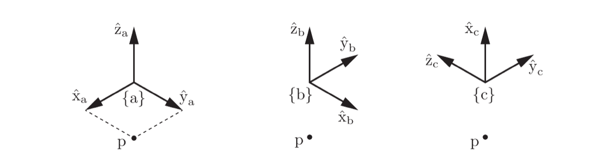

*来源：教材 Figure 3.7，书页 72／本地 PDF 第 91 页；局部截取。*

### 题目 1 - 读取 $R_{bc}$

**题目**：$R_{bc}$ 描述哪个参考系相对于哪个参考系的朝向？如果要反向描述同一对参考系，应写成什么，并如何用 $R_{bc}$ 表示？

**预期答案／判定标准**：$R_{bc}$ 描述 $\{c\}$ 相对 $\{b\}$ 的朝向；反向是 $R_{cb}=R_{bc}^{-1}=R_{bc}^T$。

**最小提示**：第二个下标是被描述者，第一个下标是描述者。

**参考答案**：$R_{bc}$ 用 $\{b\}$ 描述 $\{c\}$ 的朝向。反向描述为 $R_{cb}$，因为旋转矩阵的逆等于转置，所以 $R_{cb}=R_{bc}^T$。

**教学意图**：固定旋转矩阵的下标方向，为下一种用途中的下标消去规则 $R_{ab}R_{bc}=R_{ac}$ 作准备。

### 下一步

通过下标读取检查后，学习用途二“改变坐标表示”及下标消去规则。

## Session 024 - 第 3.2.1.2 节：改变坐标表示

### 教学目标

学习者能使用相邻下标消去规则确定旋转矩阵的乘法顺序。


*来源：教材 Figure 3.7，书页 72／本地 PDF 第 91 页；局部截取。*

### 题目 1 - 消去中间参考系

**题目**：已知 $R_{ab}$ 和 $R_{bc}$，要得到 $\{c\}$ 相对 $\{a\}$ 的朝向，应如何相乘？若点的坐标为 $p_b$，用哪个矩阵将它转换成 $p_a$？

**预期答案／判定标准**：$R_{ac}=R_{ab}R_{bc}$；$p_a=R_{ab}p_b$。应能说明相邻的 $b$ 下标消去。

**最小提示**：将中间重复的参考系写在两个相邻位置：$a\leftarrow b\leftarrow c$。

**参考答案**：

$$
R_{ac}=R_{ab}R_{bc},
\qquad
p_a=R_{ab}p_b.
$$

前一式消去相邻的 $b$，后一式也将 $p_b$ 的 $b$ 与 $R_{ab}$ 的第二下标匹配，最终留下 $a$。

**教学意图**：建立可操作的下标检查法，为后续多参考系姿态复合与坐标转换减少顺序错误。

### 下一步

通过下标消去检查后，使用 Figure 3.8 学习用途三“主动旋转向量或参考系”。

## Session 025 - 第 3.2.1.2 节：主动旋转参考系

### 教学目标

学习者能区分“坐标表示改变”与“参考系实际转动”，并将 Figure 3.8 中的最终朝向与 $R=\operatorname{Rot}(\hat{\omega},\theta)$ 对应。

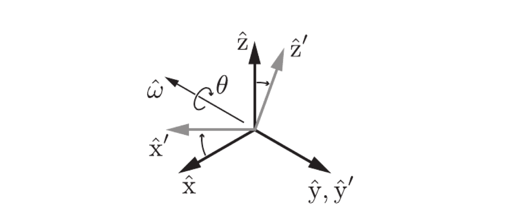

*来源：教材 Figure 3.8，书页 74／本地 PDF 第 93 页；局部截取。*

### 题目 1 - 哪一种东西真的变了

**题目**：Figure 3.8 中，初始坐标系从 $\{\hat{x},\hat{y},\hat{z}\}$ 围绕 $\hat{\omega}$ 旋到 $\{\hat{x}',\hat{y}',\hat{z}'\}$。这属于“仅改变坐标表示”还是“主动旋转”？具体是哪一个几何对象的朝向改变了？

**预期答案／判定标准**：这是主动旋转；坐标系的轴（或等价地，其朝向）在空间中实际改变，从初始朝向转到最终朝向。不能答成“同一个点不动、只换坐标”；那是用途二。

**最小提示**：比较黑色旧坐标轴与浅灰色新坐标轴：它们在图中是否指向同一方向？

**参考答案**：这是主动旋转。参考系本身的朝向发生了真实变化：旧轴 $\hat{x},\hat{y},\hat{z}$ 经绕 $\hat{\omega}$ 旋转 $\theta$ 后成为 $\hat{x}',\hat{y}',\hat{z}'$；最终朝向由 $R=\operatorname{Rot}(\hat{\omega},\theta)$ 表示。用途二则是物理对象不动，只改其坐标数组的写法。

**教学意图**：把同一旋转矩阵的两种语义清晰分开，避免后续左乘/右乘旋转时混淆“旋转轴在哪个参考系中表示”。

### 下一步

通过语义区分后，继续教材给出的绕 $\hat{x}$、$\hat{y}$、$\hat{z}$ 轴旋转矩阵，并以 Figure 3.8 检查它们的列向量含义。

## Session 026 - 第 3.2.1.2 节：绕坐标轴的基本旋转

### 教学目标

学习者能从基本旋转矩阵识别不变的旋转轴，并说明其余两个轴在哪里旋转。

### 题目 1 - 读出不变的旋转轴

**题目**：观察

$$
\operatorname{Rot}(\hat{z},\theta)=
\begin{bmatrix}
\cos\theta & -\sin\theta & 0\\
\sin\theta & \cos\theta & 0\\
0 & 0 & 1
\end{bmatrix}.
$$

哪根单位轴在此旋转中保持不变？其余两根轴在哪个平面内旋转？

**预期答案／判定标准**：$\hat{z}$ 保持不变，因为矩阵第三列为 $(0,0,1)^T$；$\hat{x}$ 与 $\hat{y}$ 在 $xy$ 平面内旋转。答出“第三列不变”或写出 $R\hat{z}=\hat{z}$ 均可。

**最小提示**：将矩阵乘以 $\hat{z}=(0,0,1)^T$，结果正好选出哪一列？

**参考答案**：$\hat{z}$ 保持不变，因为

$$
\operatorname{Rot}(\hat{z},\theta)\hat{z}
=
\begin{bmatrix}0\\0\\1\end{bmatrix}
=\hat{z}.
$$

所以旋转围绕 $z$ 轴进行；$\hat{x}$ 与 $\hat{y}$ 在垂直于该轴的 $xy$ 平面内旋转。

**教学意图**：从矩阵的列向量恢复几何动作，并把三维基本旋转与已学的二维平面旋转联系起来。

### 下一步

通过基本轴旋转检查后，学习任意单位轴的旋转公式及其与 $\hat{\omega}$ 的关系。

## Session 027 - 第 3.2.1.2 节：任意轴的轴角表示

### 教学目标

学习者能解释为何同时反转旋转轴与角度不会改变所表示的实际旋转。

### 题目 1 - 反转轴与角度

**题目**：下式是否表示同一个实际旋转？请用右手定则解释。

$$
\operatorname{Rot}(\hat{\omega},\theta)
=
\operatorname{Rot}(-\hat{\omega},-\theta).
$$

**预期答案／判定标准**：是。把轴反向后，正方向反过来；再把角度反号，旋转方向也反过来，两次反转抵消，所以空间中最终的旋转相同。

**最小提示**：先只把拇指从 $\hat{\omega}$ 改指向 $-\hat{\omega}$；此时“正转方向”发生了什么？

**参考答案**：两边表示同一个实际旋转。右手拇指改为指向 $-\hat{\omega}$ 时，正转方向与原先相反；再把 $\theta$ 改成 $-\theta$ 又反转一次旋转方向，最终几何动作与绕 $\hat{\omega}$ 转 $\theta$ 完全一致。

**教学意图**：建立轴角表示的等价性，为后续从旋转矩阵提取轴与角、以及指数坐标表示作准备。

### 下一步

通过轴角等价性检查后，进入 Figure 3.9，区分旋转轴在空间参考系还是物体参考系中表示时的左乘与右乘。

## Session 028 - 第 3.2.1.2 节：空间轴与物体轴旋转

### 教学目标

学习者能根据旋转轴在哪个参考系中表示，选择 $R$ 对 $R_{sb}$ 的正确乘法一侧。

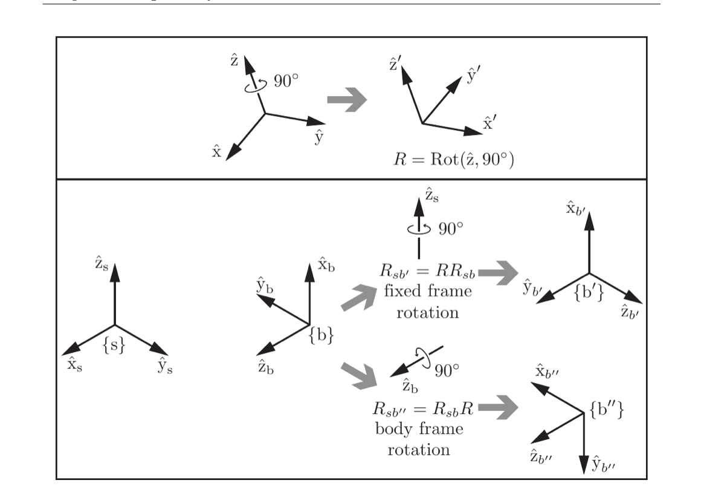

*来源：教材 Figure 3.9，书页 75／本地 PDF 第 94 页；局部截取。*

### 题目 1 - 固定在空间中的旋转轴

**题目**：若要把物体参考系 $\{b\}$ 绕固定的空间轴 $\hat{z}_s$ 旋转 $90^\circ$，新朝向应写成 $R_{sb'}=R R_{sb}$ 还是 $R_{sb'}=R_{sb}R$？为什么？

**预期答案／判定标准**：$R_{sb'}=R R_{sb}$。因为旋转轴以空间参考系 $\{s\}$ 表示、固定在空间中，所以是空间参考系旋转，$R$ 必须左乘。

**最小提示**：Figure 3.9 的上支路标注为 fixed frame rotation，观察 $R$ 位于 $R_{sb}$ 的哪一侧。

**参考答案**：

$$
R_{sb'}=R R_{sb}.
$$

绕 $\hat{z}_s$ 的轴属于固定空间参考系 $\{s\}$，不随物体移动；因此按教材约定进行左乘，即空间参考系旋转。

**教学意图**：让矩阵乘法方向从“记忆规则”转化为“旋转轴属于哪个参考系”的判断。

### 下一步

通过空间轴旋转检查后，反向比较绕物体轴 $\hat{z}_b$ 的右乘规则，并解释它为何通常与左乘结果不同。

## Session 029 - 第 3.2.1.2 节：物体轴旋转

### 教学目标

学习者能在旋转轴固连于物体参考系时写出正确的右乘公式。

### 题目 1 - 随物体转动的旋转轴

**题目**：现在改为将 $\{b\}$ 绕它自身的 $\hat{z}_b$ 轴旋转 $90^\circ$。新朝向应写成 $R_{sb''}=R R_{sb}$ 还是 $R_{sb''}=R_{sb}R$？说明旋转轴为什么不再是固定空间轴。

**预期答案／判定标准**：$R_{sb''}=R_{sb}R$。$\hat{z}_b$ 是物体参考系的一根轴，物体改变朝向时它的空间方向也改变，因此是物体参考系旋转，$R$ 右乘。

**最小提示**：Figure 3.9 的下支路标注为 body frame rotation；矩阵 $R$ 出现在 $R_{sb}$ 的右侧。

**参考答案**：

$$
R_{sb''}=R_{sb}R.
$$

$\hat{z}_b$ 固连在物体上，并非空间中的固定方向；它随 $\{b\}$ 的姿态而动。因此以物体轴旋转时，使用右乘。

**教学意图**：让“右乘”来自旋转轴随物体运动的物理含义，并与上一题的固定空间轴左乘形成对照。

### 下一步

比较同一数值 $R$ 左乘和右乘为何通常给出不同结果，并将这一差异连接到三维旋转的非交换性。

## Session 030 - 第 3.2.1.2 节：主动旋转一个向量

### 教学目标

学习者能说明 $v'=Rv$ 表示物理向量被主动旋转，而不是其坐标表示被改写。

### 题目 1 - 向量到底动没动

**题目**：比较

$$
v'=Rv
\qquad\text{和}\qquad
p_a=R_{ab}p_b.
$$

第一式中物理向量是否真的改变方向？第二式中物理点是否移动？请分别说明。

**预期答案／判定标准**：第一式是主动旋转，物理向量方向改变；第二式是坐标表示转换，物理点没有移动，只是数值坐标由 $\{b\}$ 改用 $\{a\}$ 表示。

**最小提示**：先为每个式子问一句：“等号左右是在说两个不同的几何对象，还是同一对象的两种数值描述？”

**参考答案**：在 $v'=Rv$ 中，$R$ 被施加为真实旋转操作，所以 $v'$ 是方向已改变的新物理向量；在 $p_a=R_{ab}p_b$ 中，$p_a,p_b$ 描述同一个没有移动的物理点，只是所用参考系不同。

**教学意图**：巩固本节三种旋转矩阵用途的语义边界，为下一节“角速度”中真正随时间变化的坐标轴作准备。

### 下一步

通过主动旋转与坐标转换的语义检查后，进入第 3.2.2 节，使用 Figure 3.10 学习瞬时角速度。

## Session 031 - 第 3.2.2 节：瞬时角速度与坐标轴导数

### 教学目标

学习者能从 $\omega=\hat{\omega}\dot{\theta}$ 读出瞬时旋转轴与转速，并解释为何单位坐标轴的导数由叉积给出。

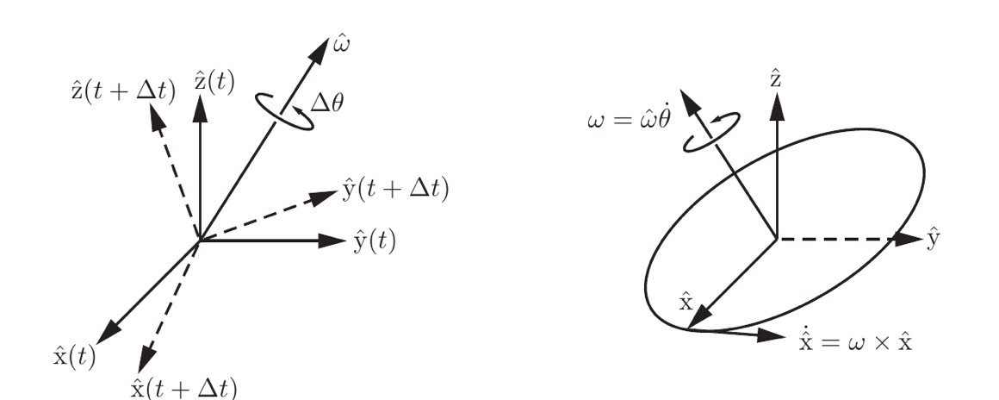

*来源：教材 Figure 3.10，书页 76／本地 PDF 第 95 页；局部截取。*

### 题目 1 - 从角速度判断不变的轴

**题目**：若某时刻 $\omega=\dot{\theta}\hat{z}$ 且 $\dot{\theta}>0$，哪根单位轴的方向在该瞬间不变？请写出 $\dot{\hat{x}}$，并说明它为何与 $\hat{x}$ 垂直。

**预期答案／判定标准**：$\hat{z}$ 不变，因为 $\omega\times\hat{z}=0$；$\dot{\hat{x}}=\dot{\theta}\hat{z}\times\hat{x}=\dot{\theta}\hat{y}$。叉积结果垂直于两个输入向量，因此垂直于 $\hat{x}$，符合单位长度不变、仅改变方向。

**最小提示**：将 $\omega$ 代入 $\dot{\hat{z}}=\omega\times\hat{z}$ 和 $\dot{\hat{x}}=\omega\times\hat{x}$；回忆右手系 $\hat{z}\times\hat{x}=\hat{y}$。

**参考答案**：

$$
\dot{\hat{z}}
=
\dot{\theta}\hat{z}\times\hat{z}
=0,
$$

所以 $\hat{z}$ 在此刻方向不变。并且

$$
\dot{\hat{x}}
=
\dot{\theta}\hat{z}\times\hat{x}
=
\dot{\theta}\hat{y}.
$$

叉积总是垂直于 $\hat{x}$，因此 $\dot{\hat{x}}$ 只改变 $\hat{x}$ 的方向而不改变其长度。

**教学意图**：把角速度向量的方向、大小和叉积导数统一到一个可计算的瞬时几何图像中。

### 题目 2 - 两种角速度坐标与 $\dot R$

**题目**：设 $R=R_{sb}$，同一个角速度分别写为 $\omega_s$ 与 $\omega_b$。请写出它们之间的坐标转换，以及 $\dot R$ 的空间参考系与物体参考系两种矩阵形式。最后说明：若 $\omega=\dot{\theta}\hat{z}$，为何 $\dot{\hat{z}}=0$？

**预期答案／判定标准**：

$$
\omega_s=R_{sb}\omega_b,
\qquad
\omega_b=R_{sb}^T\omega_s,
\qquad
\dot R=[\omega_s]R=R[\omega_b].
$$

并应说明 $\dot{\hat{z}}=\omega\times\hat{z}=\dot{\theta}\hat{z}\times\hat{z}=0$。

**最小提示**：先把 $\omega$ 当成第 3.1 节的普通向量做坐标转换；再记住“空间坐标在左，物体坐标在右”。

**参考答案**：

$$
\omega_s=R_{sb}\omega_b,
\qquad
\omega_b=R_{sb}^T\omega_s,
$$

$$
\dot R=[\omega_s]R=R[\omega_b].
$$

这两式描述的是同一个几何角速度，只是用不同参考系写出。若 $\omega=\dot{\theta}\hat{z}$，则

$$
\dot{\hat{z}}
=
\omega\times\hat{z}
=
\dot{\theta}\hat{z}\times\hat{z}
=0,
$$

因为向量与自身的叉积为零。

**教学意图**：把瞬时几何图像、坐标转换、叉积矩阵及旋转矩阵微分统一起来，防止将 $\omega_s,\omega_b$ 误认为两种物理运动。

### 下一步

通过空间/物体坐标与 $\dot R$ 的综合检查后，进入第 3.2.3 节，学习旋转的指数坐标表示。

## Session 032 - 第 3.2.3 与 3.2.3.1 节：旋转的指数坐标与矩阵指数

### 教学目标

学习者能从 $\hat{\omega}\theta$ 读出旋转轴和角度，说明它为何也可看成单位时间内积累的恒定角速度，并正确使用 Proposition 3.10 的矩阵指数性质。

### 题目 1 - 从指数坐标回到几何旋转

**题目**：若某旋转的指数坐标为

$$
\hat{\omega}\theta=
\begin{bmatrix}
0\\
0\\
\pi/2
\end{bmatrix},
$$

可取哪条单位旋转轴与哪个旋转角？若将它解释为“恒定角速度持续一个单位时间”，该角速度向量是什么？

**预期答案／判定标准**：可取 $\hat{\omega}=\hat{z}$、$\theta=\pi/2$；单位时间的恒定角速度为 $\omega=\hat{\omega}\theta=(0,0,\pi/2)^T$。应说明它表示绕 $+\hat{z}$ 按右手定则转 $90^\circ$。

**最小提示**：指数坐标向量的长度给出角度，方向给出单位旋转轴。

**参考答案**：

$$
\hat{\omega}=\hat{z},
\qquad
\theta=\frac{\pi}{2}.
$$

因此它表示绕 $+\hat{z}$ 轴正向转 $90^\circ$。若持续时间为 $1$，恒定角速度为

$$
\omega
=
\hat{\omega}\theta
=
\begin{bmatrix}
0\\
0\\
\pi/2
\end{bmatrix}.
$$

**教学意图**：将有限旋转、单位时间累计的恒定角速度，以及三参数向量表示连接起来，为 $e^{[\hat{\omega}]\theta}$ 的旋转公式铺路。

### 题目 2 - Proposition 3.10 的使用条件

**题目**：对 $\dot{x}=Ax,\ x(0)=x_0$，写出解。若 $A=PDP^{-1}$，如何计算 $e^{At}$？此外，$e^Ae^B=e^{A+B}$ 需要满足什么条件，$\left(e^A\right)^{-1}$ 等于什么？

**预期答案／判定标准**：

$$
x(t)=e^{At}x_0,
\qquad
e^{At}=Pe^{Dt}P^{-1}.
$$

若 $AB=BA$，则保证 $e^Ae^B=e^{A+B}$；这是充分条件。另有 $\left(e^A\right)^{-1}=e^{-A}$。

**最小提示**：矩阵指数保留了部分标量指数规律，但矩阵乘法通常不交换。

**参考答案**：

$$
x(t)=e^{At}x_0.
$$

若 $A=PDP^{-1}$，则

$$
e^{At}=Pe^{Dt}P^{-1}.
$$

若 $AB=BA$，教材保证下式成立：

$$
e^Ae^B=e^{A+B}.
$$

同时

$$
\left(e^A\right)^{-1}=e^{-A}.
$$

**教学意图**：完整覆盖 Proposition 3.10，并强调矩阵指数和标量指数之间最容易被误用的交换条件。

### 下一步

通过指数坐标与 Proposition 3.10 的综合检查后，使用 Figure 3.11 学习向量绕任意轴旋转，并推导 $e^{[\hat{\omega}]\theta}$ 与 Rodrigues 公式。

## Session 033 - 第 3.2.3.2 节：Rodrigues 公式

当前学习记录：Session 032 按要求给出示范答案，未认定独立掌握；当前为 Session 033。

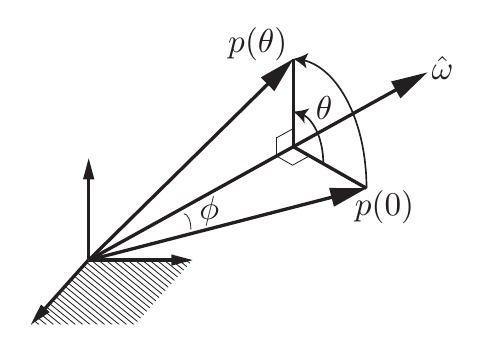

*来源：书页 83／本地 PDF 第 102 页；局部截取。*

**教学目标**：连接固定轴旋转微分方程、$W^3=-W$ 和 Proposition 3.11，应用公式计算向量旋转。

**题目**：绕 $+\hat z$ 转 $\pi/2$ 时，$p(0)=(1,0,1)^T$ 变为什么？哪个分量不变，为什么？

**参考答案／判定标准**：$(0,1,1)^T$；$z$ 分量沿旋转轴，保持不变。要求给出计算结果和几何解释。

**最小提示／追问**：将 $\sin(\pi/2)=1,\cos(\pi/2)=0$ 代入笔记末尾矩阵，再乘列向量。

**教学意图**：同时检查公式应用和轴向分量的几何含义。

**下一步**：展示 Figure 3.12 后学习 Example 3.12。

## Session 034 - 第 3.2.3.2 节：Example 3.12 与后续旋转

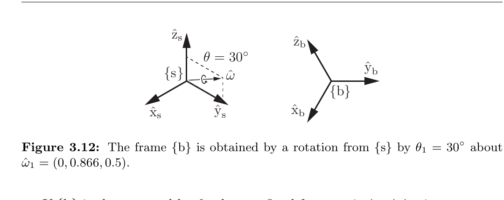

*来源：教材 Figure 3.12，书页 85／本地 PDF 第 104 页；局部截取。*

**教学目标**：使用 Rodrigues 公式把一般单位轴与角度转换为旋转矩阵，并用例题后的正文区分固定轴左乘和物体轴右乘。

**题目**：令 Example 3.12 得到的朝向为

$$
R\approx
\begin{bmatrix}
0.866&-0.250&0.433\\
0.250&0.967&0.058\\
-0.433&0.058&0.899
\end{bmatrix},
$$

再令 $Q=\operatorname{Rot}(\hat z,\pi/2)$。若第二次旋转分别绕固定轴 $\hat z_s$ 和物体轴 $\hat z_b$，写出新的矩阵乘法顺序，并分别求新矩阵的第一列。两者是否相同？

**参考答案／判定标准**：固定轴旋转为 $R'=QR$，其第一列是 $Q(0.866,0.250,-0.433)^T=(-0.250,0.866,-0.433)^T$；物体轴旋转为 $R''=RQ$，由于 $Qe_1=e_2$，其第一列是 $Re_2=(-0.250,0.967,0.058)^T$。两列不同，因此两个最终朝向不同。应同时写对乘法顺序并说明第一列的几何来源。

**最小提示**：左乘 $Q$ 会分别旋转 $R$ 的三列；右乘时先计算 $Qe_1$，再由 $R(Qe_1)$ 读出结果。

**教学意图**：把教材的 $R'\ne R''$ 从记忆规则变成可计算、可解释的列向量差异。

**学习证据**：学习者要求直接给出答案；本题作为示范收束，尚无独立作答证据。

**下一步**：收束 3.2.3.2，进入 3.2.3.3 旋转矩阵的矩阵对数。

## Session 035 - 第 3.2.3.3 节：矩阵对数的一般情形

**教学目标**：在 $0<\theta<\pi$ 时，由旋转矩阵的迹求旋转角，并由反对称部分 $R-R^T$ 求单位旋转轴。

**题目**：给定

$$
R=
\begin{bmatrix}
\tfrac12&-\tfrac{\sqrt3}{2}&0\\
\tfrac{\sqrt3}{2}&\tfrac12&0\\
0&0&1
\end{bmatrix},
$$

请依次使用

$$
\theta=\cos^{-1}\!\left(\frac{\operatorname{tr}R-1}{2}\right),
\qquad
[\hat\omega]=\frac{R-R^T}{2\sin\theta}
$$

求出 $\theta$、$\hat\omega$ 和指数坐标 $\hat\omega\theta$。

**参考答案／判定标准**：$\operatorname{tr}R=2$，故 $\theta=\cos^{-1}(1/2)=\pi/3$。又有

$$
R-R^T=
\begin{bmatrix}
0&-\sqrt3&0\\
\sqrt3&0&0\\
0&0&0
\end{bmatrix},
$$

且 $2\sin(\pi/3)=\sqrt3$，所以

$$
[\hat\omega]=
\begin{bmatrix}
0&-1&0\\
1&0&0\\
0&0&0
\end{bmatrix},
\qquad
\hat\omega=(0,0,1)^T,
\qquad
\hat\omega\theta=(0,0,\pi/3)^T.
$$

需按“先角度、后轴”的顺序计算，并说明 $R-R^T$ 提取的是反对称部分。

**最小提示**：先只计算三个对角元素之和；求得 $\theta$ 后，再计算分母 $2\sin\theta$。

**教学意图**：让矩阵对数的一般公式从抽象逆映射落实为完整计算，并为辨认 $\theta=0,\pi$ 时公式失效作准备。

**学习证据**：学习者要求直接给出答案；本题作为示范收束，尚无独立作答证据。

**下一步**：学习 $\theta=0$ 与 $\theta=\pi$ 的特殊情形和完整矩阵对数算法。

## Session 036 - 第 3.2.3.3 节：矩阵对数的特殊情形

**教学目标**：根据 $R=I$、$\operatorname{tr}R=-1$ 或其他情况选择正确的矩阵对数分支，并在 $\theta=\pi$ 时由 $R+I=2\hat\omega\hat\omega^T$ 恢复旋转轴。

**题目**：给定

$$
R=
\begin{bmatrix}
-1&0&0\\
0&1&0\\
0&0&-1
\end{bmatrix},
$$

判断它属于矩阵对数算法的哪个分支，并求出一组 $\theta$、$\hat\omega$ 与指数坐标 $\hat\omega\theta$。说明为什么一般公式 $(R-R^T)/(2\sin\theta)$ 在这里不能使用。

**参考答案／判定标准**：$\operatorname{tr}R=-1$，故属于 $\theta=\pi$ 分支。选择式 (3.59)，

$$
\hat\omega
=
\frac{1}{\sqrt{2(1+r_{22})}}
\begin{bmatrix}r_{12}\\1+r_{22}\\r_{32}\end{bmatrix}
=
\frac12
\begin{bmatrix}0\\2\\0\end{bmatrix}
=
\begin{bmatrix}0\\1\\0\end{bmatrix}.
$$

因此可取

$$
\theta=\pi,
\qquad
\hat\omega=(0,1,0)^T,
\qquad
\hat\omega\theta=(0,\pi,0)^T.
$$

取 $-\hat\omega$ 也表示同一个 $\pi$ 旋转。一般公式不能使用，因为 $\sin\pi=0$；同时 $R=R^T$ 使 $R-R^T=0$，无法从反对称部分恢复轴。

**最小提示**：先计算 $\operatorname{tr}R$；三个候选式中，选择与 $r_{22}=1$ 对应的式 (3.59)。

**教学意图**：让学习者根据矩阵特征选择算法分支，而不是无条件套用一般公式。

**学习证据**：学习者选择继续，本题由教师给出示范答案，尚无独立作答证据。

**下一步**：截取并学习 Figure 3.13，用半径为 $\pi$ 的实心球理解 $SO(3)$ 的指数坐标及边界对径点等价。

## Session 037 - 第 3.2.3.3 节：$SO(3)$ 的指数坐标球

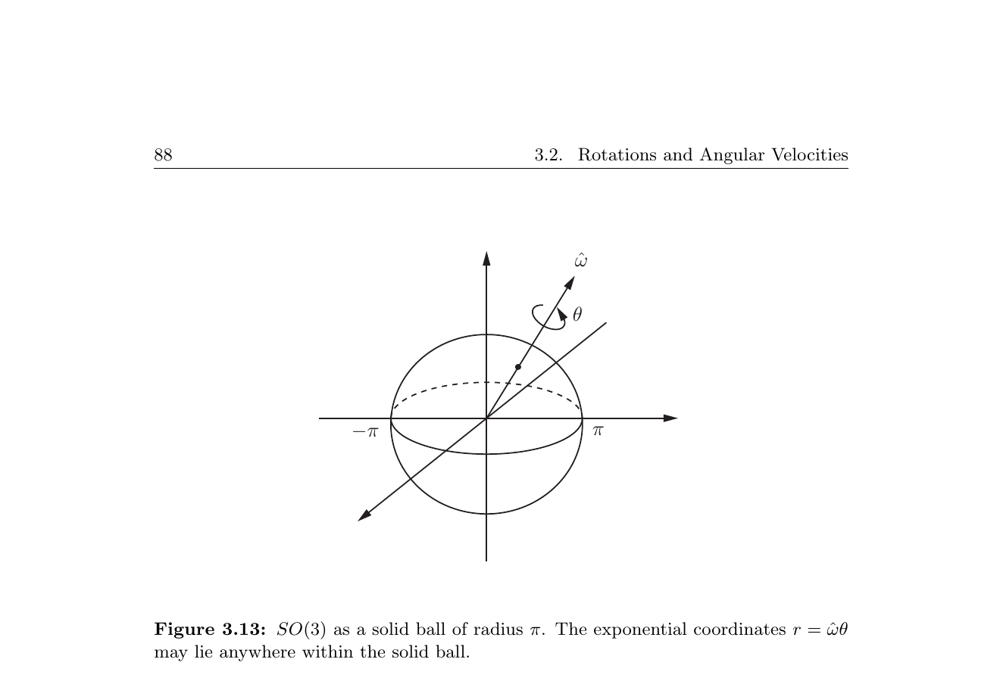

*来源：教材 Figure 3.13，书页 88／本地 PDF 第 107 页；局部截取。*

**教学目标**：从 $r=\hat\omega\theta$ 的方向与长度理解半径为 $\pi$ 的指数坐标球，并准确判断球面上的对径点等价关系。

**题目**：令

$$
r_1=\frac{\pi}{\sqrt2}
\begin{bmatrix}1\\1\\0\end{bmatrix},
\qquad
r_2=-r_1,
\qquad
r_3=\frac{\pi}{\sqrt2}
\begin{bmatrix}1\\-1\\0\end{bmatrix}.
$$

这三个点都位于指数坐标球的球面上。判断 $r_1,r_2,r_3$ 中哪些表示同一个旋转，并用“旋转轴、角度和对径点”解释。

**参考答案／判定标准**：$r_1$ 和 $r_2$ 互为对径点，长度均为 $\pi$，分别表示绕相反轴旋转 $\pi$，因此对应同一个旋转。$r_3$ 虽然长度也是 $\pi$，但既不等于 $r_1$ 也不等于 $-r_1$，旋转轴不是同一直线，因而表示不同旋转。答案必须指出只有球面上的对径点成对等价，而不是整个球面等价。

**最小提示**：分别比较三个向量的长度和方向；在 $\theta=\pi$ 时，只有 $r$ 与 $-r$ 被识别为同一点。

**教学意图**：防止把“球面存在等价点”误解为“所有 $\pi$ 旋转相同”，并为收束 3.2 建立几何理解。

**学习证据**：学习者要求直接给出答案；本题作为示范收束，尚无独立作答证据。

**下一步**：收束 3.2，统一整理其标题层级和内部结构，再进入 3.3 刚体运动与扭旋。

## Session 038 - 第 3.3.1 节：$SE(3)$ 与齐次变换矩阵

**教学目标**：把朝向 $R$ 和位置 $p$ 正确装入 $T\in SE(3)$，并解释各矩阵块的物理含义。

**题目**：已知

$$
R_{sb}=
\begin{bmatrix}
0&-1&0\\
1&0&0\\
0&0&1
\end{bmatrix},
\qquad
p_{sb}=
\begin{bmatrix}1\\2\\3\end{bmatrix}.
$$

请写出 $T_{sb}\in SE(3)$，并说明它的左上 $3\times3$ 块、右上 $3\times1$ 块和最后一行分别表示什么。

**参考答案／判定标准**：

$$
T_{sb}=
\begin{bmatrix}
0&-1&0&1\\
1&0&0&2\\
0&0&1&3\\
0&0&0&1
\end{bmatrix}.
$$

左上块 $R_{sb}$ 表示 $\{b\}$ 相对于 $\{s\}$ 的朝向；右上块 $p_{sb}$ 表示 $\{b\}$ 原点在 $\{s\}$ 中的位置；最后一行是齐次结构，不是第四个物理坐标轴。

**最小提示**：使用 $T_{sb}=\begin{bmatrix}R_{sb}&p_{sb}\\0&1\end{bmatrix}$，把 $p_{sb}$ 放在第四列。

**教学意图**：先牢固建立矩阵分块和下标含义，为后续求逆、复合及作用于点作准备。

**学习证据**：学习者要求直接给出答案；本题作为示范收束，尚无独立作答证据。

**下一步**：进入 3.3.1.1，学习齐次变换矩阵的逆、封闭性、结合律、非交换性及几何保持性质。

## Session 039 - 第 3.3.1.1 节：齐次变换矩阵的性质

**教学目标**：会计算 $T^{-1}$ 和 $Tx$，理解齐次变换的复合结构，并用 $R^TR=I$ 解释距离与夹角为何保持。

**题目**：给定

$$
R=
\begin{bmatrix}
0&-1&0\\
1&0&0\\
0&0&1
\end{bmatrix},
\qquad
p=
\begin{bmatrix}1\\2\\0\end{bmatrix},
\qquad
T=(R,p),
$$

以及点 $x=(1,0,0)^T$。求 $Tx$、$T^{-1}$，并验证 $T^{-1}(Tx)=x$。最后说明为什么 $T^{-1}$ 的平移块不能一般地写成 $-p$。

**参考答案／判定标准**：

$$
Tx=Rx+p=
\begin{bmatrix}1\\3\\0\end{bmatrix}.
$$

因为 $R^Tp=(2,-1,0)^T$，

$$
T^{-1}
=
\begin{bmatrix}
0&1&0&-2\\
-1&0&0&1\\
0&0&1&0\\
0&0&0&1
\end{bmatrix}.
$$

应用逆变换，

$$
T^{-1}(Tx)
=R^T\left(
\begin{bmatrix}1\\3\\0\end{bmatrix}
-p
\right)
=R^T
\begin{bmatrix}0\\1\\0\end{bmatrix}
=
\begin{bmatrix}1\\0\\0\end{bmatrix}
=x.
$$

平移块必须是 $-R^Tp$，因为逆变换的位移要用反向参考系表示；只有某些特殊 $R,p$ 才会恰好等于 $-p$。

**最小提示**：先分开算 $Rx+p$；求逆时先算 $R^T$，再算 $-R^Tp$。

**教学意图**：把式 (3.64)—(3.65) 串成一次正向与逆向计算，并暴露最常见的 $-p$ 误用。

**学习证据**：学习者选择继续；本题由教师给出示范答案，尚无独立作答证据。

**下一步**：截取 Figure 3.14，进入 3.3.1.2，学习齐次变换矩阵的三种用途和多参考系下标规则。

## Session 040 - 第 3.3.1.2 节：表示位姿与改变参考系

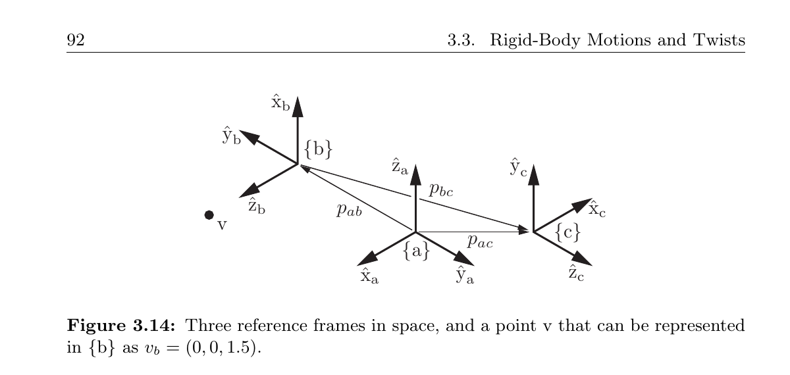

*来源：教材 Figure 3.14，书页 92／本地 PDF 第 111 页；局部截取。*

**教学目标**：区分齐次变换矩阵“表示参考系位姿”和“改变同一点的坐标表示”两种语义，并使用下标消去规则组织复合顺序。

**题目**：已知 $T_{ab}$、$T_{bc}$，且同一点在 $\{c\}$ 中的坐标为 $v_c$。请写出 $T_{ac}$ 和 $v_a$，并说明两个式子中相邻的哪个下标被消去。这里物理点 $v$ 是否移动？

**参考答案／判定标准**：

$$
T_{ac}=T_{ab}T_{bc},
\qquad
v_a=T_{ac}v_c=T_{ab}T_{bc}v_c.
$$

两个式子都逐步消去相邻的 $b$，最终保留从 $c$ 到 $a$ 的关系；在 $T_{bc}v_c$ 中还会消去 $c$。这是坐标表示转换，物理点没有移动。

**最小提示**：从右向左读：$c\rightarrow b\rightarrow a$。

**教学意图**：把矩阵乘法顺序与参考系下标绑定，避免只凭“左乘或右乘”的表面记忆。

**学习证据**：学习者要求直接给出答案；本题作为示范收束，尚无独立作答证据。

**下一步**：截取 Figure 3.15，继续用途三“主动位移”，学习固定参考系左乘、物体参考系右乘以及式 (3.66)—(3.67)。

## Session 041 - 第 3.3.1.2 节：固定系左乘与物体系右乘

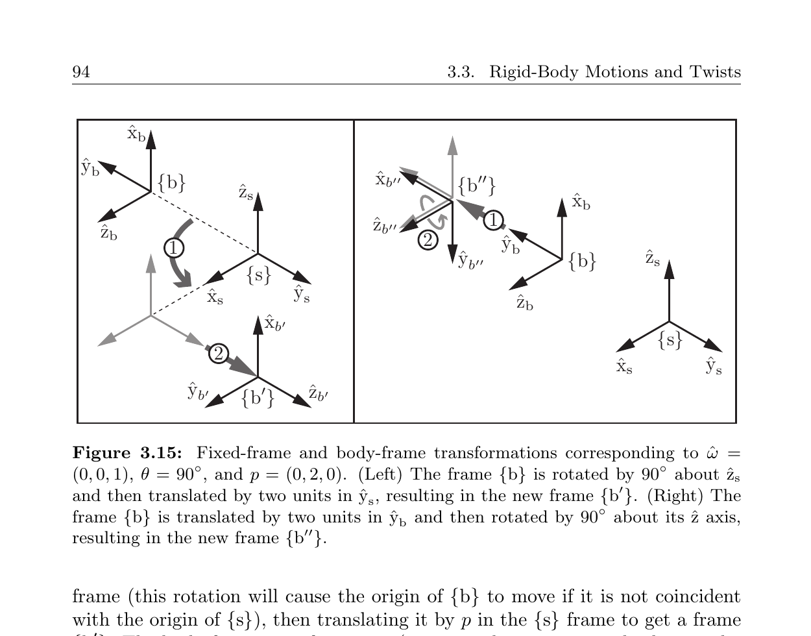

*来源：教材 Figure 3.15，书页 94／本地 PDF 第 113 页；局部截取。*

**教学目标**：根据平移量在哪个参考系中表达，正确区分固定参考系左乘与物体参考系右乘。

**题目**：设

$$
R_{sb}=\operatorname{Rot}(\hat z,\pi/2),
\qquad p_{sb}=0,
\qquad T=\operatorname{Trans}\!\left(\begin{bmatrix}1\\0\\0\end{bmatrix}\right).
$$

分别计算左乘 $TT_{sb}$ 和右乘 $T_{sb}T$ 的新位置向量。再说明：两次平移分别沿空间参考系的哪条轴、物体参考系的哪条轴？为什么数值结果不同？

**参考答案／判定标准**：左乘时

$$
p'_{sb}=p_{sb}+p=
\begin{bmatrix}1\\0\\0\end{bmatrix},
$$

即沿空间参考系的 $+\hat x_s$ 平移。右乘时

$$
p''_{sb}=p_{sb}+R_{sb}p
=R_{sb}\begin{bmatrix}1\\0\\0\end{bmatrix}
=\begin{bmatrix}0\\1\\0\end{bmatrix},
$$

即沿物体参考系的 $+\hat x_b$ 平移；在空间参考系中，当前 $+\hat x_b$ 正好指向 $+\hat y_s$。两者使用相同数字 $p$，但数字所依附的参考系不同。

**最小提示**：只比较式 (3.66)、(3.67) 的平移块：$Rp_{sb}+p$ 与 $R_{sb}p+p_{sb}$。

**教学意图**：用纯平移隔离“左/右乘决定参数所属参考系”这一核心语义，为后续螺旋运动与空间/物体旋量作准备。

**学习证据**：学习者选择继续；本题由教师给出示范答案，尚无独立作答证据。左乘位置为 $(1,0,0)^T$，右乘位置为 $(0,1,0)^T$。

**下一步**：进入 Figure 3.16 与 Example 3.19，综合齐次变换的多参考系链。

## Session 042 - 第 3.3.1.2 节：Example 3.19 多参考系位姿链

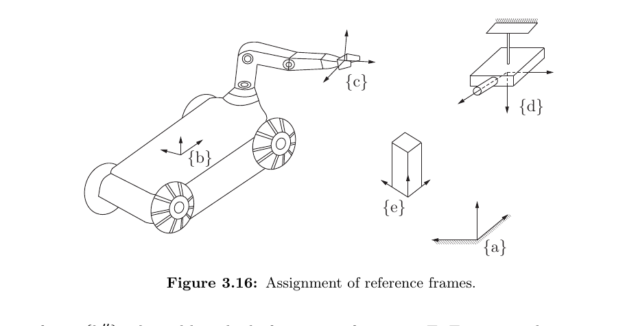

*来源：教材 Figure 3.16，书页 95／本地 PDF 第 114 页；局部截取。*

**教学目标**：不依赖图形直觉猜测乘法顺序，而是用下标消去构造机械手与物体之间的相对位姿。

**题目**：已知 $T_{db}$、$T_{de}$、$T_{bc}$ 和 $T_{ad}$。不进行数值矩阵乘法，写出 $T_{ce}$，然后把表达式化简到不含 $T_{ad}$。请解释为什么共同的固定参考系 $\{a\}$ 会消失。

**参考答案／判定标准**：先构造

$$
T_{ac}=T_{ad}T_{db}T_{bc},
\qquad
T_{ae}=T_{ad}T_{de}.
$$

由 $T_{ac}T_{ce}=T_{ae}$，

$$
T_{ce}=(T_{ad}T_{db}T_{bc})^{-1}T_{ad}T_{de}.
$$

逆矩阵会反转乘积次序，因此

$$
T_{ce}
=T_{bc}^{-1}T_{db}^{-1}T_{ad}^{-1}T_{ad}T_{de}
=\boxed{T_{bc}^{-1}T_{db}^{-1}T_{de}}.
$$

$T_{ad}^{-1}T_{ad}=I$；几何上，$\{c\}$ 与 $\{e\}$ 都先被描述到同一个固定系 $\{a\}$，求二者相对位姿时，这个共同中介参考系不影响结果。

**最小提示**：先分别写出 $T_{ac}$、$T_{ae}$，再使用 $T_{ac}T_{ce}=T_{ae}$；注意 $(ABC)^{-1}=C^{-1}B^{-1}A^{-1}$。

**教学意图**：检验下标链、乘积求逆和相对位姿三项能力，为 3.3.2 中空间旋量与物体旋量的参考系转换打基础。

**学习证据**：学习者选择继续；本题由教师给出示范答案，尚无独立作答证据。反向下标链为 $T_{cb}T_{bd}T_{de}=T_{ce}$。

**下一步**：进入 3.3.2「旋量」，推导物体旋量、空间旋量及其矩阵表示。

## Session 043 - 第 3.3.2 节：物体旋量与空间旋量

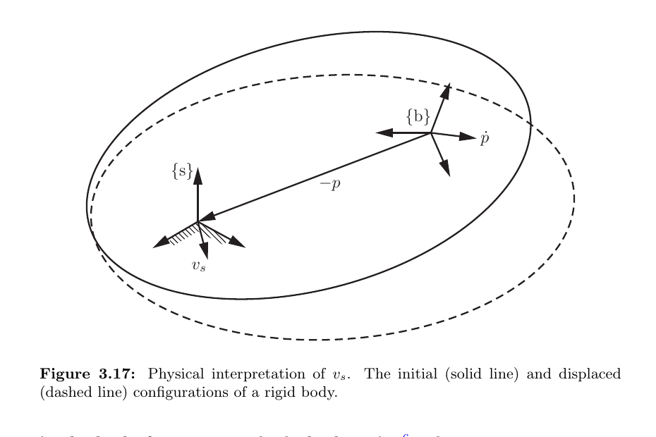

*来源：教材 Figure 3.17，书页 98／本地 PDF 第 117 页；局部截取。*

**教学目标**：由 $T(t)$ 的导数推导 $V_b$、$V_s$，并正确区分 $v_b$、$v_s$ 与 $\dot p$ 的物理含义。

**题目**：在某一瞬间 $R=I$、$p=(2,0,0)^T$、$\dot p=(0,1,0)^T$，且 $\omega_s=(0,0,1)^T$。求 $v_b$ 和 $v_s$，并分别说明它们是哪一个点的速度、用哪个参考系表示。此时 $v_s$ 是否等于 $\dot p$？

**参考答案／判定标准**：因为 $R=I$，

$$
v_b=R^T\dot p=
\begin{bmatrix}0\\1\\0\end{bmatrix}.
$$

它是物体原点的线速度，用物体参考系表示。另一方面，

$$
\omega_s\times p
=
\begin{bmatrix}0\\0\\1\end{bmatrix}
\times
\begin{bmatrix}2\\0\\0\end{bmatrix}
=
\begin{bmatrix}0\\2\\0\end{bmatrix},
$$

所以

$$
v_s=\dot p-\omega_s\times p
=
\begin{bmatrix}0\\-1\\0\end{bmatrix}.
$$

$v_s$ 是假想刚体上当前位于空间原点的点的速度，用空间参考系表示；本题中 $v_s\ne\dot p$。

**最小提示**：使用 $v_b=R^T\dot p$ 和 $v_s=\dot p-\omega_s\times p$，不要把 $v_s$ 直接写成 $\dot p$。

**教学意图**：暴露空间旋量线速度分量最常见的误解，并将 Figure 3.17 的几何意义落实到一次叉积计算。

**学习证据**：学习者选择继续；本题由教师给出示范答案，尚无独立作答证据。$v_b=(0,1,0)^T$，$v_s=(0,-1,0)^T$。

**下一步**：展开式 (3.76)，引入伴随表示 $[\operatorname{Ad}_T]$、Definition 3.20 与 Proposition 3.21—3.22。

## Session 044 - 第 3.3.2—3.3.2.1 节：伴随表示与旋量换系

**教学目标**：由 $[V_s]=T[V_b]T^{-1}$ 推导 $6\times6$ 伴随矩阵，并应用其复合、求逆和任意参考系换系公式。

**题目**：设

$$
T=(I,p),
\qquad
p=\begin{bmatrix}1\\2\\0\end{bmatrix},
$$

以及

$$
\omega_b=\begin{bmatrix}0\\0\\3\end{bmatrix},
\qquad
v_b=\begin{bmatrix}4\\5\\0\end{bmatrix}.
$$

使用 $V_s=[\operatorname{Ad}_T]V_b$ 求 $\omega_s$ 和 $v_s$。解释为什么即使 $R=I$，也不能直接断言 $v_s=v_b$。

**参考答案／判定标准**：因为 $R=I$，

$$
\omega_s=R\omega_b=\omega_b
=\begin{bmatrix}0\\0\\3\end{bmatrix}.
$$

线速度分量为

$$
v_s=[p]R\omega_b+Rv_b
=p\times\omega_b+v_b.
$$

其中

$$
p\times\omega_b
=
\begin{bmatrix}1\\2\\0\end{bmatrix}
\times
\begin{bmatrix}0\\0\\3\end{bmatrix}
=
\begin{bmatrix}6\\-3\\0\end{bmatrix},
$$

所以

$$
\boxed{v_s=\begin{bmatrix}10\\2\\0\end{bmatrix}}.
$$

虽然两个参考系朝向相同，但原点相差 $p$；对带角速度的刚体，不同位置点的线速度相差 $p\times\omega$，因此 $v_s$ 与 $v_b$ 一般不同。

**最小提示**：先写成 $\omega_s=R\omega_b$、$v_s=p\times(R\omega_b)+Rv_b$；不要遗漏平移耦合项。

**教学意图**：验证学习者理解伴随表示左下块 $[p]R$ 的物理必要性，而非只会背诵矩阵形状。

**学习证据**：学习者选择继续；本题由教师给出示范答案，尚无独立作答证据。$\omega_s=(0,0,3)^T$，$v_s=(10,2,0)^T$。

**下一步**：截取 Figure 3.18，学习 Example 3.23 的车辆瞬时旋量，并验证 $V_s=[\operatorname{Ad}_{T_{sb}}]V_b$。

## Session 045 - 第 3.3.2.1 节：Example 3.23 车辆瞬时旋量

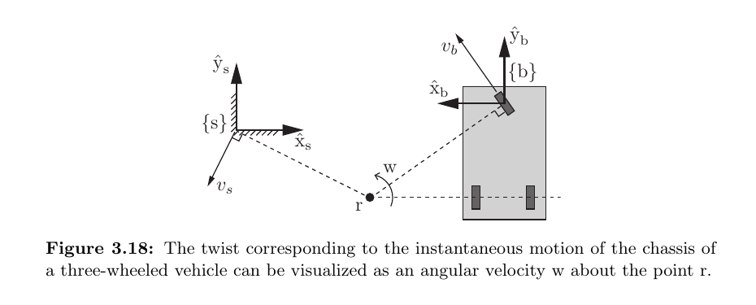

*来源：教材 Figure 3.18，书页 102／本地 PDF 第 121 页；局部截取。*

**教学目标**：从瞬时旋转中心分别构造 $V_s$、$V_b$，并数值验证伴随换系中的平移耦合项。

**题目**：沿用 Example 3.23 的

$$
R_{sb}=\operatorname{diag}(-1,1,-1),
\quad
p_{sb}=\begin{bmatrix}4\\0.4\\0\end{bmatrix},
$$

$$
\omega_s=\begin{bmatrix}0\\0\\2\end{bmatrix},
\quad
v_s=\begin{bmatrix}-2\\-4\\0\end{bmatrix}.
$$

使用逆向伴随关系求 $\omega_b$、$v_b$：

$$
\omega_b=R_{sb}^T\omega_s,
\qquad
v_b=R_{sb}^T\bigl(v_s-p_{sb}\times\omega_s\bigr).
$$

**参考答案／判定标准**：

$$
\omega_b
=R_{sb}^T\omega_s
=\begin{bmatrix}0\\0\\-2\end{bmatrix}.
$$

先算

$$
p_{sb}\times\omega_s
=\begin{bmatrix}0.8\\-8\\0\end{bmatrix},
$$

所以

$$
v_s-p_{sb}\times\omega_s
=\begin{bmatrix}-2.8\\4\\0\end{bmatrix},
$$

进而

$$
\boxed{
v_b
=R_{sb}^T
\begin{bmatrix}-2.8\\4\\0\end{bmatrix}
=\begin{bmatrix}2.8\\4\\0\end{bmatrix}.}
$$

**最小提示**：先移走平移耦合项，再乘 $R^T$；不能直接使用 $R^Tv_s$。

**教学意图**：从反方向使用伴随映射，检验学习者是否真正理解 $v_s=[p]R\omega_b+Rv_b$。

**学习证据**：学习者选择继续；本题由教师给出示范答案，尚无独立作答证据。$\omega_b=(0,0,-2)^T$，$v_b=(2.8,4,0)^T$。

**下一步**：进入 3.3.2.2「旋量的螺旋解释」，学习螺旋轴 $S$、节距 $h$ 与速度 $\dot\theta$。

## Session 046 - 第 3.3.2.2 节：旋量的螺旋解释

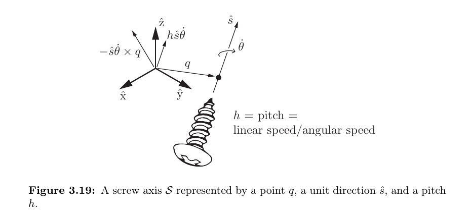

*来源：教材 Figure 3.19，书页 103／本地 PDF 第 122 页；局部截取。*

**教学目标**：从 $\{q,\hat s,h\}$ 构造归一化螺旋轴 $S$ 和一般旋量 $V=S\dot\theta$，并区分有限节距与纯平移。

**题目**：给定

$$
q=\begin{bmatrix}1\\2\\0\end{bmatrix},
\qquad
\hat s=\begin{bmatrix}0\\0\\1\end{bmatrix},
\qquad
h=0.5,
\qquad
\dot\theta=2.
$$

计算归一化螺旋轴

$$
S=
\begin{bmatrix}
\hat s\\-\hat s\times q+h\hat s
\end{bmatrix}
$$

以及旋量 $V=S\dot\theta$。指出 $v$ 中哪一部分来自绕轴旋转，哪一部分来自沿轴平移。

**参考答案／判定标准**：

$$
\hat s\times q
=
\begin{bmatrix}0\\0\\1\end{bmatrix}
\times
\begin{bmatrix}1\\2\\0\end{bmatrix}
=
\begin{bmatrix}-2\\1\\0\end{bmatrix},
$$

所以

$$
-\hat s\times q+h\hat s
=
\begin{bmatrix}2\\-1\\0\end{bmatrix}
+
\begin{bmatrix}0\\0\\0.5\end{bmatrix}
=
\begin{bmatrix}2\\-1\\0.5\end{bmatrix}.
$$

因此

$$
\boxed{
S=
\begin{bmatrix}
0\\0\\1\\2\\-1\\0.5
\end{bmatrix},
\qquad
V=S\dot\theta=
\begin{bmatrix}
0\\0\\2\\4\\-2\\1
\end{bmatrix}.}
$$

在 $V$ 的线速度部分中，$(4,-2,0)^T$ 来自绕轴旋转，$(0,0,1)^T$ 来自沿轴平移。

**最小提示**：先计算 $-\hat s\times q$，再加 $h\hat s$，最后整体乘 $\dot\theta$；负号不要遗漏。

**教学意图**：把 Figure 3.19 的三个几何参数落实为六维螺旋轴，并检验旋转项和平移项的分解。

**学习证据**：学习者选择继续；本题由教师给出示范答案，尚无独立作答证据。$S=(0,0,1,2,-1,0.5)^T$，$V=(0,0,2,4,-2,1)^T$。

**下一步**：进入 3.3.3「刚体运动的指数坐标表示」，学习 Chasles–Mozzi 定理与 $e^{[S]\theta}$。

## Session 047 - 第 3.3.3.1 节：刚体运动的矩阵指数

**教学目标**：理解 $S\theta$ 的两种参数含义，掌握 $G(\theta)$ 与 Proposition 3.25，并能从偏置旋转轴构造有限刚体位移。

**题目**：设零节距螺旋轴沿 $+\hat z$，经过

$$
q=\begin{bmatrix}1\\0\\0\end{bmatrix},
\qquad
\omega=\begin{bmatrix}0\\0\\1\end{bmatrix},
$$

并令 $\theta=\pi/2$。先求

$$
v=-\omega\times q,
$$

再使用

$$
R=e^{[\omega]\theta},
\qquad
p=G(\theta)v
$$

求 $e^{[S]\theta}$。最后用几何关系 $p=q-Rq$ 检查平移块。

**参考答案／判定标准**：

$$
v=-\begin{bmatrix}0\\0\\1\end{bmatrix}
\times
\begin{bmatrix}1\\0\\0\end{bmatrix}
=\begin{bmatrix}0\\-1\\0\end{bmatrix}.
$$

旋转矩阵为

$$
R=
\begin{bmatrix}
0&-1&0\\
1&0&0\\
0&0&1
\end{bmatrix}.
$$

代入

$$
G(\theta)
=I\frac{\pi}{2}
+[\omega]
+\left(\frac{\pi}{2}-1\right)[\omega]^2
$$

可得

$$
p=G(\theta)v
=\begin{bmatrix}1\\-1\\0\end{bmatrix}.
$$

几何检查：

$$
q-Rq
=\begin{bmatrix}1\\0\\0\end{bmatrix}
-
\begin{bmatrix}0\\1\\0\end{bmatrix}
=\begin{bmatrix}1\\-1\\0\end{bmatrix}.
$$

所以

$$
\boxed{
e^{[S]\theta}
=
\begin{bmatrix}
0&-1&0&1\\
1&0&0&-1\\
0&0&1&0\\
0&0&0&1
\end{bmatrix}.}
$$

**最小提示**：先求 $v=-\omega\times q$；$\theta=\pi/2$ 时 $1-\cos\theta=1$、$\theta-\sin\theta=\pi/2-1$。

**教学意图**：检验学习者不仅能写 Proposition 3.25，还能把偏置旋转轴的几何位置编码进平移块。

**学习证据**：学习者选择继续；本题由教师给出示范答案，尚无独立作答证据。$v=(0,-1,0)^T$，$R=R_z(\pi/2)$，$p=(1,-1,0)^T$。

**下一步**：进入 3.3.3.2「刚体运动的矩阵对数」，学习式 (3.90)—(3.92) 与 Example 3.26。

## Session 048 - 第 3.3.3.2 节：刚体运动的矩阵对数

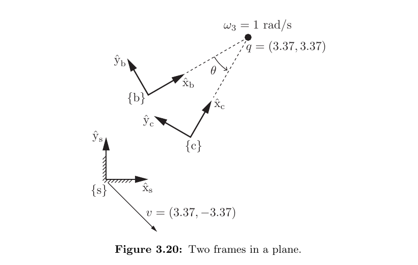

*来源：教材 Figure 3.20，书页 107／本地 PDF 第 126 页；局部截取。*

**教学目标**：根据 $R=I$ 或 $R\ne I$ 选择矩阵对数分支，并理解 Example 3.26 中为何计算 $T_{sc}T_{sb}^{-1}$。

**题目**：给定纯平移

$$
T=
\begin{bmatrix}
1&0&0&3\\
0&1&0&4\\
0&0&1&0\\
0&0&0&1
\end{bmatrix},
$$

求归一化螺旋轴 $S$、运动量 $\theta$、指数坐标 $S\theta$ 和矩阵对数 $[S]\theta$。

**参考答案／判定标准**：因为 $R=I$ 且

$$
p=\begin{bmatrix}3\\4\\0\end{bmatrix},
\qquad
\|p\|=5,
$$

所以选择纯平移分支：

$$
\omega=0,
\qquad
v=\frac{p}{\|p\|}
=\begin{bmatrix}3/5\\4/5\\0\end{bmatrix},
\qquad
\theta=5.
$$

因此

$$
\boxed{
S=
\begin{bmatrix}
0\\0\\0\\3/5\\4/5\\0
\end{bmatrix},
\qquad
S\theta=
\begin{bmatrix}
0\\0\\0\\3\\4\\0
\end{bmatrix}.}
$$

矩阵对数为

$$
\boxed{
[S]\theta=
\begin{bmatrix}
0&0&0&3\\
0&0&0&4\\
0&0&0&0\\
0&0&0&0
\end{bmatrix}.}
$$

**最小提示**：$R=I$ 时先判断是否为纯平移；归一化方向是 $p/\|p\|$，运动量是 $\|p\|$。

**教学意图**：确认学习者能独立选择矩阵对数算法分支，并区分 $S$、$S\theta$、$[S]\theta$ 三种对象。

**学习证据**：学习者选择继续；本题由教师给出示范答案，尚无独立作答证据。$\theta=5$，$S=(0,0,0,3/5,4/5,0)^T$，$S\theta=(0,0,0,3,4,0)^T$。

**下一步**：进入 3.4「力旋量」，先截取 Figure 3.21，再学习功率不变性和力旋量换系。

## Session 049 - 第 3.4 节：力旋量、换系与传感器例题

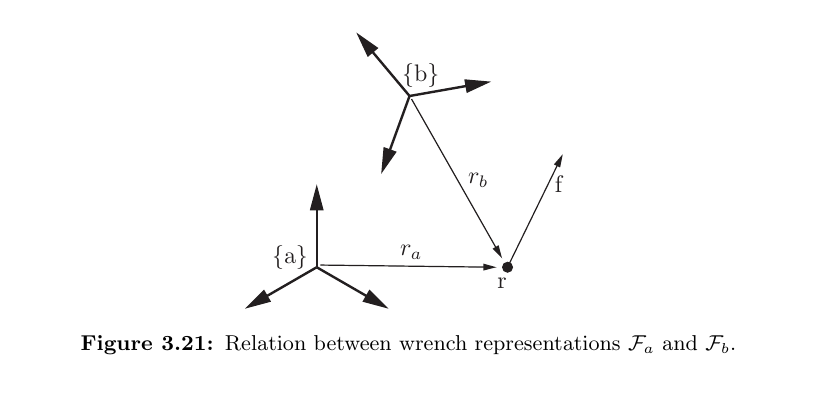

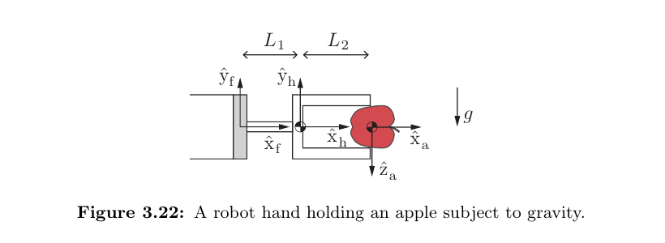

*来源：教材 Figure 3.21—3.22，书页 109—110／本地 PDF 第 128—129 页；局部截取。*

**教学目标**：由功率不变性推导力旋量换系公式，并理解平移参考系原点为何改变力矩但不改变力。

**题目**：设 $R_{ab}=I$、$p_{ab}=(1,0,0)^T$，且

$$
F_a=
\begin{bmatrix}
m_a\\f_a
\end{bmatrix},
\qquad
m_a=\begin{bmatrix}0\\0\\0\end{bmatrix},
\qquad
f_a=\begin{bmatrix}0\\1\\0\end{bmatrix}.
$$

使用

$$
F_b=[\operatorname{Ad}_{T_{ab}}]^TF_a
$$

求 $f_b$ 和 $m_b$。说明为什么力不变而力矩出现非零值。

**参考答案／判定标准**：

$$
f_b=R_{ab}^Tf_a
=\begin{bmatrix}0\\1\\0\end{bmatrix}.
$$

而

$$
m_b
=R_{ab}^T(m_a-p_{ab}\times f_a).
$$

由于

$$
p_{ab}\times f_a
=
\begin{bmatrix}1\\0\\0\end{bmatrix}
\times
\begin{bmatrix}0\\1\\0\end{bmatrix}
=
\begin{bmatrix}0\\0\\1\end{bmatrix},
$$

所以

$$
\boxed{
m_b=\begin{bmatrix}0\\0\\-1\end{bmatrix},
\qquad
f_b=\begin{bmatrix}0\\1\\0\end{bmatrix}.}
$$

两个参考系朝向相同，所以力坐标不变；但原点相距一单位，新的力臂为 $(-1,0,0)^T$，故产生 $-\hat z$ 方向的单位力矩。

**最小提示**：展开转置伴随矩阵，使用 $m_b=R^T(m_a-p\times f_a)$。

**教学意图**：验证学习者理解力旋量换系的转置伴随形式及其力臂意义。

**学习证据**：学习者选择继续；本题由教师给出示范答案，尚无独立作答证据。$f_b=(0,1,0)^T$，$m_b=(0,0,-1)^T$。

**下一步**：进入 3.5，总结旋转与刚体运动之间的平行结构。

## Session 050 - 第 3.5 节：旋转与刚体运动的平行结构

**教学目标**：把 $SO(3)$ 与 $SE(3)$ 中的对象、速度、换系、指数/对数和对偶力学量建立成可检索的对应关系。

**题目**：补全并解释下列四个换系关系：

$$
\omega_a=\underline{\hspace{2.5cm}}\,\omega_b,
$$

$$
V_a=\underline{\hspace{3.5cm}}\,V_b,
$$

$$
m_a=\underline{\hspace{2.5cm}}\,m_b,
$$

$$
F_a=\underline{\hspace{4cm}}\,F_b.
$$

最后说明为什么完整力旋量不能像纯力矩一样只乘一个 $R$。

**参考答案／判定标准**：

$$
\boxed{
\omega_a=R_{ab}\omega_b,
\qquad
V_a=[\operatorname{Ad}_{T_{ab}}]V_b,}
$$

$$
\boxed{
m_a=R_{ab}m_b,
\qquad
F_a=[\operatorname{Ad}_{T_{ba}}]^TF_b.}
$$

纯力矩没有力分量，不会因参考系原点平移产生额外力矩；完整力旋量含有力 $f$，改变原点会改变力臂，因此必须使用包含 $[p]R$ 的伴随矩阵之转置。

**最小提示**：运动学量沿 $b\to a$ 使用 $R_{ab}$ 或 $\operatorname{Ad}_{T_{ab}}$；保持 $V^TF$ 不变会迫使力旋量使用逆方向变换的转置。

**教学意图**：检查学习者是否建立了本章最重要的结构化对应，而不只是孤立记忆公式。

**学习证据**：学习者要求继续完成本章；本题由教师给出示范答案，尚无独立作答证据。

**下一步**：进入 3.6「软件」，把本章数学对象与 Modern Robotics 函数对应起来。

## Session 051 - 第 3.6 节：软件函数与数学对象的映射

**教学目标**：能根据输入对象和目标对象选择函数，而不是只凭函数名或维数猜测。

**题目**：已知两个位姿 $T_{sb}$ 与 $T_{sc}$，要求得到从初始位姿到目标位姿、以物体坐标表示的归一化螺旋轴 $S_b$ 和运动量 $\theta$。写出所需的相对变换和函数调用顺序。

**参考答案／判定标准**：先计算物体坐标表达的相对变换

$$
T_{bc}=T_{sb}^{-1}T_{sc}.
$$

对应的软件流程为

$$
T_{bc}
\xrightarrow{\texttt{MatrixLog6}}
[S_b]\theta
\xrightarrow{\texttt{se3ToVec}}
S_b\theta
\xrightarrow{\texttt{AxisAng}}
(S_b,\theta).
$$

若按函数调用写，可表示为：

```matlab
Tbc = TransInv(Tsb) * Tsc;
se3mat = MatrixLog6(Tbc);
expc6 = se3ToVec(se3mat);
[Sb, theta] = AxisAng(expc6);
```

判定关键有三点：相对变换顺序必须是 $T_{sb}^{-1}T_{sc}$；`MatrixLog6` 的输出是 $\mathfrak{se}(3)$ 矩阵；必须经过 `se3ToVec` 后才能交给 `AxisAng` 拆出 $(S_b,\theta)$。

**最小提示**：先决定结果在哪个参考系表达，再按 $SE(3)\to\mathfrak{se}(3)\to\mathbb R^6\to(S,\theta)$ 的对象链选择函数。

**教学意图**：综合检查 3.3 的相对位姿语义、矩阵对数和 3.6 的软件接口映射。

**学习证据**：为按用户要求完成本章，本题采用教师完整示范；尚无独立作答证据。

**下一步**：第 3 章教学内容已收束；后续如需巩固，可从 3.8 习题中选择综合题，但不作为本章正文覆盖完成的前提。
