# 第 4 章 · 正向运动学｜Q&A

[← 阅读首页](../../README.md) · [章节正文](ch04-forward-kinematics.md) · [学习进度](../../progress.md) · [来源索引](../../sources.md)

<strong>Q&A 目录</strong>

- [Session 001 - 第 4 章导言至 4.1.1：空间形式 PoE](#session-001---第-4-章导言至-411空间形式-poe)
- [Session 002 - 4.1.2 Example 4.1：3R 空间开链](#session-002---412-example-413r-空间开链)
- [Session 003 - 4.1.2 Example 4.2：3R 平面链的 $SE(2)$ 简化](#session-003---412-example-423r-平面链的-se2-简化)
- [Session 004 - 4.1.2 Example 4.3：6R 空间开链](#session-004---412-example-436r-空间开链)
- [Session 005 - 4.1.2 Example 4.4：RRPRRR 空间开链](#session-005---412-example-44rrprrr-空间开链)
- [Session 006 - 4.1.2 Example 4.5：UR5 数值 PoE](#session-006---412-example-45ur5-数值-poe)
- [Session 007 - 4.1.3 物体形式 PoE](#session-007---413-物体形式-poe)
- [Session 008 - Example 4.6：6R 空间链的物体轴](#session-008---example-466r-空间链的物体轴)
- [Session 009 - Example 4.7：WAM 7R 冗余机械臂](#session-009---example-47wam-7r-冗余机械臂)
- [Session 010 - 4.2 URDF：树结构、关节与连杆](#session-010---42-urdf树结构关节与连杆)
- [Session 011 - 4.2 UR5 的实际 URDF](#session-011---42-ur5-的实际-urdf)
- [Session 012 - 4.3 第 4 章统一总结](#session-012---43-第-4-章统一总结)

本文件只保存教师侧的学习设计、判定依据和参考答案，不记录学习者的原始回答。

> 当前学习断点与练习状态统一见 [学习进度](../../progress.md)。

## Session 001 - 第 4 章导言至 4.1.1：空间形式 PoE

### 掌握目标

学习者能从零位形读出平面转动关节的空间螺旋轴，使用正向运动学公式计算末端位姿变量，并解释空间形式 PoE 为什么不需要在每次关节运动后重算螺旋轴。

### 讲解前所用教材图

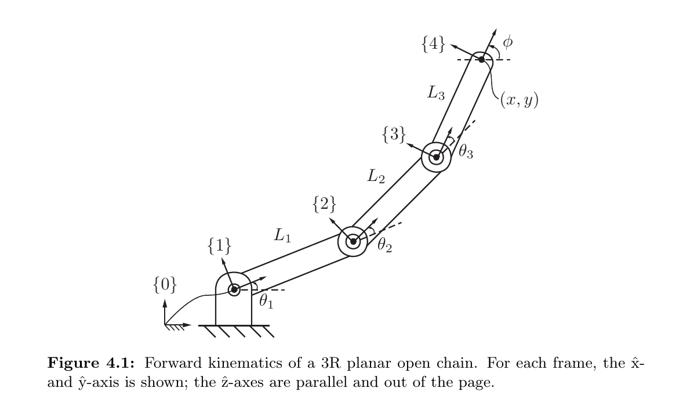

*来源：教材 Figure 4.1，书页 138／本地 PDF 第 157 页；局部截取。*

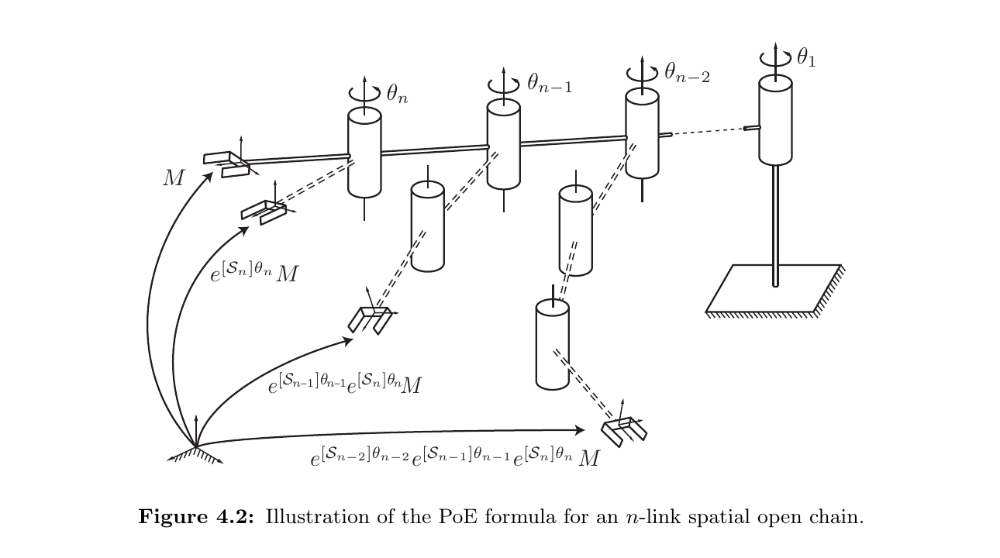

*来源：教材 Figure 4.2，书页 141／本地 PDF 第 160 页；局部截取。*

### 题目 1 - 3R 平面链的数值位姿与空间螺旋轴

**题目**：某 3R 平面开链在零位形时沿 $+\hat x_0$ 完全伸直，三个关节正轴均为 $+\hat z_0$。令

$$
L_1=2,\qquad L_2=1,\qquad L_3=1,
$$

$$
(\theta_1,\theta_2,\theta_3)
=
\left(\frac{\pi}{2},-\frac{\pi}{2},0\right).
$$

请完成三个相连任务：

1. 用式 (4.1)–(4.3) 求末端的 $(x,y,\phi)$。
2. 写出零位形末端位姿 $M$，以及关节 2 在固定系中的空间螺旋轴 $S_2=(\omega_2,v_2)$
3. 解释为什么式 $T=e^{[S_1]\theta_1}e^{[S_2]\theta_2}e^{[S_3]\theta_3}M$ 中的 $S_2$ 仍按零位形定义，不需要先随 $\theta_1$ 更新后再代入。

**预期答案／判定标准**：

- 正确得到 $(x,y,\phi)=(2,2,0)$，并能说明各连杆使用的是累积角。
- 正确写出 $M$ 的旋转部分为单位矩阵、平移为 $(4,0,0)$。
- 正确写出 $\omega_2=(0,0,1)$、$q_2=(2,0,0)$、$v_2=-\omega_2\times q_2=(0,-2,0)$，尤其不能漏掉负号。
- 能说明所有 $S_i$ 都在零位形中用固定空间系表示；靠近基座的指数因子通过左乘带动整个外侧子链，所以前一关节造成的轴运动已由乘积结构处理。

以上四点均成立，才有本单元的独立掌握证据。若只会代公式但不能解释第 3 项，表示计算层面基本正确，PoE 的几何结构仍需补强。

**最小提示**：第二关节轴经过 $q_2=(L_1,0,0)$；先计算 $-\omega_2\times q_2$。第 3 项可从“关节 1 转动时，它会带动哪些连杆和关节轴”入手。

**追问（仅在第 3 项含糊时使用）**：若先固定 $\theta_2,\theta_3$，再转动关节 1，关节 1 的运动是否会整体带动关节 2、关节 3 和末端？这个整体运动在 PoE 乘积的哪一侧出现？

**参考答案**：累积角为 $\theta_1=\pi/2$、$\theta_1+\theta_2=0$、$\theta_1+\theta_2+\theta_3=0$，因此

$$
x=2\cos\frac{\pi}{2}+\cos 0+\cos 0=2,
$$

$$
y=2\sin\frac{\pi}{2}+\sin 0+\sin 0=2,
\qquad
\phi=0.
$$

零位形末端位姿为

$$
M=
\begin{bmatrix}
1&0&0&4\\
0&1&0&0\\
0&0&1&0\\
0&0&0&1
\end{bmatrix}.
$$

对关节 2，$\omega_2=(0,0,1)$，可取轴上一点 $q_2=(2,0,0)$，所以

$$
v_2=-\omega_2\times q_2=(0,-2,0),
\qquad
S_2=
\begin{bmatrix}
0\\0\\1\\0\\-2\\0
\end{bmatrix}.
$$

空间形式中的 $S_i$ 统一在零位形中用固定系定义。矩阵乘法从右向左作用，而 $e^{[S_1]\theta_1}$ 位于 $e^{[S_2]\theta_2}$ 左侧；关节 1 的变换因此整体作用于已经包含关节 2、关节 3 运动的外侧链。轴随关节 1 的物理移动已由左乘体现，不需要重算 $S_2$。

**教学意图**：把章导言的三角函数表示、螺旋轴符号和一般空间形式 PoE 连接成一个可迁移的建模过程，同时检查最常见的两个错误：把相对角当绝对角，以及写错 $v=-\omega\times q$ 的符号。

### 实际使用的提示或补救

学习者要求直接给出第 1 项答案并继续。已示范三根连杆的累积角分别为 $\pi/2,0,0$，因此 $(x,y,\phi)=(2,2,0)$；该项尚无独立掌握证据。第 2 项随后无提示完成：$M$ 的旋转块为 $I$、平移为 $(4,0,0)$，并正确由 $q_2=(2,0,0)$、$\omega_2=(0,0,1)$ 得到 $v_2=(0,-2,0)$ 与 $S_2=(0,0,1,0,-2,0)^T$。第 3 项按学习者要求由教师直接示范，尚无独立解释证据。

### 下一步

进入教材 4.1.2 的 Example 4.1；完整讲完一个连贯单元后，一次提出整道综合题，不再拆成逐小问往返。

## Session 002 - 4.1.2 Example 4.1：3R 空间开链

### 掌握目标

学习者能从零位形图中读出末端位姿 $M$，根据关节正方向与轴上点构造三根空间螺旋轴，并按正确次序写出空间形式 PoE。

### 讲解前所用教材图

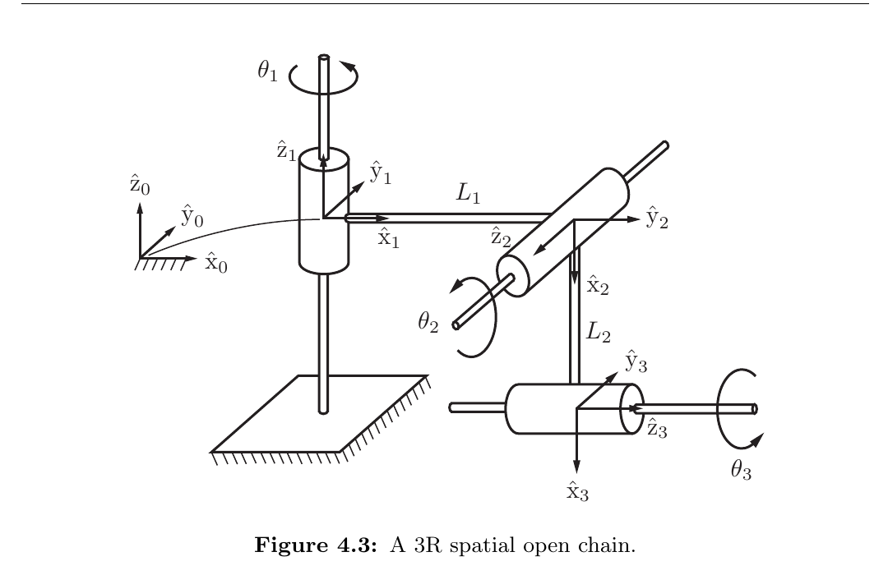

*来源：教材 Figure 4.3，书页 143／本地 PDF 第 162 页；局部截取。*

### 综合题 - 数值化 Figure 4.3

**题目**：保持 Figure 4.3 的坐标系、零位形与关节正方向不变，令 $L_1=2,L_2=3$。

1. 写出零位形末端位姿 $M$。
2. 写出 $S_1,S_2,S_3$。其中对关节 3 分别选择 $q_3=(0,0,-3)$ 和 $q_3'=(5,0,-3)$，验证两种选择得到相同的 $v_3$。
3. 写出完整空间形式 PoE，不需要展开矩阵指数。
4. 用一句话解释为什么沿关节轴方向改变 $q_3$ 不会改变螺旋轴。

**预期答案／判定标准**：

$$
M=
\begin{bmatrix}
0&0&1&2\\
0&1&0&0\\
-1&0&0&-3\\
0&0&0&1
\end{bmatrix}.
$$

$$
S_1=
\begin{bmatrix}0\\0\\1\\0\\0\\0\end{bmatrix},
\qquad
S_2=
\begin{bmatrix}0\\-1\\0\\0\\0\\-2\end{bmatrix},
\qquad
S_3=
\begin{bmatrix}1\\0\\0\\0\\-3\\0\end{bmatrix}.
$$

对 $q_3=(0,0,-3)$ 与 $q_3'=(5,0,-3)$，都有

$$
-\omega_3\times q_3
=
-\omega_3\times q_3'
=
(0,-3,0),
$$

因为 $q_3'-q_3=(5,0,0)$ 与 $\omega_3=(1,0,0)$ 平行，其叉积为零。完整模型为

$$
T(\theta)
=
e^{[S_1]\theta_1}
e^{[S_2]\theta_2}
e^{[S_3]\theta_3}M.
$$

判定时重点检查：$M$ 的旋转块不能误写为 $I$；$\omega_2$ 必须沿 $-\hat y_0$；$v_i=-\omega_i\times q_i$ 的负号不能丢；PoE 顺序从关节 1 到关节 3。

**最小提示**：先把 $R_{03}$ 的三列写成 $\hat x_3=-\hat z_0$、$\hat y_3=\hat y_0$、$\hat z_3=\hat x_0$；再逐关节使用 $v_i=-\omega_i\times q_i$。

**教学意图**：把“看图读取 $M$”“从正转方向确定 $\omega$”“选择轴上点并计算 $v$”合成一次完整建模，同时利用不同 $q_3$ 检查学习者是否理解螺旋轴只依赖轴线而不依赖轴上点的具体选择。

### 实际使用的提示或补救

学习者一次性、无提示完成整题。$M$ 的非单位旋转块、三根 $S_i$ 的方向与线速度分量、两种 $q_3$ 选择产生相同 $v_3$ 的验证以及空间形式 PoE 的顺序均正确；并能指出 $q_3'-q_3$ 与 $\omega_3$ 平行，因此附加叉积为零。聊天中的反斜杠与等号显示异常仅属 Markdown 排版，不是数学错误。本单元形成独立掌握证据，无需补救。

### 下一步

继续 4.1.2 Example 4.2，学习 3R 平面链从六维 $SE(3)$ 螺旋轴到三维 $SE(2)$ 表示的无损简化。

## Session 003 - 4.1.2 Example 4.2：3R 平面链的 $SE(2)$ 简化

### 掌握目标

学习者能在六维空间螺旋轴与三维平面螺旋轴之间转换，写出 $\mathfrak{se}(2)$ 矩阵、平面零位形 $M_{2D}$ 和平面 PoE，并解释这种降维为什么不是近似。

### 讲解前所用教材图

*来源：教材 Figure 4.1，书页 137／本地 PDF 第 156 页；本例复用。*

### 综合题 - 六维表示与平面表示互换

**题目**：保持 Figure 4.1 的零位形和关节正方向不变，令 $L_1=2,L_2=1,L_3=3$。

1. 写出三根完整六维空间螺旋轴 $S_1,S_2,S_3$。
2. 将它们压缩为 $\bar S_i=(\omega_z,v_x,v_y)$，并写出 $[\bar S_2]\in\mathfrak{se}(2)$。
3. 写出 $M_{2D}\in SE(2)$ 和完整的平面形式 PoE，不需要展开矩阵指数。
4. 用一句话说明这种三维表示为什么与六维表示等价而不是近似，并指出哪类出平面运动会破坏这一简化。

**预期答案／判定标准**：

$$
S_1=
\begin{bmatrix}0\\0\\1\\0\\0\\0\end{bmatrix},
\qquad
S_2=
\begin{bmatrix}0\\0\\1\\0\\-2\\0\end{bmatrix},
\qquad
S_3=
\begin{bmatrix}0\\0\\1\\0\\-3\\0\end{bmatrix}.
$$

$$
\bar S_1=(1,0,0),
\qquad
\bar S_2=(1,0,-2),
\qquad
\bar S_3=(1,0,-3),
$$

$$
[\bar S_2]
=
\begin{bmatrix}
0&-1&0\\
1&0&-2\\
0&0&0
\end{bmatrix}.
$$

$$
M_{2D}
=
\begin{bmatrix}
1&0&6\\
0&1&0\\
0&0&1
\end{bmatrix},
$$

$$
T_{2D}(\theta)
=
e^{[\bar S_1]\theta_1}
e^{[\bar S_2]\theta_2}
e^{[\bar S_3]\theta_3}M_{2D}.
$$

等价性的关键是平面运动中 $\omega_x,\omega_y,v_z$ 恒为零，三维表示只删去这些固定零分量；若出现绕 $x$ 或 $y$ 轴旋转，或沿 $z$ 方向平移，就必须恢复完整 $SE(3)$ 表示。

判定时重点检查：第三关节到原点的距离是 $L_1+L_2=3$，不是末端总长度；$[\bar S_2]$ 的平移列为 $(0,-2)^T$；PoE 的乘积顺序保持不变；解释中必须提到平面运动约束。

**最小提示**：对位于 $q=(a,0,0)$ 的 $+\hat z$ 转轴，先写 $v=-\omega\times q=(0,-a,0)$，再保留 $(\omega_z,v_x,v_y)$。

**教学意图**：检查学习者能否区分“物理螺旋轴”和“选用的坐标编码”，并把 $SE(3)$ PoE 的结构完整迁移到 $SE(2)$。

### 实际使用的提示或补救

学习者要求直接继续，未独立作答。教师示范答案为：$S_1=(0,0,1,0,0,0)^T$、$S_2=(0,0,1,0,-2,0)^T$、$S_3=(0,0,1,0,-3,0)^T$；对应平面轴为 $(1,0,0)$、$(1,0,-2)$、$(1,0,-3)$，且 $[\bar S_2]=\left[\begin{smallmatrix}0&-1&0\\1&0&-2\\0&0&0\end{smallmatrix}\right]$；$M_{2D}=\left[\begin{smallmatrix}1&0&6\\0&1&0\\0&0&1\end{smallmatrix}\right]$，PoE 顺序不变。三维表示只删去平面约束下恒为零的 $\omega_x,\omega_y,v_z$，若出现绕 $x,y$ 轴旋转或沿 $z$ 平移则失效。本单元没有独立掌握证据。

### 下一步

Figure 4.4 已裁取并核验；继续 4.1.2 Example 4.3，学习 6R 空间开链的 $M$、六根空间螺旋轴与 PoE。

## Session 004 - 4.1.2 Example 4.3：6R 空间开链

### 掌握目标

学习者能从 Figure 4.4 的零位形读出 $M$，根据六条无限延伸的关节轴构造 $S_1,\ldots,S_6$，并理解关节实体位置与轴上点选择不是同一概念。

### 讲解前所用教材图

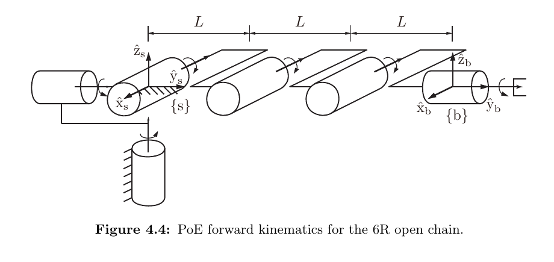

*来源：教材 Figure 4.4，书页 145／本地 PDF 第 164 页；局部截取。*

### 综合题 - 数值化 Figure 4.4

**题目**：保持 Figure 4.4 的零位形、坐标系和关节正方向不变，令 $L=2$。

1. 写出零位形末端位姿 $M$。
2. 写出六根空间螺旋轴 $S_1,\ldots,S_6$；对关节 4、5 明确写出所选的 $q_i$ 和计算所得的 $v_i$。
3. 解释为什么关节 6 虽位于末端附近，仍可以选择 $q_6=(0,0,0)$，并说明这对 $v_6$ 有何结果。
4. 写出完整空间形式 PoE，不需要展开矩阵指数。

**预期答案／判定标准**：

$$
M=
\begin{bmatrix}
1&0&0&0\\
0&1&0&6\\
0&0&1&0\\
0&0&0&1
\end{bmatrix}.
$$

$$
S_1=\begin{bmatrix}0\\0\\1\\0\\0\\0\end{bmatrix},
\quad
S_2=\begin{bmatrix}0\\1\\0\\0\\0\\0\end{bmatrix},
\quad
S_3=\begin{bmatrix}-1\\0\\0\\0\\0\\0\end{bmatrix},
$$

$$
S_4=\begin{bmatrix}-1\\0\\0\\0\\0\\2\end{bmatrix},
\quad
S_5=\begin{bmatrix}-1\\0\\0\\0\\0\\4\end{bmatrix},
\quad
S_6=\begin{bmatrix}0\\1\\0\\0\\0\\0\end{bmatrix}.
$$

对关节 4、5，可取

$$
q_4=(0,2,0),
\qquad
q_5=(0,4,0),
$$

由 $v_i=-\omega_i\times q_i$ 得到

$$
v_4=(0,0,2),
\qquad
v_5=(0,0,4).
$$

关节 6 的轴线沿 $y$ 方向并与空间系 $y$ 轴重合；该无限直线经过原点，所以 $q_6=0$ 是合法轴上点，从而 $v_6=0$。完整模型为

$$
T(\theta)
=
e^{[S_1]\theta_1}
e^{[S_2]\theta_2}
e^{[S_3]\theta_3}
e^{[S_4]\theta_4}
e^{[S_5]\theta_5}
e^{[S_6]\theta_6}M.
$$

判定时重点检查：$M$ 的平移为 $(0,6,0)$；$\omega_3,\omega_4,\omega_5$ 均沿 $-\hat x_s$；$v_4,v_5$ 的 $z$ 分量符号为正；不能因关节 6 的实体位置在末端就误判 $v_6\ne0$。

**最小提示**：先把六条关节轴当作无限直线；轴线经过原点时直接取 $q_i=0$，否则再用 $v_i=-\omega_i\times q_i$。

**教学意图**：把 3R 例题的建模流程迁移到更多关节，并检查学习者是否真正按轴线几何而不是按图中关节实体的位置构造螺旋轴。

### 实际使用的提示或补救

学习者要求直接继续，未独立作答。教师示范答案为 $M$ 的平移部分 $(0,6,0)$；六根轴依次为 $S_1=(0,0,1,0,0,0)^T$、$S_2=(0,1,0,0,0,0)^T$、$S_3=(-1,0,0,0,0,0)^T$、$S_4=(-1,0,0,0,0,2)^T$、$S_5=(-1,0,0,0,0,4)^T$、$S_6=(0,1,0,0,0,0)^T$。对关节 4、5 可取 $q_4=(0,2,0)$、$q_5=(0,4,0)$；关节 6 的无限延伸轴线与空间系 $y$ 轴重合，故可取原点并得到 $v_6=0$。完整 PoE 按 $S_1$ 到 $S_6$ 排列。本单元没有独立掌握证据。

### 下一步

Figure 4.5 已裁取并核验；继续 4.1.2 Example 4.4，学习同时包含转动与移动关节的 RRPRRR 空间开链。

## Session 005 - 4.1.2 Example 4.4：RRPRRR 空间开链

### 掌握目标

学习者能区分转动与移动关节螺旋轴的归一化规则，构造 RRPRRR 链的六根空间螺旋轴，并说明纯平移指数因子的几何意义与变量单位。

### 讲解前所用教材图

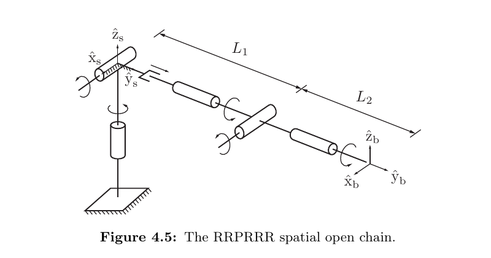

*来源：教材 Figure 4.5，书页 146／本地 PDF 第 165 页；局部截取。*

### 综合题 - 数值化 RRPRRR 链

**题目**：保持 Figure 4.5 的零位形、坐标系和关节正方向不变，令 $L_1=2,L_2=3$。

1. 写出零位形末端位姿 $M$ 和六根空间螺旋轴 $S_1,\ldots,S_6$。
2. 单独说明第三关节为什么满足 $\omega_3=0$、$v_3=(0,1,0)$，写出 $e^{[S_3]\theta_3}$，并说明 $\theta_3$ 的单位。
3. 对第五关节选择 $q_5=(0,2,0)$，用 $v_5=-\omega_5\times q_5$ 验证其线速度部分的符号。
4. 写出完整空间形式 PoE，不需要展开其他矩阵指数。

**预期答案／判定标准**：

$$
M=
\begin{bmatrix}
1&0&0&0\\
0&1&0&5\\
0&0&1&0\\
0&0&0&1
\end{bmatrix}.
$$

$$
S_1=\begin{bmatrix}0\\0\\1\\0\\0\\0\end{bmatrix},
\quad
S_2=\begin{bmatrix}1\\0\\0\\0\\0\\0\end{bmatrix},
\quad
S_3=\begin{bmatrix}0\\0\\0\\0\\1\\0\end{bmatrix},
$$

$$
S_4=\begin{bmatrix}0\\1\\0\\0\\0\\0\end{bmatrix},
\quad
S_5=\begin{bmatrix}1\\0\\0\\0\\0\\-2\end{bmatrix},
\quad
S_6=\begin{bmatrix}0\\1\\0\\0\\0\\0\end{bmatrix}.
$$

第三关节是沿 $+\hat y_s$ 的移动关节，所以 $\omega_3=0$，$v_3$ 是该方向的单位向量。其指数为

$$
e^{[S_3]\theta_3}
=
\begin{bmatrix}
1&0&0&0\\
0&1&0&\theta_3\\
0&0&1&0\\
0&0&0&1
\end{bmatrix},
$$

其中 $\theta_3$ 的单位是长度。第五关节有 $\omega_5=(1,0,0)$，故

$$
v_5
=
-(1,0,0)\times(0,2,0)
=
(0,0,-2).
$$

完整模型为

$$
T(\theta)
=
e^{[S_1]\theta_1}
e^{[S_2]\theta_2}
e^{[S_3]\theta_3}
e^{[S_4]\theta_4}
e^{[S_5]\theta_5}
e^{[S_6]\theta_6}M.
$$

判定时重点检查：第三关节不能使用 $v=-\omega\times q$ 构造；$v_3$ 必须是单位正平移方向；$v_5$ 的 $z$ 分量为负；转动关节变量与移动关节变量的单位不同。

**最小提示**：先按 R/P 分类。R 关节使用单位 $\omega$ 和 $v=-\omega\times q$；P 关节直接令 $\omega=0$，把单位平移方向写入 $v$。

**教学意图**：防止把转动关节公式机械套到移动关节上，并建立“同一 PoE 结构、不同螺旋轴类型与变量单位”的统一认识。

### 实际使用的提示或补救

学习者要求直接继续，未独立作答。教师示范答案为 $M$ 的平移部分 $(0,5,0)$；六根轴为 $S_1=(0,0,1,0,0,0)^T$、$S_2=(1,0,0,0,0,0)^T$、$S_3=(0,0,0,0,1,0)^T$、$S_4=(0,1,0,0,0,0)^T$、$S_5=(1,0,0,0,0,-2)^T$、$S_6=(0,1,0,0,0,0)^T$。第三关节的纯平移指数沿 $+y$ 平移 $\theta_3$，且 $\theta_3$ 的单位是长度；第五关节由 $q_5=(0,2,0)$ 得到 $v_5=(0,0,-2)$；完整 PoE 顺序不变。本单元没有独立掌握证据。

### 下一步

Figure 4.6 与 Figure 4.7 已裁取并核验；继续 4.1.2 Example 4.5，学习真实 UR5 的零位形、空间螺旋轴与数值 PoE。

## Session 006 - 4.1.2 Example 4.5：UR5 数值 PoE

### 掌握目标

学习者能把真实机器人尺寸统一为米，读出非单位旋转块的 $M$，识别指定关节角下真正参与计算的指数因子，并从最终齐次矩阵解释末端位置和朝向。

### 讲解前所用教材图

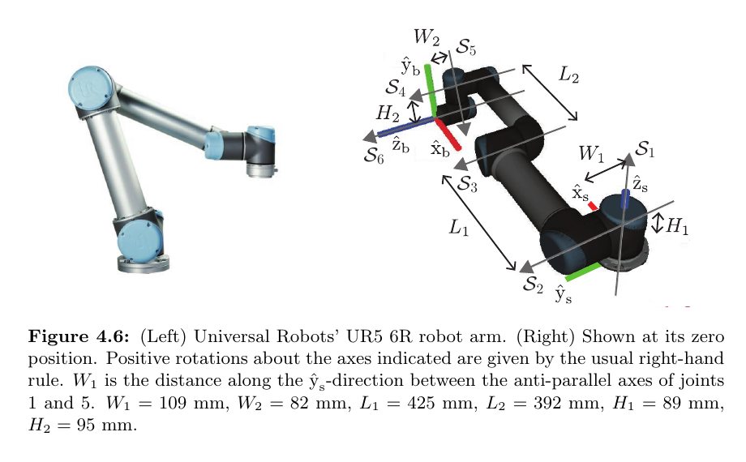

*来源：教材 Figure 4.6，书页 148／本地 PDF 第 167 页；局部截取。*

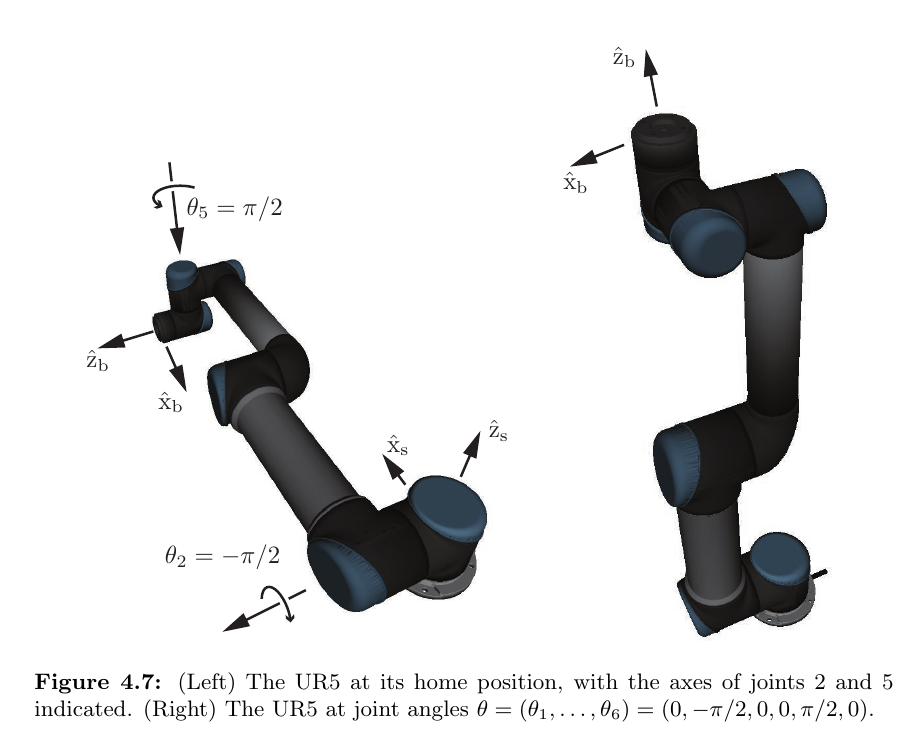

*来源：教材 Figure 4.7，书页 149／本地 PDF 第 168 页；局部截取。*

### 综合题 - 复核 UR5 的两关节运动

**题目**：使用教材参数

$$
(W_1,W_2,L_1,L_2,H_1,H_2)
=(0.109,0.082,0.425,0.392,0.089,0.095)\ \mathrm{m},
$$

并令 $\theta=(0,-\pi/2,0,0,\pi/2,0)$。

1. 写出数值 $M$，以及本次真正参与运动的 $S_2,S_5$。
2. 把六因子 PoE 简化为只含两个非单位指数因子的表达式。
3. 使用本单元给出的两个指数矩阵，算出最终 $T$；从其最后一列和旋转块分别读出末端位置与朝向。
4. 用一句话解释为什么其余四个关节无需出现在简化后的乘积中。

**预期答案／判定标准**：

$$
M=
\begin{bmatrix}
-1&0&0&0.817\\
0&0&1&0.191\\
0&1&0&-0.006\\
0&0&0&1
\end{bmatrix},
$$

$$
S_2=
\begin{bmatrix}0\\1\\0\\-0.089\\0\\0\end{bmatrix},
\qquad
S_5=
\begin{bmatrix}0\\0\\-1\\-0.109\\0.817\\0\end{bmatrix}.
$$

$$
T(\theta)
=
e^{-[S_2]\pi/2}e^{[S_5]\pi/2}M
=
\begin{bmatrix}
0&-1&0&0.095\\
1&0&0&0.109\\
0&0&1&0.988\\
0&0&0&1
\end{bmatrix}.
$$

末端位置是 $(0.095,0.109,0.988)\ \mathrm{m}$，旋转块是绕空间 $z$ 轴旋转 $+\pi/2$。其余四个关节角为零，而任意矩阵满足 $e^{[S_i]0}=I$，所以对应因子可以省略。

判定时重点检查：$M$ 中 $H_1-H_2=-0.006$；$S_2$ 的 $v_x=-0.089$；$S_5$ 的角轴沿 $-z$ 且 $v=(-0.109,0.817,0)$；$\theta_2$ 的负号不能丢；位置单位是米。

**最小提示**：先把所有毫米尺寸除以 $1000$；再删除关节角为零的指数因子，但不要交换剩余两个因子的次序。

**教学意图**：把抽象 PoE 建模落实到真实机械臂数据，同时检查单位、符号、非交换乘法顺序和齐次矩阵结果解释。

### 实际使用的提示或补救

学习者要求直接继续，未独立作答。教师示范了米制零位形 $M$、活动轴 $S_2=(0,1,0,-0.089,0,0)^T$ 与 $S_5=(0,0,-1,-0.109,0.817,0)^T$；把六因子 PoE 化简为 $e^{-[S_2]\pi/2}e^{[S_5]\pi/2}M$，并得到末端位姿 $T=\left[\begin{smallmatrix}0&-1&0&0.095\\1&0&0&0.109\\0&0&1&0.988\\0&0&0&1\end{smallmatrix}\right]$。末端位置为 $(0.095,0.109,0.988)\,\mathrm m$，朝向为绕空间 $z$ 轴 $+\pi/2$；其余因子因关节角为零而等于 $I$，剩余两因子不能交换。本单元没有独立掌握证据。

### 下一步

进入 4.1.3 第二种形式，推导物体形式 PoE，理解 $B_i=\operatorname{Ad}_{M^{-1}}S_i$ 与两种乘法顺序。

## Session 007 - 4.1.3 物体形式 PoE

### 掌握目标

学习者能由共轭恒等式推导物体形式 PoE，把零位形空间轴换算为物体轴，并准确解释两种形式中 $M$ 的位置、轴的参考系与关节次序。

### 综合题 - 把平面 3R 链改写成物体形式

**题目**：考虑先前的平面 3R 链，令 $L_1=2,L_2=1,L_3=1$，并使用完整 $SE(3)$ 表示：

$$
M=
\begin{bmatrix}
1&0&0&4\\
0&1&0&0\\
0&0&1&0\\
0&0&0&1
\end{bmatrix},
$$

$$
S_1=\begin{bmatrix}0\\0\\1\\0\\0\\0\end{bmatrix},
\quad
S_2=\begin{bmatrix}0\\0\\1\\0\\-2\\0\end{bmatrix},
\quad
S_3=\begin{bmatrix}0\\0\\1\\0\\-3\\0\end{bmatrix}.
$$

1. 写出 $M^{-1}$，并用 $B_i=\operatorname{Ad}_{M^{-1}}S_i$ 计算 $B_1,B_2,B_3$。
2. 分别写出该机器人的空间形式和物体形式 PoE。
3. 用一句话说明为什么两种形式中的关节编号次序都保持 $1,2,3$，但 $M$ 分别位于右侧和左侧。
4. 解释 $B_i$ 是否需要随当前关节角实时更新。

**预期答案／判定标准**：

$$
M^{-1}=
\begin{bmatrix}
1&0&0&-4\\
0&1&0&0\\
0&0&1&0\\
0&0&0&1
\end{bmatrix}.
$$

当 $M=(I,p)$ 且 $p=(4,0,0)$ 时，

$$
B_i
=
\begin{bmatrix}
\omega_i\\v_i-p\times\omega_i
\end{bmatrix}.
$$

因此

$$
B_1=\begin{bmatrix}0\\0\\1\\0\\4\\0\end{bmatrix},
\quad
B_2=\begin{bmatrix}0\\0\\1\\0\\2\\0\end{bmatrix},
\quad
B_3=\begin{bmatrix}0\\0\\1\\0\\1\\0\end{bmatrix}.
$$

空间形式与物体形式分别为

$$
T(\theta)
=
e^{[S_1]\theta_1}
e^{[S_2]\theta_2}
e^{[S_3]\theta_3}M,
$$

$$
T(\theta)
=
M e^{[B_1]\theta_1}
e^{[B_2]\theta_2}
e^{[B_3]\theta_3}.
$$

两式由 $e^P M=M e^{M^{-1}PM}$ 逐因子换写得到，所以关节编号顺序不变；共轭把 $M$ 从右侧移到左侧，同时把 $S_i$ 换成 $B_i$。$B_i$ 是零位形下用末端系表示的常量，不需要随当前关节角更新。

判定时重点检查：$B_i$ 的角速度方向仍为 $+z$；线速度部分分别为正的 $4,2,1$；不能把因子顺序反写为 $B_3,B_2,B_1$；不能把 $B_i$ 描述成实时变化量。

**最小提示**：对纯平移 $M=(I,p)$，$\operatorname{Ad}_{M^{-1}}$ 不改变 $\omega$，只把 $v$ 变为 $v-p\times\omega$。

**教学意图**：把代数上的共轭变换与“同一物理轴换到零位形末端系表示”连接起来，并消除物体形式需要反转关节顺序或实时更新轴的误解。

### 实际使用的提示或补救

学习者要求直接继续，未独立作答。教师示范 $M^{-1}$ 的平移为 $(-4,0,0)$；使用 $B=(\omega,v-p\times\omega)$ 得到 $B_1=(0,0,1,0,4,0)^T$、$B_2=(0,0,1,0,2,0)^T$、$B_3=(0,0,1,0,1,0)^T$。空间形式为 $e^{[S_1]\theta_1}e^{[S_2]\theta_2}e^{[S_3]\theta_3}M$，物体形式为 $M e^{[B_1]\theta_1}e^{[B_2]\theta_2}e^{[B_3]\theta_3}$。两式由共轭恒等式逐因子换写，关节次序不反转；$B_i$ 是零位形常量，无需实时更新。本单元没有独立掌握证据。

### 下一步

继续 Example 4.6，用 Figure 4.4 的 6R 空间链验证物体形式。

## Session 008 - Example 4.6：6R 空间链的物体轴

### 掌握目标

学习者能把 Example 4.3 的六根空间轴通过 $\operatorname{Ad}_{M^{-1}}$ 换算为物体轴，并从原点平移的几何意义检查各线速度分量的符号和长度。

### 复用教材图

*来源：教材 Figure 4.4，书页 145／本地 PDF 第 164 页；本例复用。*

### 综合题 - 数值化物体轴

**题目**：对 Figure 4.4 的 6R 空间链令 $L=2$。已知

$$
M=
\begin{bmatrix}
1&0&0&0\\
0&1&0&6\\
0&0&1&0\\
0&0&0&1
\end{bmatrix},
$$

并沿用 Example 4.3 的六根空间轴。

1. 使用 $p=(0,6,0)$ 与 $B_i=(\omega_i,v_i-p\times\omega_i)$ 计算全部 $B_1,\ldots,B_6$。
2. 至少展开验证 $B_1$ 和 $B_4$ 的叉积计算。
3. 写出完整物体形式 PoE。
4. 用一句话说明为什么 $S_i$ 与 $B_i$ 的角速度方向相同，但线速度部分一般不同。

**预期答案／判定标准**：

$$
B_1=\begin{bmatrix}0\\0\\1\\-6\\0\\0\end{bmatrix},
\quad
B_2=\begin{bmatrix}0\\1\\0\\0\\0\\0\end{bmatrix},
\quad
B_3=\begin{bmatrix}-1\\0\\0\\0\\0\\-6\end{bmatrix},
$$

$$
B_4=\begin{bmatrix}-1\\0\\0\\0\\0\\-4\end{bmatrix},
\quad
B_5=\begin{bmatrix}-1\\0\\0\\0\\0\\-2\end{bmatrix},
\quad
B_6=\begin{bmatrix}0\\1\\0\\0\\0\\0\end{bmatrix}.
$$

对关节 1，

$$
p\times\omega_1
=(0,6,0)\times(0,0,1)
=(6,0,0),
$$

故 $v_{B_1}=0-(6,0,0)=(-6,0,0)$。对关节 4，

$$
p\times\omega_4
=(0,6,0)\times(-1,0,0)
=(0,0,6),
$$

而 $v_{S_4}=(0,0,2)$，所以 $v_{B_4}=(0,0,-4)$。

$$
T(\theta)
=
M e^{[B_1]\theta_1}
e^{[B_2]\theta_2}
e^{[B_3]\theta_3}
e^{[B_4]\theta_4}
e^{[B_5]\theta_5}
e^{[B_6]\theta_6}.
$$

本例的 $M$ 只有平移、没有旋转，因此换系不改变 $\omega_i$；但坐标原点移动了 $p$，使线速度部分增加 $-p\times\omega_i$。

判定时重点检查：$B_1$ 的 $v_x=-6$；$B_3,B_4,B_5$ 的 $v_z$ 分别为 $-6,-4,-2$；物体形式中 $M$ 位于最左侧；不能把轴顺序反转。

**最小提示**：先统一计算两类叉积：$p\times(0,0,1)=(6,0,0)$，$p\times(-1,0,0)=(0,0,6)$；与 $p$ 平行的 $y$ 轴叉积为零。

**教学意图**：通过同一机器人空间轴和物体轴的并排换算，把伴随变换从抽象公式变成可检查的几何原点迁移。

### 实际使用的提示或补救

学习者要求直接继续，未独立作答。教师示范在 $L=2$ 时得到 $B_1=(0,0,1,-6,0,0)^T$、$B_2=(0,1,0,0,0,0)^T$、$B_3=(-1,0,0,0,0,-6)^T$、$B_4=(-1,0,0,0,0,-4)^T$、$B_5=(-1,0,0,0,0,-2)^T$、$B_6=(0,1,0,0,0,0)^T$；其中 $p\times\omega_1=(6,0,0)$，而 $p\times\omega_4=(0,0,6)$。物体形式中 $M$ 位于最左侧，轴顺序不变。由于 $M$ 只有原点平移而无旋转，$\omega_i$ 不变，$v_i$ 因原点变化而增加 $-p\times\omega_i$。本单元没有独立掌握证据。

### 下一步

继续 Example 4.7 与 Figure 4.8—4.9，学习 WAM 7R 冗余机械臂、物体轴和数值 PoE。

## Session 009 - Example 4.7：WAM 7R 冗余机械臂

### 掌握目标

学习者能解释 7R 对 6 维末端任务的冗余含义，读出 WAM 的零位形与物体轴，并在只激活三个关节时正确化简物体形式 PoE、解释最终位姿。

### 讲解前所用教材图

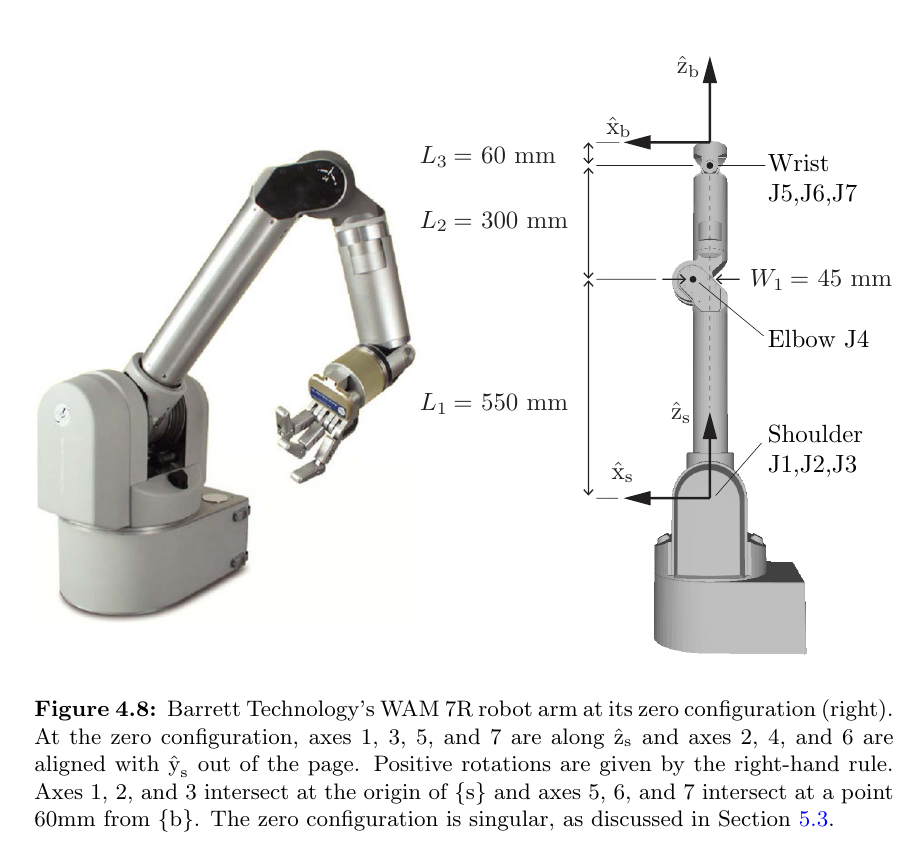

*来源：教材 Figure 4.8，书页 151／本地 PDF 第 170 页；局部截取。*

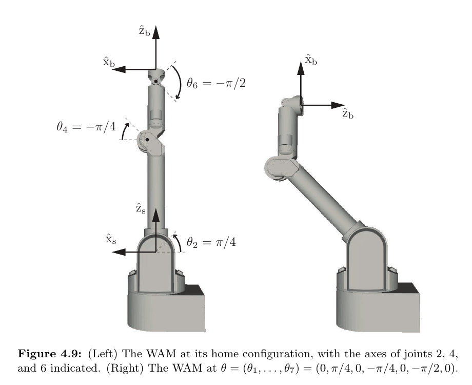

*来源：教材 Figure 4.9，书页 153／本地 PDF 第 172 页；局部截取。*

### 综合题 - WAM 的冗余与三关节运动

**题目**：使用

$$
L_1=0.550,
\quad
L_2=0.300,
\quad
L_3=0.060,
\quad
W_1=0.045
\quad(\mathrm m),
$$

并令 $\theta=(0,\pi/4,0,-\pi/4,0,-\pi/2,0)$。

1. 写出数值 $M$，以及本次参与运动的物体轴 $B_2,B_4,B_6$。
2. 把七因子物体形式 PoE 化简为三个非单位指数因子。
3. 教材计算得到 $T=\left[\begin{smallmatrix}0&0&-1&0.3157\\0&1&0&0\\1&0&0&0.6571\\0&0&0&1\end{smallmatrix}\right]$；从中读出末端位置，并用三列说明 $\hat x_b,\hat y_b,\hat z_b$ 的空间方向。
4. 用两句话区分“7R 冗余”和“零位形奇异”，再给出冗余自由度的一种用途。

**预期答案／判定标准**：

$$
M=
\begin{bmatrix}
1&0&0&0\\
0&1&0&0\\
0&0&1&0.910\\
0&0&0&1
\end{bmatrix},
$$

$$
B_2=\begin{bmatrix}0\\1\\0\\0.910\\0\\0\end{bmatrix},
\qquad
B_4=\begin{bmatrix}0\\1\\0\\0.360\\0\\0.045\end{bmatrix},
\qquad
B_6=\begin{bmatrix}0\\1\\0\\0.060\\0\\0\end{bmatrix}.
$$

$$
T(\theta)
=
M e^{[B_2]\pi/4}
e^{-[B_4]\pi/4}
e^{-[B_6]\pi/2}.
$$

由最终矩阵得到

$$
p=(0.3157,0,0.6571)\ \mathrm m,
$$

$$
\hat x_b=\hat z_s,
\qquad
\hat y_b=\hat y_s,
\qquad
\hat z_b=-\hat x_s.
$$

冗余表示七维关节变量控制六维任务时，一般会为同一可达末端位姿留下局部一维关节解集；奇异表示某个具体构型处的瞬时运动映射秩下降。额外自由度可用于避障或优化保持姿态的电机功率。

判定时重点检查：$L_1+L_2+L_3=0.910$；$B_4$ 同时含 $v_x=0.360$ 和 $v_z=0.045$；$\theta_4,\theta_6$ 的负号不能丢；旋转矩阵按列读取物体系轴在空间系中的方向。

**最小提示**：先删除奇数关节的零角度因子；旋转块的第 $j$ 列就是物体系第 $j$ 根单位轴在空间系中的坐标。

**教学意图**：把物体形式 PoE、真实 7R 几何、冗余与奇异性区分整合到一个可迁移问题中。

### 实际使用的提示或补救

学习者未提交独立解答并要求继续，因此本题由教师完整示范：

$$
M=
\begin{bmatrix}
1&0&0&0\\
0&1&0&0\\
0&0&1&0.910\\
0&0&0&1
\end{bmatrix},
$$

$$
B_2=\begin{bmatrix}0\\1\\0\\0.910\\0\\0\end{bmatrix},
\qquad
B_4=\begin{bmatrix}0\\1\\0\\0.360\\0\\0.045\end{bmatrix},
\qquad
B_6=\begin{bmatrix}0\\1\\0\\0.060\\0\\0\end{bmatrix}.
$$

删除零角度因子后，

$$
T(\theta)=M e^{[B_2]\pi/4}e^{-[B_4]\pi/4}e^{-[B_6]\pi/2}
=
\begin{bmatrix}
0&0&-1&0.3157\\
0&1&0&0\\
1&0&0&0.6571\\
0&0&0&1
\end{bmatrix}.
$$

所以 $p=(0.3157,0,0.6571)\,\mathrm m$，且 $\hat x_b=\hat z_s$、$\hat y_b=\hat y_s$、$\hat z_b=-\hat x_s$。7R 冗余表示七维关节变量控制六维末端任务时，同一可达位姿一般留下局部一维解集；奇异则是特定构型处瞬时运动映射秩下降。冗余自由度可用于避障或功率优化。

本记录是教师示范，不计作学习者独立掌握证据。

### 下一步

进入 4.2 Universal Robot Description Format；从教材对 joints 与 links 的定义开始。

## Session 010 - 4.2 URDF：树结构、关节与连杆

### 掌握目标

学习者能把 URDF 读成一棵 link-joint 树，准确解释关节 `origin`、`axis` 和连杆惯性字段，写出教材的固定轴 RPY 顺序，并说明普通 URDF 不能直接表示闭环机构的原因。

### 讲解前所用教材图

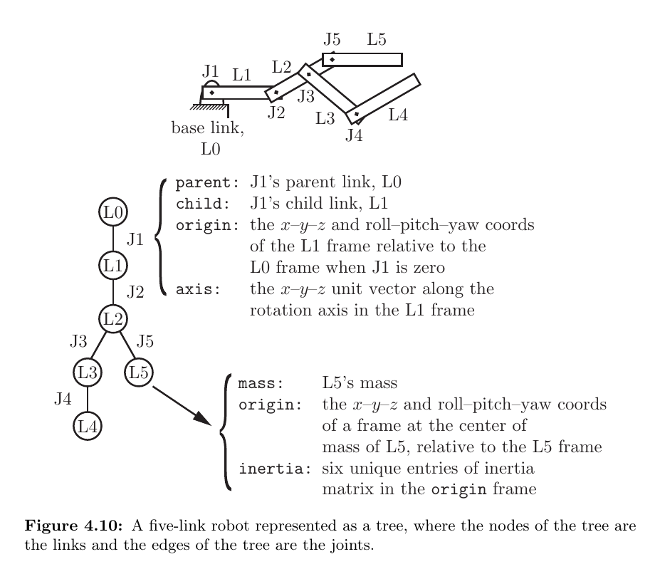

*来源：教材 Figure 4.10，书页 154／本地 PDF 第 173 页；局部截取。*

### 综合题 - 读懂一个最小 URDF 运动学树

考虑如下结构：

$$
\texttt{base\_link}
\xrightarrow{\texttt{joint1 (revolute)}}
\texttt{link1}
\xrightarrow{\texttt{joint2 (prismatic)}}
\texttt{link2}.
$$

其中：

- `joint1`：`parent=base_link`，`child=link1`，`origin xyz="0 0 0.5" rpy="0 0 0"`，`axis="0 0 1"`；
- `joint2`：`parent=link1`，`child=link2`，`origin xyz="1 0 0" rpy="0 0 0"`，`axis="1 0 0"`；
- `link2` 的惯性部分给出 `mass=2 kg`、质心 `origin xyz="0.4 0 0"`，以及惯性矩阵的六个互异分量。

请一次回答全部问题：

1. 列出树的节点、边和每条边的父子方向。
2. 分别解释两个关节的 `origin` 与 `axis` 在零位形中的物理意义；指出哪个变量是转角、哪个是位移及其通常单位。
3. 把上述字段分为“joint 的运动学字段”和“link 的惯性字段”。
4. 若把机构改成平面四杆闭环，普通 URDF 能否直接表示？为什么？
5. 若一般的 `rpy` 为 $(\alpha,\beta,\gamma)$，写出教材采用的固定轴旋转顺序及相应矩阵乘积。

### 预期答案／判定标准

1. 节点为 `base_link`、`link1`、`link2`；边为 `joint1`、`joint2`；方向依次为 `base_link → link1 → link2`。
2. `origin` 是关节变量为零时子连杆系相对父连杆系的位姿，且其原点在关节轴线上；`axis` 是在子连杆系中表示的单位正运动方向。`joint1` 绕 $+z_{\texttt{link1}}$ 转动，变量为角度（rad）；`joint2` 沿 $+x_{\texttt{link2}}$ 平移，变量为距离（m）。
3. joint 字段包括 type、parent、child、origin、axis；link 的惯性字段包括 mass、质心 origin 和 inertia 的六个互异分量。
4. 不能直接表示；普通 URDF 是树，而闭环要求两条运动学路径重新连接并施加闭合约束。
5. 先绕固定 $x$ 轴滚转 $\alpha$，再绕固定 $y$ 轴俯仰 $\beta$，最后绕固定 $z$ 轴偏航 $\gamma$；对列向量约定，

$$
R=R_z(\gamma)R_y(\beta)R_x(\alpha).
$$

判定时重点检查：`axis` 的表达坐标系是子连杆系；不能只说“全局 $z$ 轴”或“全局 $x$ 轴”；RPY 的口述顺序与矩阵从右向左作用应一致。

### 最小提示

先把圆圈当作 link、连线当作 joint；再逐条按“零位形子系相对父系的位姿 + 子系中的正轴”阅读。

### 教学意图

把 XML 字段、几何意义、PoE 的共同坐标表示和树结构限制整合成一个可迁移的 URDF 阅读任务。

### 实际使用的提示或补救

学习者未提交独立解答并要求继续，因此本题由教师完整示范：

1. 节点为 `base_link`、`link1`、`link2`；边为 `joint1`、`joint2`，父子方向为 `base_link → link1 → link2`。
2. `origin` 是关节变量为零时子连杆系相对父连杆系的位姿，`axis` 是用子连杆系表达的单位正运动方向。`joint1` 绕 $+\hat z_{\texttt{link1}}$ 转动，变量是角度（rad）；`joint2` 沿 $+\hat x_{\texttt{link2}}$ 平移，变量是距离（m）。
3. joint 的运动学字段为 type、parent、child、origin、axis；link 的惯性字段为 mass、质心 origin 和 inertia 的六个互异分量。
4. 普通 URDF 不能直接表示平面四杆闭环，因为它的数据结构是树，而闭环需要额外的路径闭合约束。
5. 固定轴顺序为先绕 $x$ 轴滚转 $\alpha$，再绕 $y$ 轴俯仰 $\beta$，最后绕 $z$ 轴偏航 $\gamma$；对列向量约定，$R=R_z(\gamma)R_y(\beta)R_x(\alpha)$。

本记录是教师示范，不计作学习者独立掌握证据。

### 下一步

结合 Figure 4.11 与教材 UR5 文件片段，逐项读取实际 URDF XML。

## Session 011 - 4.2 UR5 的实际 URDF

### 掌握目标

学习者能从真实 URDF 片段恢复整棵 link-joint 树，计算单个 `origin` 对应的零位形齐次变换，正确处理固定末端关节，并区分运动学字段与惯性字段。

### 讲解前所用教材图

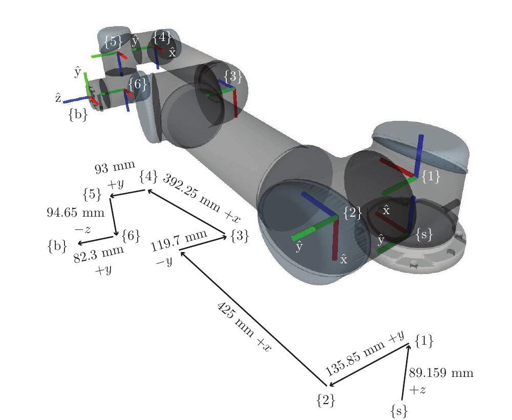

*来源：教材 Figure 4.11，书页 155／本地 PDF 第 174 页；局部截取。*

### 综合题 - 从 UR5 XML 恢复几何与惯性信息

使用教材中的以下数据：

~~~xml
<joint name="joint2" type="continuous">
  <parent link="link1"/>
  <child link="link2"/>
  <origin rpy="0 1.570796325 0" xyz="0 0.13585 0"/>
  <axis xyz="0 1 0"/>
</joint>

<joint name="ee_joint" type="fixed">
  <origin rpy="-1.570796325 0 0" xyz="0 0.0823 0"/>
  <parent link="link6"/>
  <child link="ee_link"/>
</joint>
~~~

同时，整条路径为 `world → base_link → link1 → … → link6 → ee_link`；`link2` 的质量为 $8.393\,\mathrm{kg}$，质心为 $(0,0,0.28)\,\mathrm m$，惯性分量为 $I_{xx}=I_{yy}=0.22689067591$、$I_{zz}=0.0151074$，交叉项均为零。

请一次回答全部问题：

1. 这棵树有多少个 link 节点和 joint 边？哪些边是 fixed，哪些是六个机械关节？
2. 写出 $T_{12}(0)$ 的 $4\times4$ 数值矩阵。
3. `joint2` 的正转轴在哪个坐标系中表达？把它换到父系 $\{1\}$ 后是多少？
4. 写出 $T_{6b}$ 的分块形式，并解释为什么 `ee_joint` 没有自由度却不能从末端运动学中删除。
5. 写出 `link2` 的质心和 $3\times3$ 惯性矩阵，并说明这些量是否影响本章的纯运动学计算。
6. 解释教材把机械关节写成 `continuous` 和给出非精确惯性数据时，应如何理解这份 URDF；再列出 URDF 还能描述的两类几何信息。

### 预期答案／判定标准

1. 九个 link、八条 joint 边；`world_joint` 与 `ee_joint` 为 fixed，`joint1` 到 `joint6` 是六个机械关节。
2.

$$
T_{12}(0)=
\begin{bmatrix}
0&0&1&0\\
0&1&0&0.13585\\
-1&0&0&0\\
0&0&0&1
\end{bmatrix}.
$$

3. 轴 $(0,1,0)$ 在子系 $\{2\}$ 中表达；$R_y(\pi/2)(0,1,0)^T=(0,1,0)^T$，所以在父系 $\{1\}$ 中数值碰巧不变。
4.

$$
T_{6b}=
\begin{bmatrix}
R_x(-\pi/2)&(0,0.0823,0)^T\\
0&1
\end{bmatrix}.
$$

它不增加自由度，却决定最后一个关节系到末端系的固定变换，并进入最终零位形 $M$。
5. 质心为 $(0,0,0.28)\,\mathrm m$，

$$
I_2=
\begin{bmatrix}
0.22689067591&0&0\\
0&0.22689067591&0\\
0&0&0.0151074
\end{bmatrix}.
$$

质量、质心和惯性不影响本章纯运动学的位姿计算，但用于动力学。
6. 真实 UR5 有关节限位，`continuous` 只是教材省略 limits 的简化；质量和惯性也不是精确参数，因此文件用于语法和几何教学而非高精度动力学。URDF 还可描述视觉几何和碰撞几何。

判定时重点检查：$T_{12}$ 的平移列是 $(0,0.13585,0)^T$；$R_y(\pi/2)$ 的第一列为 $(0,0,-1)^T$；`axis` 先在子系中解释；fixed joint 的“不增加自由度”不等于“变换为单位阵”。

### 最小提示

先用 $R=R_z(\gamma)R_y(\beta)R_x(\alpha)$ 展开 `rpy`，再把 `xyz` 直接放入齐次矩阵的最后一列。

### 教学意图

把 URDF 的 XML 语法真正转化为可计算的坐标变换，并建立“固定关节仍是运动学链的一部分”和“惯性参数不属于纯几何 FK”的边界。

### 实际使用的提示或补救

学习者未提交独立解答并要求继续，因此本题由教师完整示范：

1. 整棵树有九个 link 节点和八条 joint 边；`world_joint` 与 `ee_joint` 为 fixed，`joint1` 到 `joint6` 是六个机械关节。
2.

$$
T_{12}(0)=
\begin{bmatrix}
0&0&1&0\\
0&1&0&0.13585\\
-1&0&0&0\\
0&0&0&1
\end{bmatrix}.
$$

3. `axis=(0,1,0)` 最初在子系 $\{2\}$ 中表达；换到父系后为 $R_y(\pi/2)(0,1,0)^T=(0,1,0)^T$。
4.

$$
T_{6b}=
\begin{bmatrix}
R_x(-\pi/2)&(0,0.0823,0)^T\\
0&1
\end{bmatrix}.
$$

`ee_joint` 不增加自由度，却决定最后一个机械关节系到末端系的固定偏置，并进入 $M$。
5. `link2` 的质心为 $(0,0,0.28)\,\mathrm m$，

$$
I_2=
\begin{bmatrix}
0.22689067591&0&0\\
0&0.22689067591&0\\
0&0&0.0151074
\end{bmatrix}.
$$

质量、质心和惯性不影响本章的纯运动学计算，而用于动力学。
6. 真实 UR5 有关节限制，教材中的 `continuous` 是省略 limits 的简化；惯性参数也不是精确值。这份文件适合语法和坐标关系教学，而不代表高精度动力学模型。URDF 还可记录视觉几何与碰撞几何。

本记录是教师示范，不计作学习者独立掌握证据。

### 下一步

进入 4.3 Summary，统一比较逐连杆法、D–H、空间/物体 PoE 和 URDF。

## Session 012 - 4.3 第 4 章统一总结

### 掌握目标

学习者能围绕同一个正向运动学问题写出逐连杆、空间 PoE 和物体 PoE 三种公式，准确解释 D–H 的最小性及其代价，并判断 URDF 与 PoE 各自保存什么数据。

### 综合题 - 同一条 3R 链的五种表示

一条 3R 串联机械臂依次建立 $\{0\}=\{s\}$、$\{1\}$、$\{2\}$、$\{3\}$ 和末端系 $\{b\}$。已知相邻变换 $T_{01}(\theta_1)$、$T_{12}(\theta_2)$、$T_{23}(\theta_3)$ 以及固定但不一定为单位阵的 $T_{3b}$；也已知零位形 $M$ 和空间轴 $S_1,S_2,S_3$。

请一次回答全部问题：

1. 写出正向运动学的输入和输出，并用逐连杆形式写出 $T_{sb}(\theta)$。
2. 写出空间形式 PoE。
3. 写出 $B_i$ 与 $S_i$ 的关系以及物体形式 PoE。
4. 在什么条件下可以省去 $T_{3b}$？为什么“fixed”本身还不够？
5. 每个 D–H 变换使用几个参数？其中多少个描述固定结构、多少个是关节变量？其最小性的主要代价是什么？
6. 比较 PoE 与 URDF：哪一个无需中间连杆系并直接给末端公式？哪一个能在同一文件中保存树结构、惯性、视觉和碰撞信息？

### 预期答案／判定标准

1. 输入为 $\theta=(\theta_1,\theta_2,\theta_3)$，输出为 $T_{sb}(\theta)\in SE(3)$，

$$
T_{sb}(\theta)
=T_{01}(\theta_1)T_{12}(\theta_2)T_{23}(\theta_3)T_{3b}.
$$

2.

$$
T(\theta)
=e^{[S_1]\theta_1}e^{[S_2]\theta_2}e^{[S_3]\theta_3}M.
$$

3.

$$
B_i=\operatorname{Ad}_{M^{-1}}S_i,
\qquad
T(\theta)
=M e^{[B_1]\theta_1}e^{[B_2]\theta_2}e^{[B_3]\theta_3}.
$$

4. 只有主动选择 $\{b\}$ 与 $\{3\}$ 重合时 $T_{3b}=I$，才可省略。fixed 仅表示它不随关节变量变化，不保证它是单位阵。
5. 四个参数；三个描述固定结构，一个是关节变量。代价是必须为所有中间连杆建立坐标系并严格遵循 D–H 建系约定。
6. PoE 无需中间连杆系，并以 $M$ 和统一坐标表达的螺旋轴直接给出末端公式；URDF 用 link-joint 局部数据表示整棵树，并可同时保存惯性、视觉与碰撞信息。

判定时重点检查：空间形式的 $M$ 在右，物体形式的 $M$ 在左；两种 PoE 的关节因子都按 $1\to3$ 排列；$B_i$ 的换系方向是 $\operatorname{Ad}_{M^{-1}}$；fixed 与 identity 必须区分。

### 最小提示

先固定同一个输出 $T_{sb}$，再逐一回答“数据在哪个坐标系”“$M$ 在哪一侧”“是否需要中间坐标系”。

### 教学意图

把本章各表示法收束成可相互转换、但不能混淆坐标表达和乘法顺序的统一框架。

### 实际使用的提示或补救

本单元已完整讲解，综合题一次性提出，等待学习者一次作答。

### 下一步

反馈整题后进入 4.4 Software，学习 `FKinSpace` 与 `FKinBody` 的调用约定和实现逻辑。

---

[← 第 3 章](../ch03/ch03-rigid-body-motions-qa.md) · [返回顶部](#第-4-章--正向运动学qa) · [阅读首页](../../README.md)
